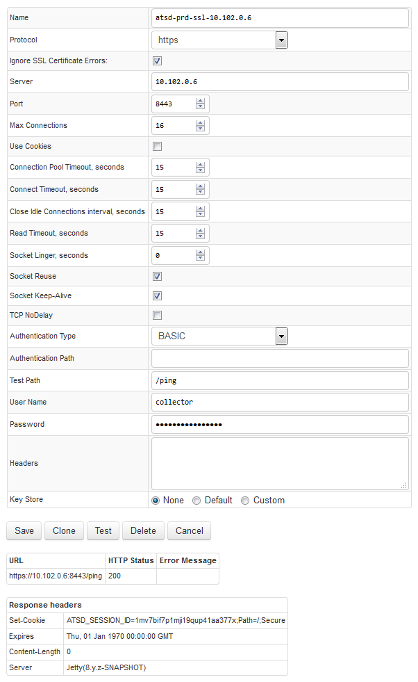
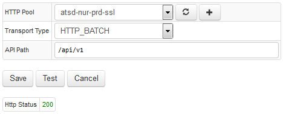

# ATSD Server Connection

## Overview

In order for Axibase Collector to function properly, it needs to know where to send data collected from remote data sources.

This document describes how to add a storage driver for sending data into ATSD.

## Collector Account

* Create a [collector account](https://axibase.com/docs/atsd/administration/collector-account.html) in ATSD to be used for inserting data into ATSD.

## HTTP Pool

Since Axibase Collector transmits data to ATSD using the http/https protocol, you need to configure a HTTP connection pool by specifying connection properties, as well as various timeouts and limits.

* Open **Data Sources > HTTP Pools > Add** form.
* Enter a pool name.
* Set connection parameters to the target ATSD instance: hostname/IP address; port (8443); https protocol.
* Check 'Ignore SSL Certificate Errors' to ignore certificate errors since ATSD certificate is self-signed by default.
* Apply connection limits using the [recommended settings](#recommended-pool-settings) below.
* Select Authentication Type=BASIC. Set Test Path to `/ping`.
* Enter [collector account](https://axibase.com/docs/atsd/administration/collector-account.html) credentials. Make sure that the collector user has roles `API_DATA_WRITE` and `API_META_WRITE`, as well as 'All Access: Write' permission.

### Test HTTP Pool

Click Test to verify the settings:

* Response code is 200 if the connection is successful and credentials are valid.
* Response code is 401 if credentials are not valid.
* Response code is 403 if the specified user is not authorized to access the specified Test Path.

#### Recommended HTTP Pool Settings

**Setting** | **Value**
----- | -----
Max Connections | 16
Use Cookies | false
Connection Pool Timeout | 15
Connect Timeout | 15
Close Idle Connections interval | 60
Read Timeout | 15
Socket Linger | 0
Socket Reuse | true
Socket Keep-Alive | true

#### ATSD HTTP Pool Configuration Example

## Storage Driver Configuration

* Open the **Admin > Storage Drivers > Add** page.
* Choose ATSD HTTP pool configured previously.
* Set Transport Type to **HTTP_BATCH**.
* Keep API path as `/api/v1`.
* Click Test. Response Code is 200 if the connection was successful.

