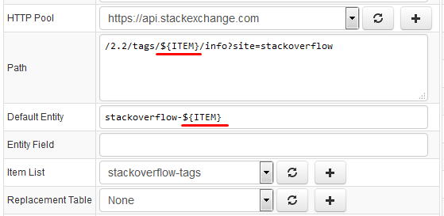
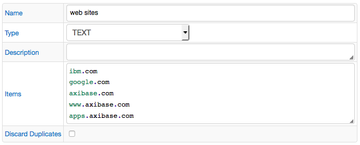
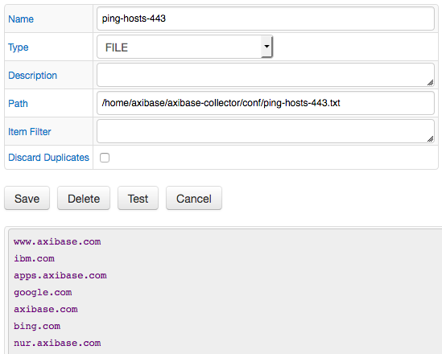
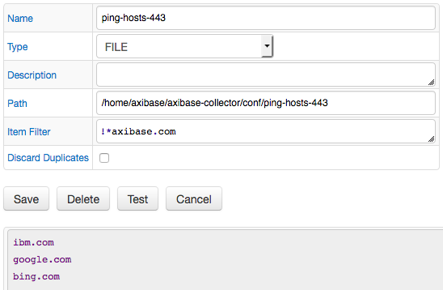
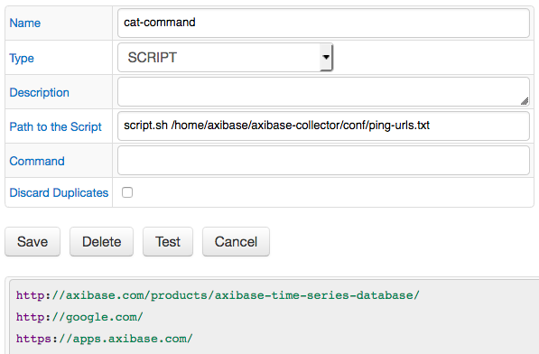
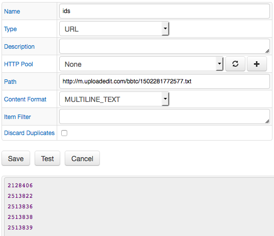
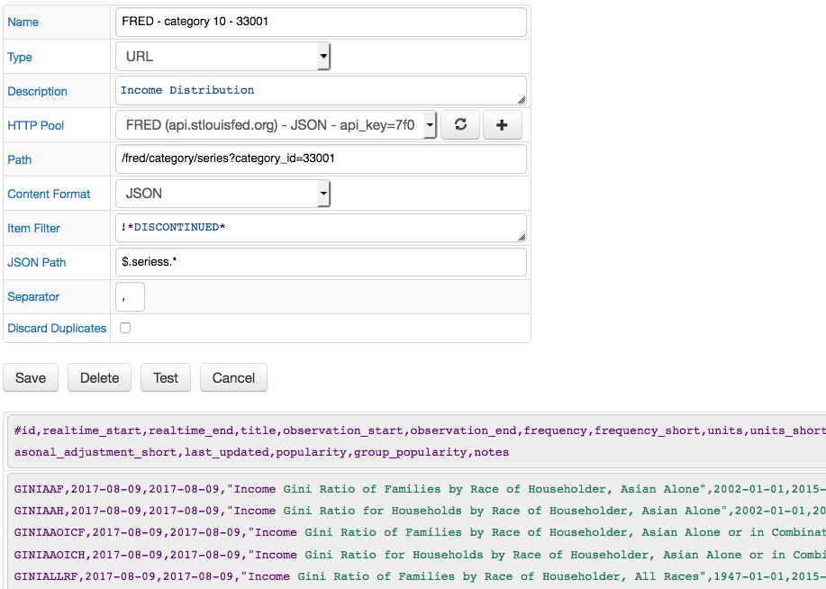
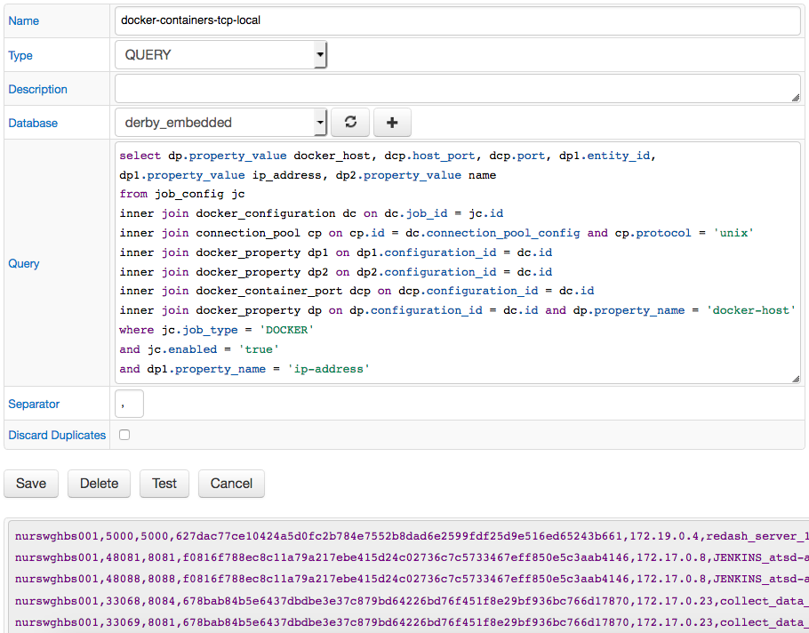
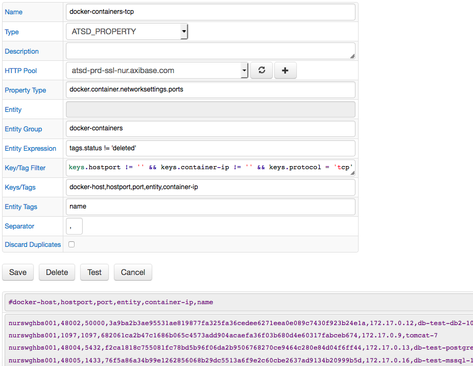

# Collections

## Item Lists

Item List is a collection of strings which can be iterated to execute repetitive requests (queries) within the same job configuration.

The list can be defined by specifying items as text (one item per line) or by retrieving them from an external source such as file or script output.

Items starting with the hash `#` symbol are treated as comments and are ignored.

Supported list types:

* [TEXT](#text)
* [FILE](#file)
* [SCRIPT](#script)
* [URL](#url)
* [QUERY](#query)
* [ATSD_PROPERTY](#atsd_property)

Job types with support for Item List automation:

* FILE
* HTTP
* ICMP
* JSON
* OVPM
* SNMP
* SOCRATA
* TCP

### Configuration

To create a new list, open the **Collections:Item Lists** page, and click **Add**:

| **Field** | **Description**|
|:----|:---|
|`Name` | Item List name.|
|`Description` | Item List description.|
| `Type` | Method used to retrieve list items. See [types](#types).|
|`Discard Duplicates` | Discard items with the same name.If true, the list discards duplicate items regardless of type (TEXT, FILE, SCRIPT).String comparison for duplicate checks is case-sensitive.|
|`Items`, `Path`, `Command`... | Type-specific fields to configure the source for reading list items.|

### Usage

Use the `${ITEM}` placeholder to access the value of the current item in the list while iterating.

The items retain the original order as specified in the editor or returned by an external source.

For example, include the `${ITEM}` placeholder into the Path field in JSON job to query a different URL for each element in the list.



### Functions

Item values can be further modified with built-in [string functions](jobs/placeholders.md#string-functions).

```ls
${ITEM?function(arguments)}
```

Example: `${ITEM?keep_before("_")}`

Multiple functions can be chained (executed from left to right):

```ls
${ITEM?functionA(arguments)?functionB(arguments)}
```

Example: `${ITEM?keep_before("_")?replace(".csv", "")}`

### Types

Item Lists may receive items from different sources. Currently the following types are implemented:

#### TEXT

An Item List which stores strings entered in the `Items` field on the form.

List items should be separated by a line break.



#### FILE

Reads lines from a file on the local filesystem.

**Field** | **Description**
:--- | :---
`Path` | Absolute path to the text file containing Item List elements
`Item Filter` | Expression for matching item. This field also supports regex expression, for example: REGEXP(expression).

If the file is not found, an empty list is returned. List items in the file should be separated with a line break.



Exclude items which end with `axibase.com`:



#### SCRIPT

Executes a script specified in the `Command` field and reads lines from a standard output as list items.

**Field** | **Description**
:--- | :---
`Path to the Script` | Relative path to a script file returning Item List elements.Scripts should be located in $AXIBASE_COLLECTOR_HOME/conf/scripts directory.
`Command` | A list of commands returning Item List elements. During execution a temporary file is created in the directory $AXIBASE_COLLECTOR_HOME/conf/scripts, also this directory is used as working directory.It is recommended to specify a command interpreter by providing a shebang on the first line, e.g. #!/usr/bin/env bash.You must provide the setting 'script.text.execute.allow=true' in server.properties file in order to be able to use this feature.

The `Command` field should start with the script file name (absolute path not supported) and optional script arguments.

The script should print items separated by line breaks to 'stdout'.



* **Example**

The directory `/tmp/report/csv` contains CSV files. The Item List should contain a collection of file name prefixes before the underscore symbol.

```txt
ent-1_file-1.csv
ent-1_file-2.csv
ent-1_file-3.csv
ent-2_file-1.csv
ent-2_file-2.csv
ent-3_file-3.csv
```

```sh
nano prefix.sh
```

```sh
#!/usr/bin/env bash
dir="$1/*"
for file in $dir; do
    if [[ -f $file &&  $file == *"_"* ]]; then
        filename=${file##*/}
        b=${filename%_*}
        echo -e "$b"
    fi
done
```

```sh
chmod a+x prefix.sh
prefix.sh /tmp/report/csv

ent-1
ent-1
ent-1
ent-2
ent-2
ent-3
```

#### URL

Reads lines from a remote file/page.

**Field** | **Description**
:--- | :---
`HTTP Pool` | HTTP Pool specifying connection properties to ATSD from which the records will be retrieved.
`Path` | HTTP(s) Path to file. If HTTP Pool is enabled, the path should be relative. Otherwise the Path should be a full URI including the protocol, host, port and path.
`Content Format` | Content format in the file. Supported formats: `MULTILINE_TEXT` and `JSON`.
`Item Filter`| Expression for matching item. This field also supports regex expression, for example: REGEXP(expression).
`JSON Path` | JSON Path expression to match a list of items in the JSON document.
`Separator` | Separator used when concatenating multiple field values.

If the file is not found, an empty list is returned. List items should be separated with a line break when the `MULTILINE_TEXT` format is selected.

Examples:

* [MULTILINE_TEXT](#example-with-multiline-text-content)
* [JSON](#example-with-json-content)

##### Example with `MULTILINE_TEXT` content



* ***Example***

```txt
URL = http://m.uploadedit.com/bbtc/1502281772577.txt
```

Remote file content:

```txt
#ID
2128406
2513822
2513836
2513838
2513839
```

result:

```txt
2128406
2513822
2513836
2513838
2513839
```

##### Example with `JSON` content



#### QUERY

Selects data from a database with a SELECT query.

**Field** | **Description**
:--- | :---
`Database` | Database from which the item list records will be selected.
`Query` | SELECT query for retrieving item list elements. Values contained in multiple columns are concatenated using specified separator.
`Separator` | Separator used when concatenating multiple column values.

Each item is created by concatenating values from **all** columns in a given row separated by the specified token.

If the result set is empty, an empty list is returned.



#### ATSD_PROPERTY

Requests a list of property records from ATSD with the [property query](https://axibase.com/docs/atsd/api/data/properties/query.html) method.

**Field** | **Description**
:--- | :---
`HTTP Pool` | HTTP Pool specifying connection properties to ATSD from which the records will be retrieved.
`Property Type` | Property type to be retrieved.
`Entity` | Entity name or pattern containing * as a wildcard.
`Entity Group` | Entity group name to filter records for entities that are members of this group.
`Entity Expression` | An expression to filter entities: all or a subset matched with Entity/Entity Group fields.
`Key/Tag Filter` | Expression for matching property records with specified keys or tags.
`Keys/Tags` | List of property keys and tags to be concatenated into a line using separator specified in Separator field. All fields are concatenated, if this field is set to *.
`Entity Tags` | List of entity tags to be concatenated into a line using separator specified in Separator field. All fields are concatenated, if this field is set to *.
`Separator` | Separator used when concatenating multiple key/tag values.

Each item is created by concatenating field values (Keys/Tags + Entity Tags) separated by the specified token.

If no property records are found, an empty list is returned.


