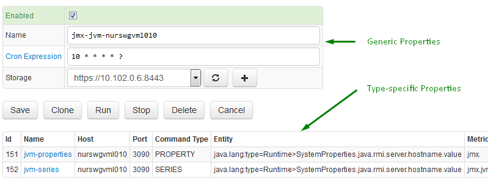

# Jobs

A job is a primary unit of configuration and scheduling in Axibase Collector.

Each job has the following generic properties:

| **Name** | **Description** |
|:--- |:---|
| Type | Job type, such as JDBC, JMX, FILE, etc.|
| Name | Job name. |
| Enabled | Job schedule status. The job must be enabled to be executed according to its schedule. |
| Cron Expression | [Cron Expression](scheduling.md#cron-expressions) determines how frequently the job is executed.
| Storage | Target ATSD server for sending collected data. |

Type-specific properties, such as a SQL query in a JDBC job or a CSV parser in a FILE job, are specified in nested configuration objects.

```sh
+ job-1
  - configuration-1
+ job-2
  - configuration-2
  - configuration-3
...
```

The job may include multiple configurations. For example, a JDBC job may be configured to execute multiple SQL queries.



## Cloning Jobs

You can create the exact copy of the job by clicking 'Clone'.

The copied job will have the same name as the original job but with the '-cloned' postfix.

By default, cloned jobs are disabled.

You can change the necessary settings and enable the job by selecting the Enabled check box.

A cloned job has its own primary key and can run concurrently with the original job.
