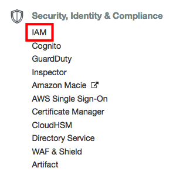
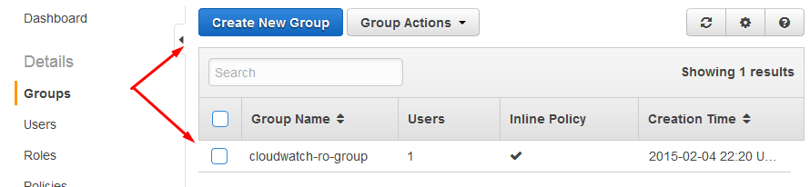
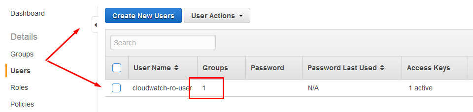
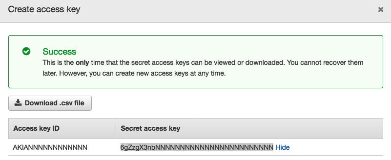
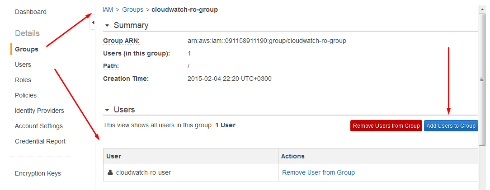
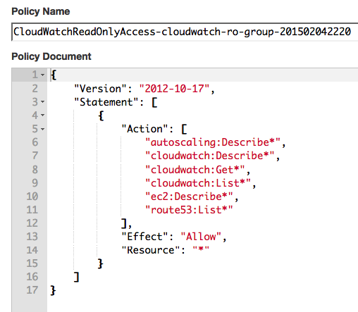

# AWS IAM Account for CloudWatch

## Overview

The following document describes the process of creating a **read-only** account used to query statistics from AWS CloudWatch API.

## Account Configuration

### Create User Group

Login into the AWS Console and locate **IAM** (Identity and Access Management) service under the **Security, Identity and Compliance** section.



Open the Groups menu and click **Create New Group**.

Specify group name, for example `cloudwatch-ro-group`.



### Create User

Open Users page and click **Create New User**.

Enter a user name such as `cloudwatch-ro-user`.



Generate access and secret keys for the user. Copy the keys for your reference.



The keys will be required for the AWS job in Axibase Collector.

### Add User To Group

Open Group page and click on **Add Users to Group**.

Add `cloudwatch-ro-user` to the `cloudwatch-ro-group`.



### Grant Permissions

Open the Group page and click **Create Group Policy**

Enter the following policy text in `JSON` format, click **Validate Policy** and save it.

```json
{
    "Version": "2012-10-17",
    "Statement": [
        {
            "Action": [
                "cloudwatch:List*",
                "cloudwatch:Get*",
                "cloudwatch:Describe*",
                "ec2:Describe*",
                "autoscaling:Describe*",
                "route53:List*"
            ],
            "Effect": "Allow",
            "Resource": "*"
        }
    ]
}
```

The above policy grants users in the `cloudwatch-ro-group` permissions to execute various `Get`, `List`, and `Describe` API methods. This type of policy provides a **read-only** access.

The `cloudwatch:` actions are required to list available CloudWatch metrics and download statistics, whereas actions for the other namespaces are required to download AWS resource attributes and relationships and store them as metadata in ATSD.

To simplify configuration, use wildcards to grant multiple actions using prefix matching. For example, specify `route53:List*` action instead of `route53:ListHealthChecks` and `route53:ListTagsForResources`.

Sample namespace-specific actions:

* [`ec2:DescribeInstances`](https://docs.aws.amazon.com/AWSEC2/latest/APIReference/API_DescribeInstances.html)
* [`ec2:DescribeVolumes`](https://docs.aws.amazon.com/AWSEC2/latest/APIReference/API_DescribeVolumes.html)
* [`autoscaling:DescribeScalingPlans`](https://docs.aws.amazon.com/autoscaling/plans/APIReference/API_DescribeScalingPlans.html)
* [`autoscaling:DescribeScalingPlanResources`](https://docs.aws.amazon.com/autoscaling/plans/APIReference/API_DescribeScalingPlanResources.html)
* [`route53:ListTagsForResources`](https://docs.aws.amazon.com/Route53/latest/APIReference/API_ListTagsForResources.html)
* [`route53:ListHealthChecks`](https://docs.aws.amazon.com/Route53/latest/APIReference/API_ListHealthChecks.html)



You can now query Amazon CloudWatch APIs with the new user account, access key, and secret key.
