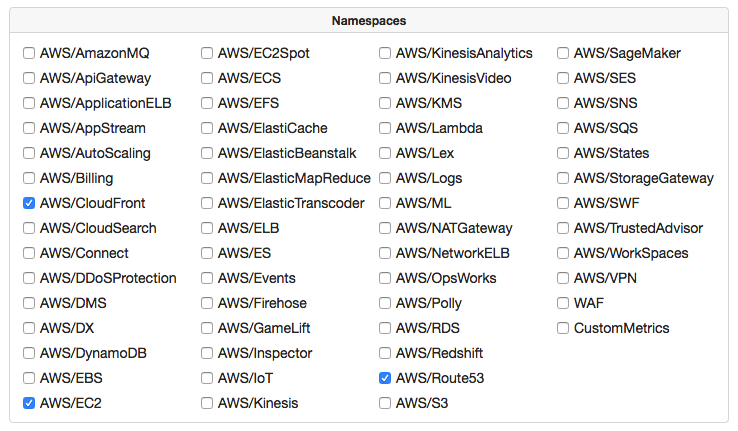
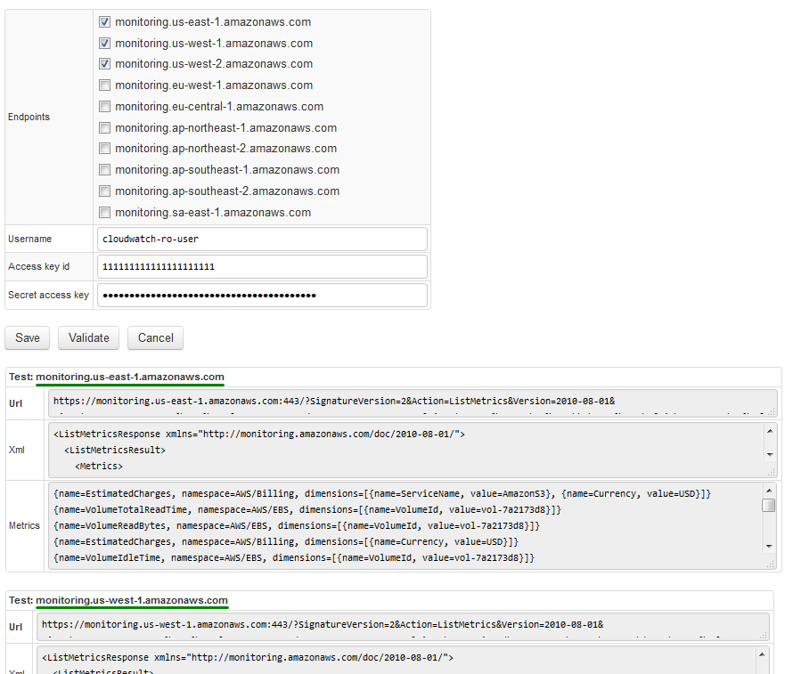
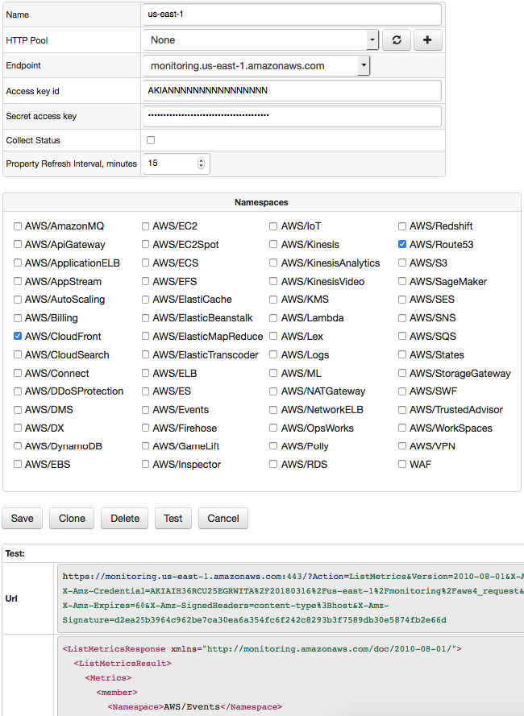
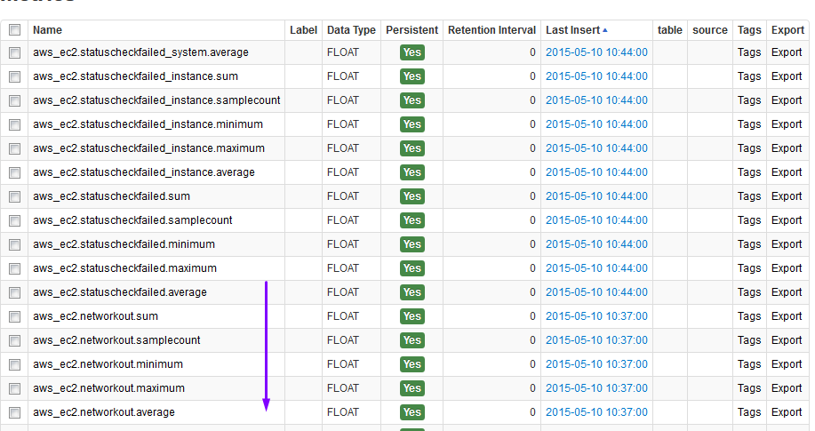
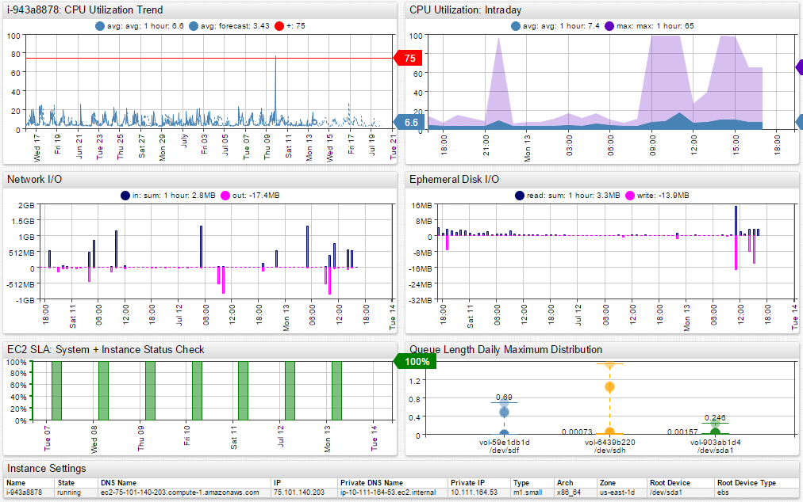
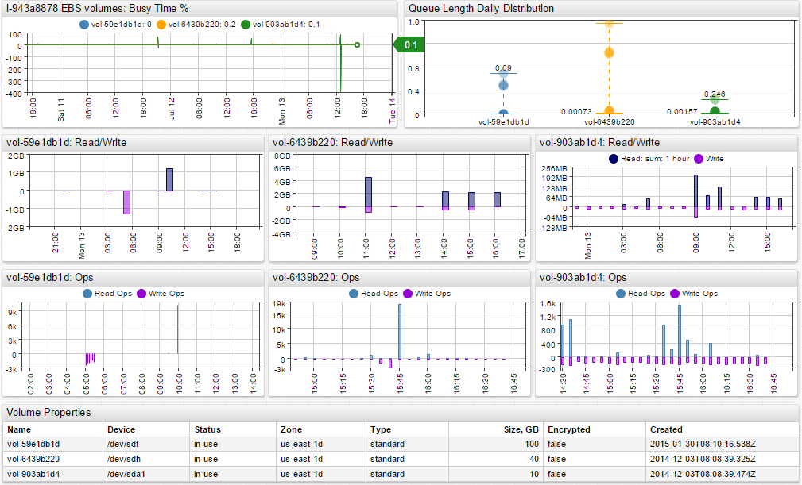

# AWS Job

## Overview

AWS job allows you to copy [Amazon Web Services CloudWatch](https://aws.amazon.com/cloudwatch/) statistics into Axibase Time Series Database for long-term retention, reporting, and visualization.

Refer to [AWS documentation](http://docs.aws.amazon.com/AmazonCloudWatch/latest/DeveloperGuide/CW_Support_For_AWS.html) for a complete list of available metrics.

The AWS job stores markers for each CloudWatch metric so that API requests are incremental and load only the most recent data. These markers allow the job to build optimized queries and to avoid data gaps in case of network outages.

Each job can be configured to execute multiple configurations in order to retrieve metrics from different [regions](http://docs.aws.amazon.com/general/latest/gr/rande.html#cw_region). The configurations are processed sequentially within each job iteration.

When an AWS job is started for the first time, it will load available historical data from CloudWatch, available for up to 2 weeks.

## Supported Namespaces

Each AWS [namespace](http://docs.aws.amazon.com/AmazonCloudWatch/latest/DeveloperGuide/aws-namespaces.html) provides a set of metrics available for resources of a particular type.

You can configure the AWS job to collect metrics for all or a subset of namespaces. To minimize the number of API queries, choose to collect data only for AWS services that you're actually using.

Available namespaces:



## Schema

The CloudWatch metrics are stored in ATSD using the following naming convention:

```ls
{namespace}.{metric-name}.{statistic-name}
```

The composite metric name is normalized by replacing slash and whitespace symbols with underscores.

```ls
aws_ebs.volumeidletime.maximum
```

For each metric, the AWS job retrieves the following period statistics:

* average
* minimum
* maximum
* sum
* sample count

The AWS statistics are stored in ATSD as metrics which means that ATSD can compute aggregate statistics on top of AWS statistics.

For example, the `AWS/Billing Estimated Charges` metric is stored as 5 metrics:

* `aws_billing.estimatedcharges.minimum`
* `aws_billing.estimatedcharges.maximum`
* `aws_billing.estimatedcharges.sum`
* `aws_billing.estimatedcharges.average`
* `aws_billing.estimatedcharges.samplecount`

The number of metrics within each namespace varies greatly. For AWS/EC2 the list consists of 15+ [metrics](#aws-ec2-metrics).

The job assigns each metric to an entity which is determined based on the [primary dimension](#namespace-dimensions).

## Configuration Settings

| **Field** | **Description** |
|:---|:---|
| Name | Configuration name. |
| HTTP Pool | Pool of https connections to execute requests against the specified CloudWatch endpoint. The pool can be left empty. |
| Endpoint  | [CloudWatch Endpoint](http://docs.aws.amazon.com/general/latest/gr/rande.html#cw_region) URL.   |
| Access key id  | Access key. See [Getting Your Access Key ID and Secret Access Key](http://docs.aws.amazon.com/AWSSimpleQueueService/latest/SQSGettingStartedGuide/AWSCredentials.html).   |
| Secret access key  | Secret access key. |
| Namespaces  | CloudWatch metric namespaces enabled for collection.   |
| Collect Status  |  Collect status check metrics such as `StatusCheckFailed`, `StatusCheckFailed_Instance`, `StatusCheckFailed_System` |
| Property Refresh  Interval, minutes | Interval for loading resource attributes. |

## Configuration Steps

* Create a read-only [IAM account](aws-iam.md) for querying CloudWatch statistics.
* Open the **Jobs:Add Job:Use Wizard** page.
* Specify access and secret keys.
* Select AWS regions from which you want to collect data. The wizard will create a separate AWS configuration for each region within the same job.
* Validate the credentials and save the job if there are no errors.



* Select one of the created configurations and click Test.



* To view available metrics for a particular namespace, uncheck all namespaces except one and click Test.

## Validation

* Open the AWS job page and set the schedule to `R 0/5 * * * ?` to execute the job every 5 minutes with random seconds.
* On the AWS Jobs list page, check that Items Read and Commands Sent are greater than 0.
* Login into ATSD. Open the **Metrics** tab and review available metrics by typing `aws` into the Name Mask.Note that it may take the AWS job a while to load backlogged historical data for all metrics after the job was created.
* Open the Entities tab and locate one of AWS EC2 instances. Click on Portal links to access pre-defined AWS portals.



## Sample Dashboards

* [EC2](https://apps.axibase.com/chartlab/0aa34311)



* [EBS](https://apps.axibase.com/chartlab/e8977b4a)



## Configuration Example


## Sample AWS/EC2 CloudWatch Metrics

* aws_ec2.cpucreditbalance
* aws_ec2.cpucreditusage
* aws_ec2.cpuutilization
* aws_ec2.diskreadbytes
* aws_ec2.diskreadops
* aws_ec2.diskwritebytes
* aws_ec2.diskwriteops
* aws_ec2.networkin
* aws_ec2.networkout
* aws_ec2.networkpacketsin
* aws_ec2.networkpacketsout
* aws_ec2.statuscheckfailed
* aws_ec2.statuscheckfailed_instance
* aws_ec2.statuscheckfailed_system

## AWS CloudWatch API Fees

AWS applies [usage charges](https://aws.amazon.com/cloudwatch/pricing/) for CloudWatch API requests with free entitlement available on a monthly basis.

An extra fee is charged for detailed monitoring, as well as for custom metrics. The detailed monitoring provides `1-minute` period granularity and a lower delay, typically 1 or 2 minutes, whereas the basic monitoring can have a delay between 5 and 10 minutes.

## Namespace Dimensions

The primary dimension determines entity name in ATSD.

|**Namespace**|**Primary Dimension**|
|---|---|
| AWS/Route53 | HealthCheckId |
| AWS/ApiGateway | ApiName |
| AWS/AppStream | Fleet |
| AWS/AutoScaling | AutoScalingGroupName |
| AWS/Billing | ServiceName |
| AWS//CloudFront | DistributionId |
| AWS/CloudSearch | ClientId |
| CWAgent | InstanceId |
| AWS/Events | RuleName |
| AWS/Logs | LogGroupName |
| AWS/Connect | InstanceId |
| AWS/DMS --> extract *id* or *arn* |
| AWS/DX | ConnectionId |
| AWS/DynamoDB | TableName |
| AWS/EC2 | InstanceId |
| AWS/EC2Spot | AvailabilityZone |
| AWS/ECS | ClusterName |
| AWS/ElasticBeanstalk | InstanceId |
| AWS/EBS | VolumeId |
| AWS/EFS | FileSystemId |
| AWS/ELB | LoadBalancerName  |
| AWS/ApplicationELB | LoadBalancerName |
| AWS/NetworkELB  | LoadBalancer |
| AWS/ElasticTranscoder | PipelineId |
| AWS/ElastiCache | CacheClusterId |
| AWS/ES | ClientId |
| AWS/ElasticMapReduce | JobId |
| AWS/GameLift | FleetId |
| AWS/Inspector | ??? |
| AWS/IoT | RuleName |
| AWS/KMS | KeyId |
| AWS/KinesisAnalytics | Flow |
| AWS/Firehose | DeliveryStreamName |
| AWS/Kinesis | StreamName |
| AWS/KinesisVideo | StreamName |
| AWS/Lambda | FunctionName |
| AWS/Lex | BotName |
| AWS/ML | MLModelId |
| AWS/OpsWorks | InstanceId |
| AWS/Polly | Operation |
| AWS/Redshift | NodeID |
| AWS/RDS | DBInstanceIdentifier |
| AWS/Route53 | HealthCheckId |
| AWS/SageMaker | Host |
| AWS/DDoSProtection |  |
| AWS/SES | |
| AWS/SNS | Application |
| AWS/SQS | QueueName |
| AWS/S3 | BucketName |
| AWS/SWF | Domain |
| AWS/States | *arn |
| AWS/StorageGateway | GatewayName |
| AWS/NATGateway | NatGatewayId |
| AWS/VPN | VpnId |
| WAF | Rule |
| AWS/WorkSpaces | WorkspaceId |
| AWS/AmazonMQ | Topic  |
| AWS/TrustedAdvisor | ServiceName |
