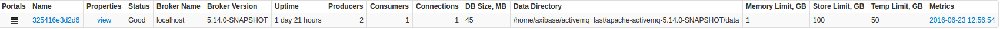
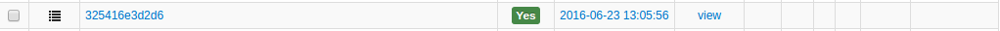

# Monitoring ActiveMQ with ATSD

## Overview

This document describes the process of configuring ActiveMQ for availability and performance monitoring with the Axibase Time Series Database.

## Requirements

* [ActiveMQ version 5.x.+](http://activemq.apache.org)

## Installation Steps

### Configure ActiveMQ Server

#### Enable JMX and Log Aggregator

* Log in to the ActiveMQ server via SSH.
* Change to the ActiveMQ installation directory.

```sh
cd /opt/apache-activemq-5.13.1
```

* Download the log aggregation filter `.jar` files to the ActiveMQ lib directory:

```sh
wget --content-disposition -P ./lib/ \
   "https://repository.sonatype.org/service/local/artifact/maven/redirect?r=central-proxy&g=com.axibase&a=aggregation-log-filter&v=LATEST"
wget --content-disposition -P ./lib/ \
   "https://repository.sonatype.org/service/local/artifact/maven/redirect?r=central-proxy&g=com.axibase&a=aggregation-log-filter-log4j&v=LATEST"
```

* Append aggregation filter settings to the ActiveMQ `log4j.properties` file. Replace `atsd_hostname` with the hostname of the ATSD server:

```sh
cat <<EOF >> ./conf/log4j.properties
log4j.appender.logfile.filter.COLLECTOR=com.axibase.tsd.collector.log4j.Log4jCollector
log4j.appender.logfile.filter.COLLECTOR.writerHost=atsd_hostname
EOF
```

See [Aggregation Log Filter](https://github.com/axibase/aggregation-log-filter) for additional configuration options.

* Modify JMX settings in ActiveMQ JVM launch options.
  * Search for the `ACTIVEMQ_SUNJMX_START` setting and change it as specified below.
  * Replace `activemq_hostname` with the full hostname or the IP address of the ActiveMQ server.
  * This should be the same hostname that Axibase Collector will be using when connecting to the ActiveMQ server.
  * For more information on configuring JMX in ActiveMQ, see [activemq.apache.org/jmx.html](http://activemq.apache.org/jmx.html)

ActiveMQ 5.11.x and later:

```sh
vi ./bin/env
```

```sh
ACTIVEMQ_SUNJMX_START="$ACTIVEMQ_SUNJMX_START -Dcom.sun.management.jmxremote"
ACTIVEMQ_SUNJMX_START="$ACTIVEMQ_SUNJMX_START -Dcom.sun.management.jmxremote.port=1090"
ACTIVEMQ_SUNJMX_START="$ACTIVEMQ_SUNJMX_START -Dcom.sun.management.jmxremote.rmi.port=1090"
ACTIVEMQ_SUNJMX_START="$ACTIVEMQ_SUNJMX_START -Dcom.sun.management.jmxremote.ssl=false"
ACTIVEMQ_SUNJMX_START="$ACTIVEMQ_SUNJMX_START -Djava.rmi.server.hostname=activemq_hostname"
ACTIVEMQ_SUNJMX_START="$ACTIVEMQ_SUNJMX_START -Dcom.sun.management.jmxremote.password.file=${ACTIVEMQ_CONF}/jmx.password"
ACTIVEMQ_SUNJMX_START="$ACTIVEMQ_SUNJMX_START -Dcom.sun.management.jmxremote.access.file=${ACTIVEMQ_CONF}/jmx.access"
```

ActiveMQ 5.10.x and earlier:

```sh
vi ./bin/activemq
```

```sh
ACTIVEMQ_SUNJMX_START="-Dcom.sun.management.jmxremote \
   -Dcom.sun.management.jmxremote.port=1090 \
   -Dcom.sun.management.jmxremote.rmi.port=1090 \
   -Dcom.sun.management.jmxremote.ssl=false \
   -Djava.rmi.server.hostname=activemq_hostname \
   -Dcom.sun.management.jmxremote.password.file=${ACTIVEMQ_BASE}/conf/jmx.password \
   -Dcom.sun.management.jmxremote.access.file=${ACTIVEMQ_BASE}/conf/jmx.access"
```

The result should be as shown on the image below:


* Modify JMX security credential files in the `./conf` directory.

jmx.access:

```sh
# The "monitorRole" role has readonly access.
monitorRole readonly
```

jmx.password:

```sh
# The "monitorRole" role has password "abc123".
monitorRole abc123
```

* Secure access to the `jmx.password` file by restricting permissions:

```sh
chmod 600 ./conf/jmx.password
```

* Restart ActiveMQ server.

```sh
./bin/activemq stop
./bin/activemq start
```

#### Configure ActiveMQ JMX Job

1. Log in to Axibase Collector at `https://collector_hostname:9443`.
1. Click the Jobs tab in the top menu.
1. Locate the `jmx-activemq` job.
1. On the JMX Job page, enable its status by checking on the 'Enabled' check box.
1. Adjust the cron expression if required. By default, the job will be executed every 10 seconds.

* For more information on cron expressions, see [Scheduling](../../../scheduling.md).


##### Configuring activemq-series

1. Select the `activemq-series` configuration.
1. On the JMX Configuration page, enter the JMX connection parameters as above:

* **Host** — ActiveMQ hostname. Must be the same as the `activemq_hostname`.
* **Port** — JMX port.
* **User Name** — JMX user name such as `monitorRole`. Read-only permissions are sufficient.
* **Password** — Password for JMX user.
* **Entity** — Optionally, specify the output of the hostname command on the ActiveMQ server if it's different from `activemq_hostname` (for example if `activemq_hostname` represents a fully qualified name).

Other parameters are optional. For more information on JMX configuration, see [JMX](../../../jobs/jmx.md).

1. Click Test to validate the configuration.

If the specified configuration is correct, there must be no errors or empty fields in the test results.

1. Click **Save**.


##### Configuring activemq-property

1. From the table on the JMX Job page, click Edit next to the activemq-property configuration.
1. Set Host, Port, User Name, Password, and Entity fields as described in the previous section.
1. Click Test to validate the configuration.
1. Click Save.


## Viewing Data in ATSD

### Metrics

* List of collected [AcriveMQ metrics](metric-list.md)

### Properties

* List of collected [Active MQ properties](properties-list.md)

### Entity group

* Open **Admin:Entity Groups**, click the [Import], button and upload  [activemq_entity_group.xml](configs/activemq_entity_group.xml).
* Select the imported `apache-activemq-brokers` group.
* Verify that the group contains your Active MQ hosts.

### Entity Views

* Open **Configuration:Entity Views**, click the [Import] button and upload  [activemq_entity_view.xml](configs/activemq_entity_view.xml).
* Select the imported `Apache ActiveMQ Brokers` view.
* Select the Entity Group that you created earlier.
* Click on the [View] button and browse information about your entities.



### Portal

* Open **Configuration: Portals** and click the [Import] button and upload [activemq_portal.xml](configs/activemq_portal.xml).
* Click the Assign link and associate the portal with the entity group you created earlier.
* Open the Entity tabs, find the java application by name, and click on its portal icon.



[**Active MQ Live Portal**](http://apps.axibase.com/chartlab/2f11a5ef)


### Rules

### Setting up Mail Client

* Configure [Mail Client](https://axibase.com/docs/atsd/administration/mail-client.html).

#### Import Rules

* Open the **Configuration: Rules** page, click the [Import], button and upload [jvm_rules.xml](configs/activemq_rules.xml).
* For each created rule, open it in the Rule Editor, and change the recipient address on the *Email Notifications* tab.
* These rules will automatically apply to all JVM based applications monitored by Axibase Collector.

Imported rules:

| **Rule** |  **Description** |
| :--- | :--- |
| *activemq_broker_configuration_change* | Send a notification on configuration change. |
| *activemq_connection_count* | Raise an alert when connection count exceeds the specified threshold. |
| *activemq_enqueue_stopped* |  Raise an alert when enqueueing stops (no new messages are received). |
| *activemq_health_status* |   Raise an alert when Activemq health status is abnormal. |
| *activemq_unauthorized_connection* | Raise an alert when connection from unauthorized IP adddress is detected. |

To create your own rules, refer to [Rule Engine documentation](https://axibase.com/docs/atsd/rule-engine/).