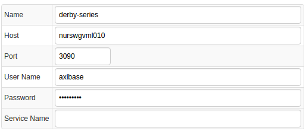
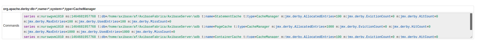
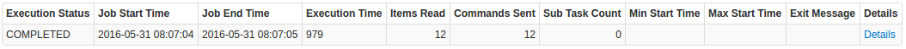
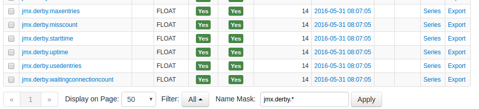
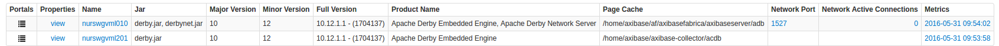
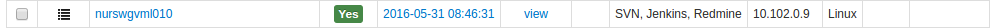
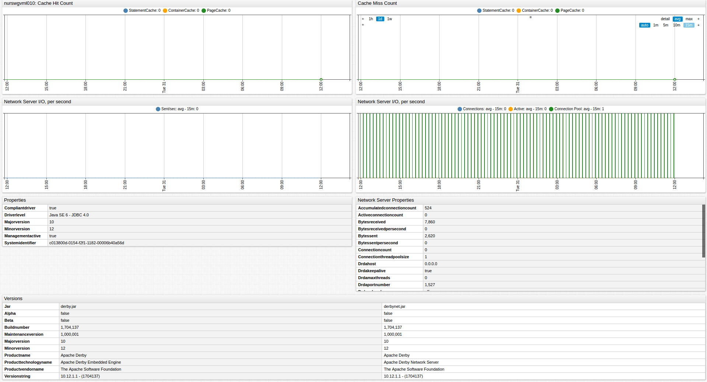

# Derby Database

## Overview

This document describes how to collect JMX metrics exposed by the [Apache Derby Database](https://db.apache.org/derby/)  for long-term retention and monitoring in the Axibase Time Series Database.

## Requirements

* Derby database `9+`

## Installation Steps

### Enable JMX in Java application

Configure your Java applications for JMX monitoring as described [here](../../jmx.md).

### Import Derby Job into Axibase Collector

* Open **Jobs:Import** and upload the [derby-job.xml](configs/derby_job.xml) file.

### Configure Derby JMX Connection

* Open the **Jobs:JMX** page and select the `jmx-derby` job.
* For each JMX Configuration:
* Provide connection parameters to the target Derby:

* Click the [Test] button and confirm the result:

### Schedule the Job

* Open the `JMX Job` page and click the [Run] button for the Derby JMX job.
* Make sure that the job status is `COMPLETED` and `Items Read` and `Sent commands` are greater than 0.

* If there are no errors, set job status to 'Enabled' and save the job.

### Verify Metrics in ATSD

* Login into ATSD.
* Click on Metrics tab and filter metrics by name `jmx.derby*`.

## Viewing Data in ATSD

### Metrics

* List of collected [Derby metrics](metric-list.md)

### Properties

* List of collected [Derby properties](properties-list.md)

### Entity group

* Open **Admin:Entity Groups**, click the [Import] button, and upload  [derby_entity_group.xml](configs/derby_entity_group.xml).
* Select the imported `apache-derby-databases` group.
* Verify that the group contains your Derby hosts.

### Entity Views

* Open **Configuration:Entity Views**, click the [Import] button, and upload  [derby_entity_view.xml](configs/derby_entity_view.xml)
* Select the imported `Apache Derby Databases` view.
* Select the Entity Group that you created earlier.
* Click on [View] button and browse information about your entities:

### Portal

* Open **Configuration: Portals**, click the [Import] button, and upload [derby_portal.xml](configs/derby_portal.xml).
* Click the Assign link and associate the portal with the entity group you created earlier.
* Open Entity tabs, find the java application by name, and click on it's portal icon.

[**Derby Live Portal**](http://apps.axibase.com/chartlab/c4412a78)

