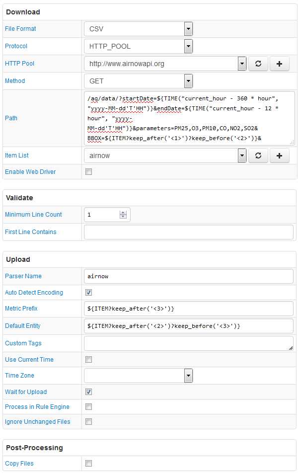

# FILE Job Example: AirNow Climate and Pollution Statistics

## Overview

Download pollution statistics from [airnow.gov](https://www.airnow.gov/) for a collection of cities and metropolitan areas in the U.S.

The Path field contains the `${ITEM}` placeholder so that multiple areas, defined in an item list, can be queried with one configuration.

The `$TIME()` function is used to set a relative time interval, 15 days, from the current time in order to override provisional (estimated) data with revised values.

Each element in the item list serializes multiple settings in one string such as bounding box coordinates, city name, and metric prefix.

API key is required to access this data source.

The configuration uses the HTTP pool to increase timeout to 180 seconds.

## File

### URI

Template: `/aq/data/?startDate=${TIME("current_hour - 360 * hour", "yyyy-MM-dd'T'HH")}&endDate=${TIME("current_hour - 12 * hour", "yyyy-MM-dd'T'HH")}&parameters=PM25,O3,PM10,CO,NO2,SO2&BBOX=${ITEM?keep_after('<1>')?keep_before('<2>')}&dataType=C&format=text/csv&API_KEY=****`

[Example](http://www.airnowapi.org:80/aq/data/?startDate=2016-06-22T15&endDate=2016-07-07T03&parameters=PM25,O3,PM10,CO,NO2,SO2&BBOX=-122.3978,37.7658,-122.3978,37.7658&dataType=C&format=text/csv&API_KEY=****)

### Local Copy

[Output.csv](Output.csv)

### Content

```ls
"37.7658","-122.3978","2016-06-22T15:00","PM2.5","8.4","UG/M3"
"37.7658","-122.3978","2016-06-22T15:00","OZONE","23.0","PPB"
"37.7658","-122.3978","2016-06-22T15:00","NO2","5.0","PPB"
"37.7658","-122.3978","2016-06-22T15:00","CO","0.39","PPM"
"37.7658","-122.3978","2016-06-22T16:00","PM2.5","8.7","UG/M3"
"37.7658","-122.3978","2016-06-22T16:00","OZONE","23.0","PPB"
"37.7658","-122.3978","2016-06-22T16:00","NO2","6.0","PPB"
"37.7658","-122.3978","2016-06-22T16:00","CO","0.41","PPM"
```

## Configuration

* [FILE job configuration](airnow-job.xml). Import xml into Collector.
* [CSV Parser](airnow-parser.xml). Import xml into ATSD.

## Screenshot


