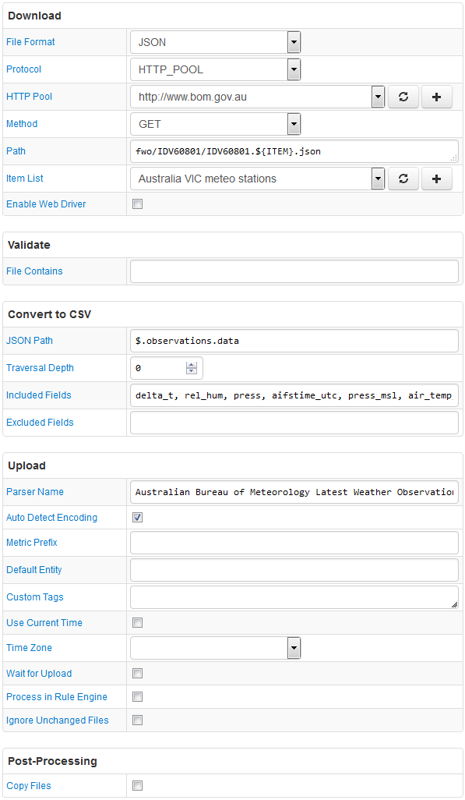

# FILE Job Example: Australian Bureau of Meteorology (JSON)

## Overview

Download climate observations for the Australian Bureau of Meteorology (BOM) stations located in Victoria province.

The Path field contains the `${ITEM}` placeholder so that multiple stations, defined in an item list, can be queried with one configuration.

## File

### URI

Template: `http://www.bom.gov.au:80/fwo/IDV60801/IDV60801.${ITEM}.json`

[Example](http://www.bom.gov.au:80/fwo/IDV60801/IDV60801.94693.json)

### Local Copy

[IDV60801.94693.json](IDV60801.94693.json)

### Content

```json
{
    "observations": {
    "notice": [
    {
    "copyright": "Copyright Commonwealth of Australia 2016, Bureau of Meteorology. For more information see: http://www.bom.gov.au/other/copyright.shtml http://www.bom.gov.au/other/disclaimer.shtml",
    "copyright_url": "http://www.bom.gov.au/other/copyright.shtml",
    "disclaimer_url": "http://www.bom.gov.au/other/disclaimer.shtml",
    "feedback_url": "http://www.bom.gov.au/other/feedback"
    }
    ],
    "header": [
    {
    "refresh_message": "Issued at  9:02 pm EST Wednesday  6 July 2016",
    "ID": "IDV60801",
    "main_ID": "IDV60800",
    "name": "Mildura",
    "state_time_zone": "VIC",
    "time_zone": "EST",
    "product_name": "Weather Observations",
    "state": "Victoria"
    }
    ],
    "data": [
    {
    "sort_order": 0,
    "wmo": 94693,
    "name": "Mildura",
    "history_product": "IDV60801",
    "local_date_time": "06/09:00pm",
    "local_date_time_full": "20160706210000",
    "aifstime_utc": "20160706110000",
    "lat": -34.2,
    "lon": 142.1,
    "apparent_t": 7.0,
    "cloud": "-",
    "cloud_base_m": null,
    "cloud_oktas": null,
    "cloud_type": "-",
    "cloud_type_id": null,
    "delta_t": 1.1,
    "gust_kmh": 17,
    "gust_kt": 9,
    "air_temp": 10.0,
    "dewpt": 7.8,
    "press": 1022.3,
    "press_msl": 1022.3,
    "press_qnh": 1022.2,
    "press_tend": "S",
    "rain_trace": "0.0",
    "rel_hum": 86,
    "sea_state": "-",
    "swell_dir_worded": "-",
    "swell_height": null,
    "swell_period": null,
    "vis_km": "10",
    "weather": "-",
    "wind_dir": "SW",
    "wind_spd_kmh": 13,
    "wind_spd_kt": 7
    },
    {
    "sort_order": 1,
    "wmo": 94693,
    "name": "Mildura",
    "history_product": "IDV60801",
    "local_date_time": "06/08:30pm",
    "local_date_time_full": "20160706203000",
    "aifstime_utc": "20160706103000",
    "lat": -34.2,
    "lon": 142.1,
    "apparent_t": 7.5,
    "cloud": "-",
    "cloud_base_m": null,
    "cloud_oktas": null,
    "cloud_type": "-",
    "cloud_type_id": null,
    "delta_t": 1.3,
    "gust_kmh": 20,
    "gust_kt": 11,
    "air_temp": 10.5,
    "dewpt": 7.7,
    "press": 1022.1,
    "press_msl": 1022.1,
    "press_qnh": 1022.0,
    "press_tend": "-",
    "rain_trace": "0.0",
    "rel_hum": 83,
    "sea_state": "-",
    "swell_dir_worded": "-",
    "swell_height": null,
    "swell_period": null,
    "vis_km": "10",
    "weather": "-",
    "wind_dir": "SW",
    "wind_spd_kmh": 13,
    "wind_spd_kt": 7
    }
    ]
    }
}
```

## Configuration

* [FILE job configuration](australia-bom-job.xml). Import xml into Collector.
* [CSV Parser](australia-bom-parser.xml). Import xml into ATSD.

## Screenshot


