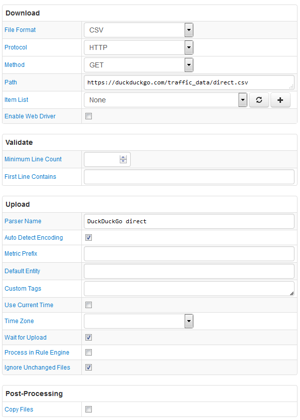

# FILE Job Example: Search Engine Statistics

## Overview

Download a Sunspot Daily Count report in a CSV file and upload it into ATSD.

## File

### URI

`https://duckduckgo.com/traffic_data/direct.csv`

### Local Copy

[direct.csv](direct.csv)

### First Lines

```ls
Date,Queries
2010-04-01,33209
2010-04-02,35873
2010-04-03,34230
```

## Configuration

* [FILE job configuration](duckduckgo-job.xml). Import xml into Collector.
* [CSV Parser](duckduckgo-parser.xml). Import xml into ATSD.

## Screenshot


