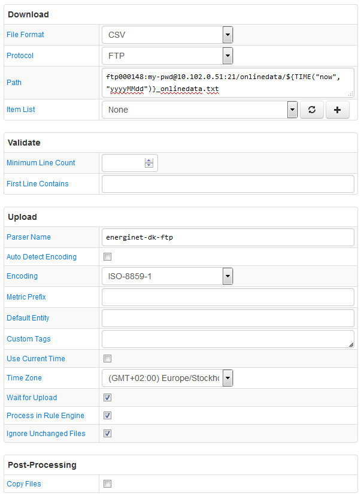

# FILE Job Example: Energinet Market Data

## Overview

Download 5-minute metering data (new files only) from the energinet.dk FTP server and upload it into ATSD.

`http://www.energinet.dk/EN/El/Engrosmarked/Udtraek-af-markedsdata/Sider/Femminutters-maalinger.aspx`

## File

### URI

Template: `ftp000148:my-pwd@10.102.0.51:21/onlinedata/${TIME("now", "yyyyMMdd")}_onlinedata.txt`

Example: `ftp000148:my-pwd@10.102.0.51:21/onlinedata/20160609_onlinedata.txt`

### Local Copy

[20160609_onlinedata.txt](20160609_onlinedata.txt)

### First Lines

```ls
 1 Centrale kraftværker DK1
 2 Centrale kraftværker DK2
 3 Decentrale kraftværker DK1
 4 Decentrale kraftværker DK2
 5 Vindmøller  DK1
 6 Vindmøller  DK2
 7 Udveksling Jylland-Norge
 8 Udveksling Jylland-Sverige
 9 Udveksling Jylland-Tyskland
10 Udveksling Sjælland-Sverige
11 Udveksling Sjælland-Tyskland
12 Udveksling Bornholm-Sverige
13 Udveksling Fyn-Sjaelland
14 Temperatur i Malling
15 Vindhastighed i Malling
16 CO2 udledning
17 Havmøller  DK
18 Landmøller  DK
19 Solceller DK1
20 Solceller DK2

Dato og tid      ;      1 ;      2 ;      3 ;      4 ;      5 ;      6 ;      7 ;      8 ;      9 ;     10 ;     11 ;     12 ;     13 ;     14 ;     15 ;     16 ;     17 ;     18 ;     19 ;     20 ;
2016-06-09 00:00 ;    508 ;     16 ;    120 ;    100 ;    405 ;    106 ;   1411 ;   -261 ;    251 ;   -101 ;    441 ;      8 ;   -566 ;     11 ;      4 ;    241 ;    313 ;    198 ;      0 ;      0 ;
2016-06-09 00:05 ;    472 ;     16 ;    121 ;     99 ;    389 ;    105 ;   1417 ;   -102 ;     68 ;    -34 ;    381 ;      9 ;   -558 ;     11 ;      5 ;    211 ;    301 ;    194 ;      0 ;      0 ;
2016-06-09 00:10 ;    428 ;     17 ;    120 ;     99 ;    378 ;    115 ;   1405 ;    -86 ;    101 ;    -29 ;    378 ;      6 ;   -550 ;     11 ;      4 ;    206 ;    300 ;    193 ;      0 ;      0 ;
2016-06-09 00:15 ;    405 ;     16 ;    121 ;    100 ;    361 ;    114 ;   1392 ;    -43 ;     88 ;    -11 ;    378 ;      8 ;   -542 ;     11 ;      3 ;    201 ;    288 ;    187 ;      0 ;      0 ;
```

## Configuration

* [FILE job configuration](energinet-ftp-job.xml). Import xml into Collector.
* [CSV Parser](energinet-ftp-parser.xml). Import xml into ATSD.

## Screenshot


