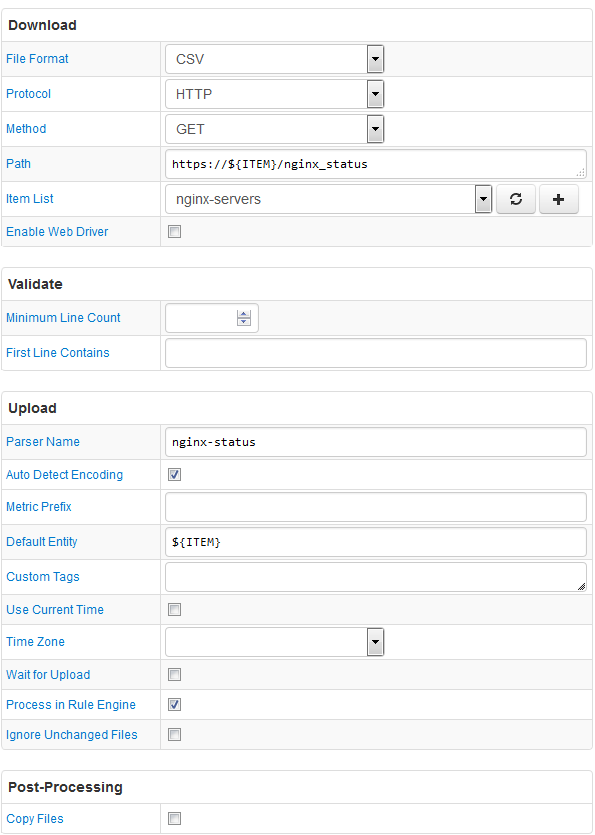

# FILE Job Example: nginx Web Server Basic Statistics

## Overview

Download basic statistics from an nginx web server. Parse plain text file into series commands.

The Path field contains the `${ITEM}` placeholder so that multiple nginx servers, defined in an item list, can be queried with one configuration.

## File

### URI

`https://example.com/nginx_status`

### Local Copy

[nginx_status](nginx_status)

### Content

```ls
Active connections: 7
server accepts handled requests
 1308441 1308441 342390
Reading: 0 Writing: 1 Waiting: 6
```

## Configuration

* [FILE job configuration](nginx-job.xml). Import xml into Collector.
* [CSV Parser](nginx-parser.xml). Import xml into ATSD.

## Screenshot


