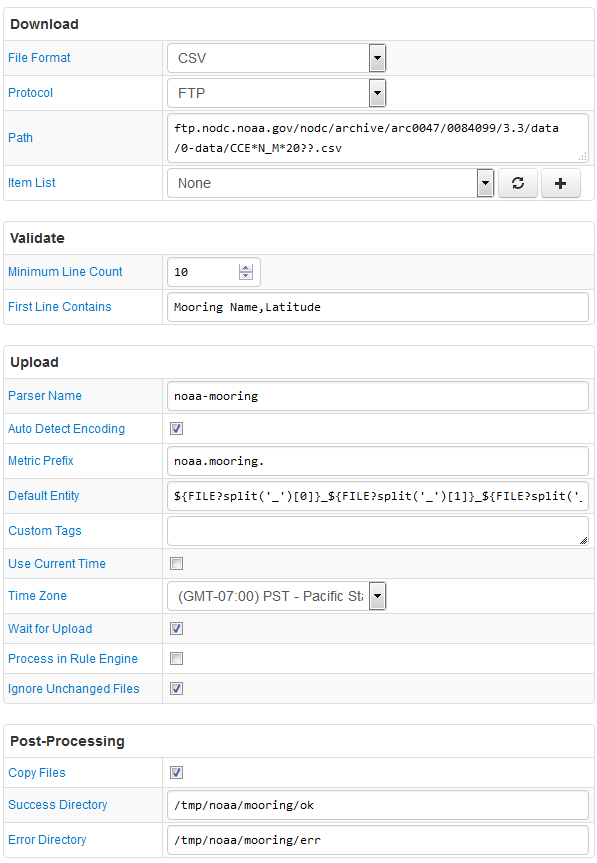

# FILE Job Example: National Oceanic and Atmospheric Administration (NOAA) Mooring Data

## Overview

Download high-resolution ocean and atmosphere pCO2 time-series measurements for a particular
mooring **CCE2_121W_34N** from a NOAA FTP server at `ftp://ftp.nodc.noaa.gov/nodc/archive/arc0047/0084099/3.3/data/0-data/`.

FTP server access is anonymous.

The Path field contains a wildcard to match multiple files that provide data in the expected format.

Default Entity is extracted from the file name.

The files are copied to a success or error directory on completion.

The parser discards reserved (invalid) values: -999 and -9.999.

## File

### URI

Template: `ftp.nodc.noaa.gov/nodc/archive/arc0047/0084099/3.3/data/0-data/CCE*N_M*20??.csv`

Example: `ftp://ftp.nodc.noaa.gov/nodc/archive/arc0047/0084099/3.3/data/0-data/CCE2_121W_34N_Mar2012_Mar2013.csv`

### Local Copy

[CCE2_121W_34N_Mar2012_Mar2013.csv](CCE2_121W_34N_Mar2012_Mar2013.csv)

### Content

```ls
Mooring Name,Latitude,Longitude,Date,Time,xCO2  SW (wet) (umol/mol),QF,H2O (mmol/mol),xCO2  Air (wet) (umol/mol),QF,H2O (mmol/mol),Licor Atm Pressure  (hPa),Licor Temp (C),% O2,SST (C),Salinity,xCO2  SW (dry) (umol/mol),xCO2  Air (dry) (umol/mol),fCO2  SW (sat) uatm,fCO2  Air (sat) uatm,dfCO2,pCO2 SW (sat) uatm,pCO2 Air (sat) uatm,dpCO2
CCE2_121W_34N,34.324,-120.816,3/24/12,6:17,533.9,2,2.47,400.3,2,2.25,1017.2,13,99.45,11.378,33.744,535.2,401.2,528.3,396.1,132.2,530.3,397.6,132.7
CCE2_121W_34N,34.324,-120.816,3/24/12,9:17,559.6,2,2.65,399.3,2,2.48,1017,12,98.8,11.201,33.748,561.1,400.3,553.8,395.1,158.7,555.9,396.6,159.3
CCE2_121W_34N,34.324,-120.816,3/24/12,12:17,521.7,2,2.73,398.9,2,2.52,1016.1,11.9,98.63,11.136,33.704,523.1,399.9,515.9,394.4,121.5,517.8,395.9,121.9
CCE2_121W_34N,34.324,-120.816,3/24/12,15:17,563.1,2,2.78,399.1,2,2.62,1015.7,11.9,98.12,11.094,33.744,564.6,400.2,556.6,394.5,162.1,558.8,396,162.8
```

## Configuration

* [FILE job configuration](noaa-mooring-job.xml). Import xml into Collector.
* [CSV Parser](noaa-mooring-parser.xml). Import xml into ATSD.

## Screenshot


