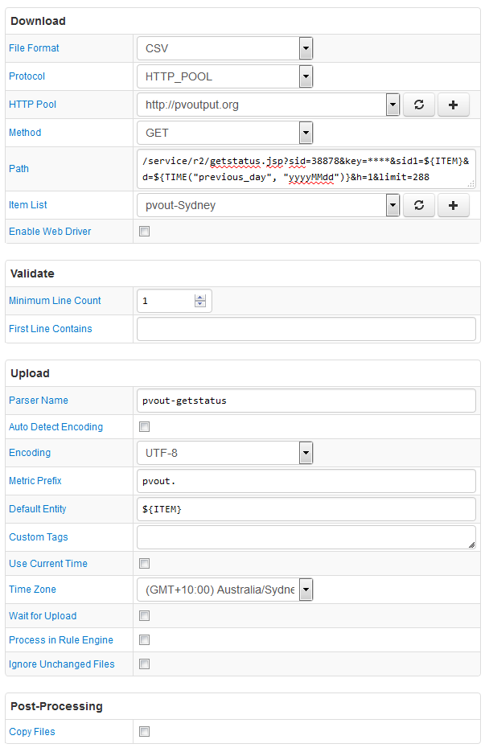

# FILE Job Example: pvoutput.org status API

## Overview

Download solar system status for a given collection of devices.

The file uses a semi-colon as a line break.

API key is required.

## File

### URI

`http://pvoutput.org/service/r2/getstatus.jsp?sid=38878&key=****&sid1=507&d=20160705&h=1&limit=288`

### Local Copy

[getstatus.txt](getstatus.txt)

### First Lines

```ls
20160705,17:10,8479,169.580,NaN,0,0.000,NaN,NaN,NaN,NaN;20160705,17:00,8479,169.580,NaN,89,1.780,NaN,NaN,NaN,NaN
```

## Configuration

* [FILE job configuration](pvout-job.xml). Import xml into Collector.
* [CSV Parser](pvout-parser.xml). Import xml into ATSD.

## Screenshot


