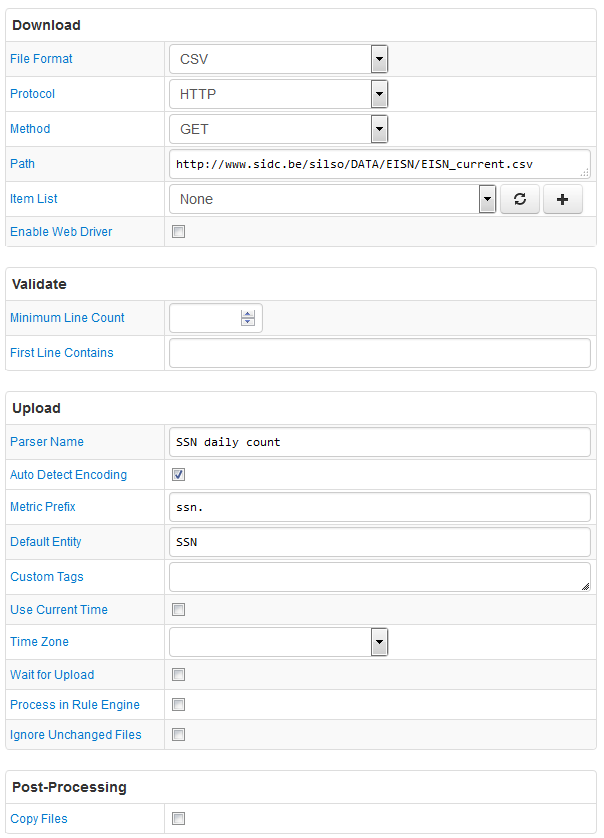

# FILE Job Example: Sunspot Daily Count

## Overview

Download Sunspot Daily Count report in a CSV file and upload it into ATSD.

## File

### URI

[http://www.sidc.be/silso/DATA/EISN/EISN_current.csv](http://www.sidc.be/silso/DATA/EISN/EISN_current.csv)

### Local Copy

[EISN_current.csv](EISN_current.csv)

### First Lines

```ls
2016,7,1,2016.499,0,  0.0,30,31,
2016,7,2,2016.501,0,  0.0,26,37,
2016,7,3,2016.504,0,  1.8,30,40,
```

## Configuration

* [FILE job configuration](ssn-job.xml). Import xml into Collector.
* [CSV Parser](ssn-parser.xml). Import xml into ATSD.

## Screenshot


