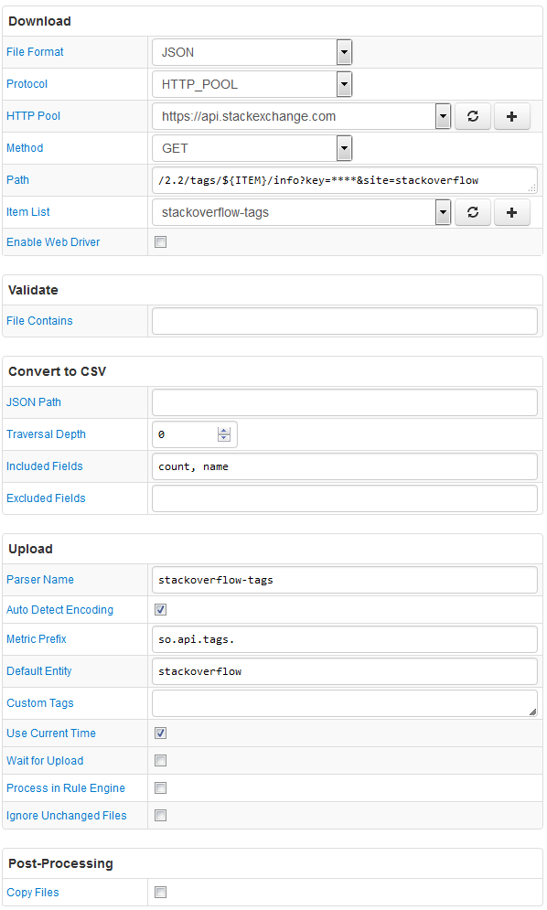

# FILE Job Example: Stackoverflow Tags

## Overview

Download Q&A activity statistics for a set of stackoverflow tags in JSON format.

API key is required.

Included fields are `count, name`.

`count` becomes a metric and `name` becomes a series tag.

Records are timestamped with the current time.

## File

### URI

`https://api.stackexchange.com/2.2/tags/docker/info?key=****&site=stackoverflow`

### Local Copy

[info.json](info.json)

### Content

```json
{
    "items": [{
    "has_synonyms": false,
    "is_moderator_only": false,
    "is_required": false,
    "count": 13158,
    "name": "docker"
    }],
    "has_more": false,
    "quota_max": 10000,
    "quota_remaining": 9999
}
```

### CSV File sent into ATSD

```ls
count,name
13158,docker
```

## Configuration

* [FILE job configuration](stackoverflow-job.xml). Import xml into Collector.
* [CSV Parser](stackoverflow-parser.xml). Import xml into ATSD.

## Screenshot


