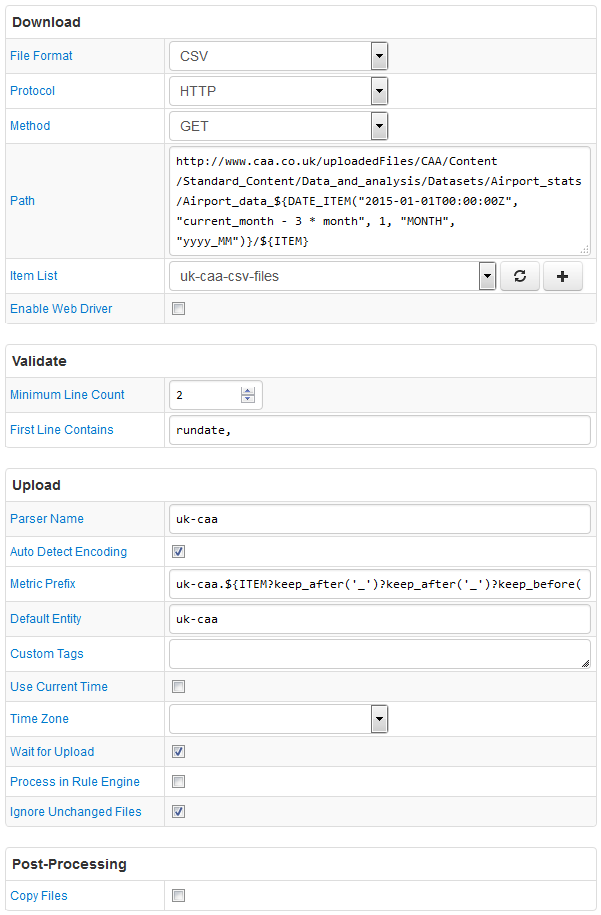

# FILE Job Example: UK Airport Statistics

## Overview

Download airport traffic, passenger, and cargo statistics from the UK's [Civil Aviation Authority](http://www.caa.co.uk/Data-and-analysis/UK-aviation-market/Airports/Datasets/UK-Airport-data/Airport-data-2016-03/).

The data is available to be downloaded starting with January 2015 onwards.

The Path field contains both `${DATE_ITEM()}` and `${ITEM}` placeholders so that different reports for multiple reporting periods can be queried with one configuration.

The `${ITEM}` placeholder returns files which are included in the Path and is also used in the metric prefix, so that metrics contained in one file are grouped together with a metric naming convention.

`${DATE_ITEM()}` function returns an array of dates, for example from 2015_01 until 2016_03. The last date in the list is determined dynamically based on current time.

## Item List Contents

```txt
Table_01_Size_of_UK_Airports.csv
Table_02_2_Summary_of_Activity_at_UK_Airports.csv
Table_03_Aircraft_Movements.csv
Table_04_Transport_Movements_by_Type.csv
Table_05_Air_Transport_Movements.csv
Table_06_Air_Transport_Movements_vs_Prev_Year.csv
Table_07_Airport_Landings_Diverted.csv
Table_08_Air_Pax_by_Type_and_Nat_of_Op.csv
Table_09_Terminal_and_Transit_Pax.csv
Table_10_1_EU_and_Other_Intl_Terminal_Pax_Traffic.csv
Table_10_2_Domestic_Terminal_Pax_Traffic.csv
Table_11_International_Air_Pax_Traffic_to_from_UK_by_Country.csv
Table_12_1_Intl_Air_Pax_Traffic_Route_Analysis.csv
Table_12_3_Domestic_Air_Pax_Route_Analysis_by_Each_Reporting_Airport.csv
Table_13_Freight_by_type_and_Nat_of_Op.csv
Table_14_Intl_and_Domestic_Freight.csv
Table_15_Freight_by_Aircraft_Configuration.csv
Table_16_Mail_by_Type_and_Nat_of_Op.csv
Table_17_Intl_and_Domestic_Mail.csv
Table_18_Mail_by_Aircraft_Configuration.csv
Table_19_Pax_and_Air_Transport_Movements_Split_by_Fixed_and_Rotary_Wing_Aircraft.csv
```

The following files have a different format and are excluded from the configuration:

```txt
Table_02_1_Main_Outputs_of_UK_Airports.csv
Table_06_Air_Transport_Movements_vs_Prev_Year.csv
Table_07_Airport_Landings_Diverted.csv
Table_11_International_Air_Pax_Traffic_to_from_UK_by_Country.csv
```

## File

### URI

Template:

```elm
http://www.caa.co.uk/uploadedFiles/CAA/Content/Standard_Content/Data_and_analysis/Datasets/Airport_stats/Airport_data_${DATE_ITEM("2015-01-01T00:00:00Z", "current_month - 3 * month", 1, "MONTH", "yyyy_MM")}/${ITEM}`
```

### Links for 2016_01

`http://www.caa.co.uk/uploadedFiles/CAA/Content/Standard_Content/Data_and_analysis/Datasets/Airport_stats/Airport_data_2016_03/Table_01_Size_of_UK_Airports.csv`

`http://www.caa.co.uk/uploadedFiles/CAA/Content/Standard_Content/Data_and_analysis/Datasets/Airport_stats/Airport_data_2016_03/Table_02_1_Main_Outputs_of_UK_Airports.csv`

`http://www.caa.co.uk/uploadedFiles/CAA/Content/Standard_Content/Data_and_analysis/Datasets/Airport_stats/Airport_data_2016_03/Table_02_2_Summary_of_Activity_at_UK_Airports.csv`

`http://www.caa.co.uk/uploadedFiles/CAA/Content/Standard_Content/Data_and_analysis/Datasets/Airport_stats/Airport_data_2016_03/Table_03_Aircraft_Movements.csv`

`http://www.caa.co.uk/uploadedFiles/CAA/Content/Standard_Content/Data_and_analysis/Datasets/Airport_stats/Airport_data_2016_03/Table_04_Transport_Movements_by_Type.csv`

`http://www.caa.co.uk/uploadedFiles/CAA/Content/Standard_Content/Data_and_analysis/Datasets/Airport_stats/Airport_data_2016_03/Table_05_Air_Transport_Movements.csv`

`http://www.caa.co.uk/uploadedFiles/CAA/Content/Standard_Content/Data_and_analysis/Datasets/Airport_stats/Airport_data_2016_03/Table_06_Air_Transport_Movements_vs_Prev_Year.csv`

`http://www.caa.co.uk/uploadedFiles/CAA/Content/Standard_Content/Data_and_analysis/Datasets/Airport_stats/Airport_data_2016_03/Table_07_Airport_Landings_Diverted.csv`

`http://www.caa.co.uk/uploadedFiles/CAA/Content/Standard_Content/Data_and_analysis/Datasets/Airport_stats/Airport_data_2016_03/Table_08_Air_Pax_by_Type_and_Nat_of_Op.csv`

`http://www.caa.co.uk/uploadedFiles/CAA/Content/Standard_Content/Data_and_analysis/Datasets/Airport_stats/Airport_data_2016_03/Table_09_Terminal_and_Transit_Pax.csv`

`http://www.caa.co.uk/uploadedFiles/CAA/Content/Standard_Content/Data_and_analysis/Datasets/Airport_stats/Airport_data_2016_03/Table_10_1_EU_and_Other_Intl_Terminal_Pax_Traffic.csv`

`http://www.caa.co.uk/uploadedFiles/CAA/Content/Standard_Content/Data_and_analysis/Datasets/Airport_stats/Airport_data_2016_03/Table_11_International_Air_Pax_Traffic_to_from_UK_by_Country.csv`

`http://www.caa.co.uk/uploadedFiles/CAA/Content/Standard_Content/Data_and_analysis/Datasets/Airport_stats/Airport_data_2016_03/Table_12_1_Intl_Air_Pax_Traffic_Route_Analysis.csv`

`http://www.caa.co.uk/uploadedFiles/CAA/Content/Standard_Content/Data_and_analysis/Datasets/Airport_stats/Airport_data_2016_03/Table_12_2_Domestic_Air_Pax_Traffic_Route_Analysis.csv`

`http://www.caa.co.uk/uploadedFiles/CAA/Content/Standard_Content/Data_and_analysis/Datasets/Airport_stats/Airport_data_2016_03/Table_12_3_Domestic_Air_Pax_Route_Analysis_by_Each_Reporting_Airport.csv`

`http://www.caa.co.uk/uploadedFiles/CAA/Content/Standard_Content/Data_and_analysis/Datasets/Airport_stats/Airport_data_2016_03/Table_13_Freight_by_type_and_Nat_of_Op.csv`

`http://www.caa.co.uk/uploadedFiles/CAA/Content/Standard_Content/Data_and_analysis/Datasets/Airport_stats/Airport_data_2016_03/Table_14_Intl_and_Domestic_Freight.csv`

`http://www.caa.co.uk/uploadedFiles/CAA/Content/Standard_Content/Data_and_analysis/Datasets/Airport_stats/Airport_data_2016_03/Table_15_Freight_by_Aircraft_Configuration.csv`

`http://www.caa.co.uk/uploadedFiles/CAA/Content/Standard_Content/Data_and_analysis/Datasets/Airport_stats/Airport_data_2016_03/Table_16_Mail_by_Type_and_Nat_of_Op.csv`

`http://www.caa.co.uk/uploadedFiles/CAA/Content/Standard_Content/Data_and_analysis/Datasets/Airport_stats/Airport_data_2016_03/Table_17_Intl_and_Domestic_Mail.csv`

`http://www.caa.co.uk/uploadedFiles/CAA/Content/Standard_Content/Data_and_analysis/Datasets/Airport_stats/Airport_data_2016_03/Table_18_Mail_by_Aircraft_Configuration.csv`

`http://www.caa.co.uk/uploadedFiles/CAA/Content/Standard_Content/Data_and_analysis/Datasets/Airport_stats/Airport_data_2016_03/Table_19_Pax_and_Air_Transport_Movements_Split_by_Fixed_and_Rotary_Wing_Aircraft.csv`

### Local Copy

* [Table_01_Size_of_UK_Airports.csv](Table_01_Size_of_UK_Airports.csv)
* [Table_02_1_Main_Outputs_of_UK_Airports.csv](Table_02_1_Main_Outputs_of_UK_Airports.csv)
* [Table_02_2_Summary_of_Activity_at_UK_Airports.csv](Table_02_2_Summary_of_Activity_at_UK_Airports.csv)
* [Table_03_Aircraft_Movements.csv](Table_03_Aircraft_Movements.csv)
* [Table_04_Transport_Movements_by_Type.csv](Table_04_Transport_Movements_by_Type.csv)
* [Table_05_Air_Transport_Movements.csv](Table_05_Air_Transport_Movements.csv)
* [Table_06_Air_Transport_Movements_vs_Prev_Year.csv](Table_06_Air_Transport_Movements_vs_Prev_Year.csv)
* [Table_07_Airport_Landings_Diverted.csv](Table_07_Airport_Landings_Diverted.csv)
* [Table_08_Air_Pax_by_Type_and_Nat_of_Op.csv](Table_08_Air_Pax_by_Type_and_Nat_of_Op.csv)
* [Table_09_Terminal_and_Transit_Pax.csv](Table_09_Terminal_and_Transit_Pax.csv)
* [Table_10_1_EU_and_Other_Intl_Terminal_Pax_Traffic.csv](Table_10_1_EU_and_Other_Intl_Terminal_Pax_Traffic.csv)
* [Table_10_2_Domestic_Terminal_Pax_Traffic.csv](Table_10_2_Domestic_Terminal_Pax_Traffic.csv)
* [Table_11_International_Air_Pax_Traffic_to_from_UK_by_Country.csv](Table_11_International_Air_Pax_Traffic_to_from_UK_by_Country.csv)
* [Table_12_1_Intl_Air_Pax_Traffic_Route_Analysis.csv](Table_12_1_Intl_Air_Pax_Traffic_Route_Analysis.csv)
* [Table_12_3_Domestic_Air_Pax_Route_Analysis_by_Each_Reporting_Airport.csv](Table_12_3_Domestic_Air_Pax_Route_Analysis_by_Each_Reporting_Airport.csv)
* [Table_13_Freight_by_type_and_Nat_of_Op.csv](Table_13_Freight_by_type_and_Nat_of_Op.csv)
* [Table_14_Intl_and_Domestic_Freight.csv](Table_14_Intl_and_Domestic_Freight.csv)
* [Table_15_Freight_by_Aircraft_Configuration.csv](Table_15_Freight_by_Aircraft_Configuration.csv)
* [Table_16_Mail_by_Type_and_Nat_of_Op.csv](Table_16_Mail_by_Type_and_Nat_of_Op.csv)
* [Table_17_Intl_and_Domestic_Mail.csv](Table_17_Intl_and_Domestic_Mail.csv)
* [Table_18_Mail_by_Aircraft_Configuration.csv](Table_18_Mail_by_Aircraft_Configuration.csv)
* [Table_19_Pax_and_Air_Transport_Movements_Split_by_Fixed_and_Rotary_Wing_Aircraft.csv](Table_19_Pax_and_Air_Transport_Movements_Split_by_Fixed_and_Rotary_Wing_Aircraft.csv)

### Content: Table_01_Size_of_UK_Airports.csv

```ls
rundate,reporting_period,airport_name,this_year_pax,this_year_total_pax_UK_airports,last_year_pax,last_year_total_pax_UK_airports
05-May-2016 09:23,201603,HEATHROW, 75382273 , 255339341 , 73693612 , 241853321
05-May-2016 09:23,201603,GATWICK, 40790754 , 255339341 , 38633115 , 241853321
05-May-2016 09:23,201603,MANCHESTER, 23513057 , 255339341 , 22300925 , 241853321
05-May-2016 09:23,201603,STANSTED, 23137198 , 255339341 , 20900098 , 241853321
```

## Configuration

* [FILE job configuration](uk-caa-job.xml). Import xml into Collector.
* [CSV Parser](uk-caa-parser.xml). Import xml into ATSD.

## Screenshot


