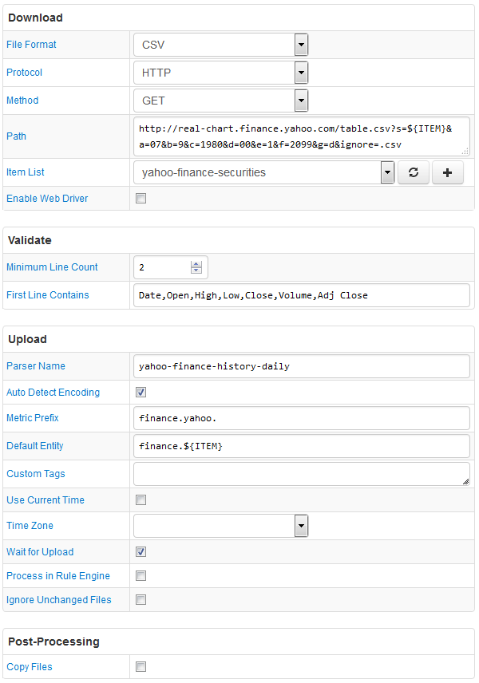

# FILE Job Example: History Daily OHLC Prices from Yahoo! Finance

## Overview

Download daily historical pricing information (OHLC) from [Yahoo! Finance](http://finance.yahoo.com/) for a collection of tickers:

* AAPL
* IBM
* MSFT
* GOOG
* FB
* AMZN

The Path field contains the `${ITEM}` placeholder so that multiple securities can be queried with one configuration.

## File

### URI

Template: `http://real-chart.finance.yahoo.com/table.csv?s=${ITEM}&a=07&b=9&c=1980&d=00&e=1&f=2099&g=d&ignore=.csv`

Example: `http://real-chart.finance.yahoo.com/table.csv?s=MSFT&a=07&b=9&c=2015&d=00&e=1&f=2099&g=d&ignore=.csv`

### Local Copy

[table.csv](table.csv)

### Content

```ls
Date,Open,High,Low,Close,Volume,Adj Close
2016-07-06,50.779999,51.540001,50.389999,51.380001,28151300,51.380001
2016-07-05,50.830002,51.279999,50.740002,51.169998,24400400,51.169998
2016-07-01,51.130001,51.720001,51.07,51.16,21396300,51.16
2016-06-30,50.720001,51.299999,50.50,51.169998,28334000,51.169998
2016-06-29,49.91,50.720001,49.799999,50.540001,31272000,50.540001
```

## Configuration

* [FILE job configuration](yahoo-finance-job.xml). Import xml into Collector.
* [CSV Parser](yahoo-finance-parser.xml). Import xml into ATSD.

## Screenshot


