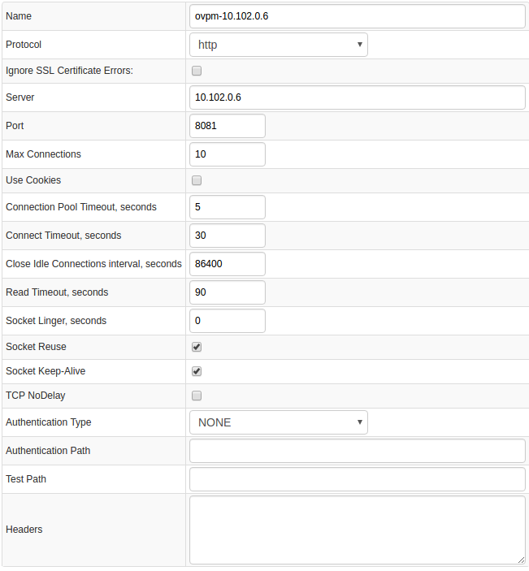
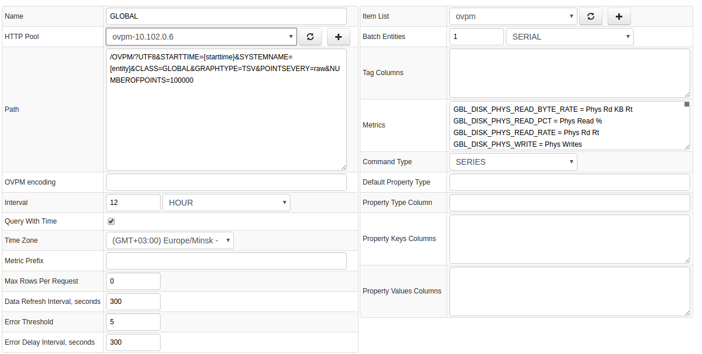
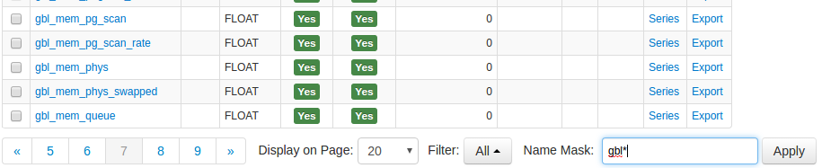
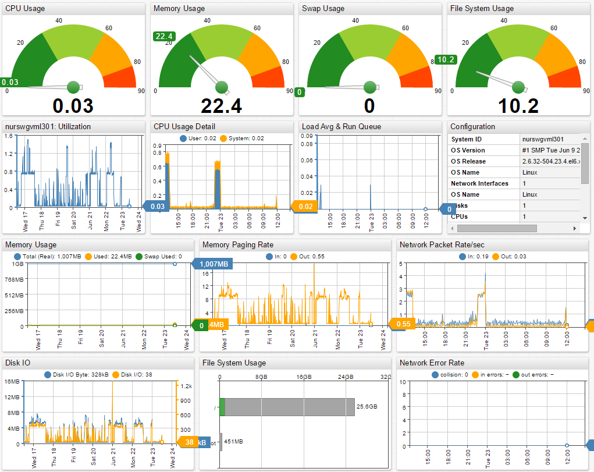
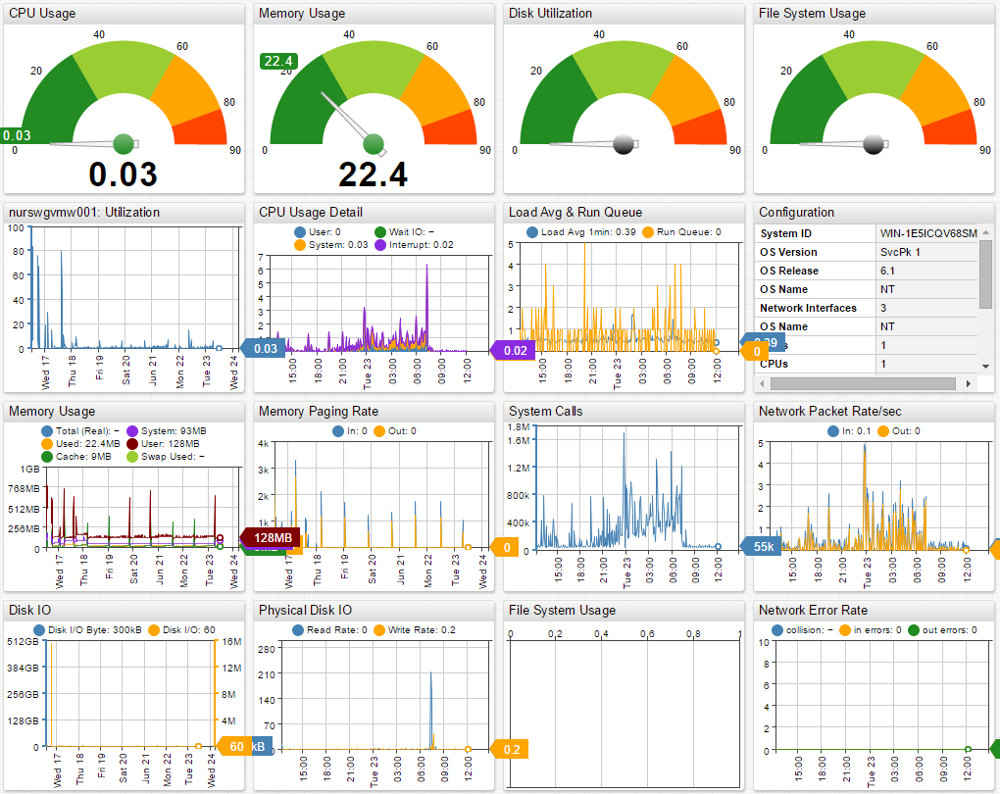

# HP OpenView

## Overview

[**HP OpenView Performance Manager**](https://h20392.www2.hpe.com/portal/swdepot/displayProductInfo.do?productNumber=PERFMINFO) provides an agent-based centralized data collection solution.

OVPM stores collected statistics in files on the local file system for a period of several months.

Axibase Collector queries the OVPM server for particular GLOBAL classes every 15 minutes to offload incremental data into the Axibase Time Series Database for long-term retention and operations analytics.

## Requirements

* HP OpenView Performance Manager `9.+`

## Installation steps

### Import HP OpenView JDBC job

* Open the **Jobs:Import** page and upload the [collector-jobs-ovpm-jobs.xml](collector-jobs-ovpm-jobs.xml) file.

### Configure HP Open View HTTP Pool

* Open the **Data Sources:HTTP Pools** page, select the `ovpm-10.102.0.6` database.
* Provide connection parameters to the target `ovpm-10.102.0.6` pool as displayed below:

### Verify Job Configuration

* Open the `ovpm-global` job.
* Set the HTTP Pool to `ovpm-10.102.0.6`.

* Choose an ATSD server if your Collector instance is connected to multiple ATSD servers.
* Save the Job.
* Open each configuration.
* Open the `ovpm` Item List and populate it with servers whose statistics you would like to collect.
* Click the **Test** button and review the output.

<!---

-->

### Schedule the Job

* Open the `OVPM Job` page and click the **Run** button for the `ovpm-global` job.
* Make sure that the job status is `COMPLETED` and the `Items Read` and `Sent commands` fields show a value greater than 0.

* If there are no errors, set job status to 'Enabled' and save the job.

### Verify Metrics in ATSD

* Log in to ATSD.
* Click on Metrics tab and filter metrics by the prefix `gbl_.*`

## Viewing Data in ATSD

### Metrics

* List of collected [HP OpenView metrics](metric-list.md)

<!--- ### Properties
* List of collected [HP OpenView properties](properties-list.md)
-->

## Entity Group List

* OVPM Linux
* OVPM Unix
* OVPM Windows

## Portal List

[OVPM Portal](https://apps.axibase.com/chartlab/f9d176ac/2/)

