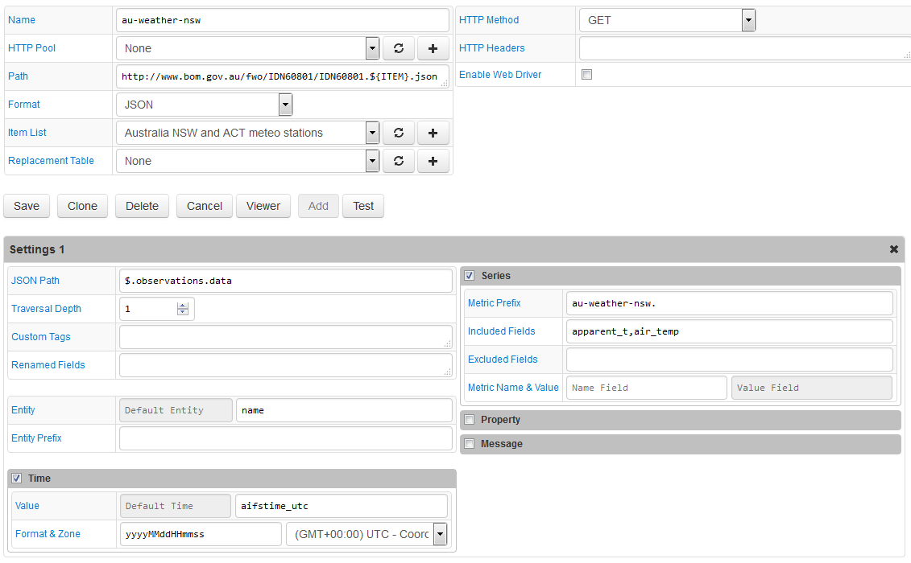

# JSON Job Example: Australia Bureau of Meteorology

## Overview

Download historical weather information from the [Bureau of Meteorology service](http://www.bom.gov.au) for a set of stations in New South Wales province.

The Path field contains the `${ITEM}` placeholder so that multiple stations in New South Wales province can be queried with one configuration.

## File

### URI

Template: `http://www.bom.gov.au/fwo/IDN60801/IDN60801.${ITEM}.json`

Example: `http://www.bom.gov.au/fwo/IDN60801/IDN60801.95695.json`

### Local Copy

[IDN60801.95695.json](IDN60801.95695.json)

### JSON Path

```javascript
$.observations.data
```

### Matched Object

```javascript
$['observations']['data']
```

```json
[
    {
    "sort_order": 0,
    "wmo": 95695,
    "name": "Wilcannia Airport",
    "history_product": "IDN60801",
    "local_date_time": "08/05:30am",
    "local_date_time_full": "20160708053000",
    "aifstime_utc": "20160707193000",
    "lat": -31.5,
    "lon": 143.4,
    "apparent_t": 8.2,
    "cloud": "-",
    "cloud_base_m": null,
    "cloud_oktas": null,
    "cloud_type": "-",
    "cloud_type_id": null,
    "delta_t": 0.7,
    "gust_kmh": 4,
    "gust_kt": 2,
    "air_temp": 8.8,
    "dewpt": 7.4,
    "press": 1020.3,
    "press_msl": 1020.3,
    "press_qnh": 1020.2,
    "press_tend": "-",
    "rain_trace": "0.2",
    "rel_hum": 91,
    "sea_state": "-",
    "swell_dir_worded": "-",
    "swell_height": null,
    "swell_period": null,
    "vis_km": "-",
    "weather": "-",
    "wind_dir": "CALM",
    "wind_spd_kmh": 0,
    "wind_spd_kt": 0
    },
    {
    "sort_order": 1,
    "wmo": 95695,
    "name": "Wilcannia Airport",
    "history_product": "IDN60801",
    "local_date_time": "08/05:00am",
    "local_date_time_full": "20160708050000",
    "aifstime_utc": "20160707190000",
    "lat": -31.5,
    "lon": 143.4,
    "apparent_t": 7.1,
    "cloud": "-",
    "cloud_base_m": null,
    "cloud_oktas": null,
    "cloud_type": "-",
    "cloud_type_id": null,
    "delta_t": 0.8,
    "gust_kmh": 9,
    "gust_kt": 5,
    "air_temp": 8.9,
    "dewpt": 7.2,
    "press": 1020.1,
    "press_msl": 1020.1,
    "press_qnh": 1020.0,
    "press_tend": "-",
    "rain_trace": "0.2",
    "rel_hum": 89,
    "sea_state": "-",
    "swell_dir_worded": "-",
    "swell_height": null,
    "swell_period": null,
    "vis_km": "-",
    "weather": "-",
    "wind_dir": "W",
    "wind_spd_kmh": 6,
    "wind_spd_kt": 3
    }
]
```

## Commands

```ls
series e:Wilcannia_Airport d:2016-07-07T19:30:00.000Z m:au-weather-nsw.air_temp=8.8 m:au-weather-nsw.apparent_t=8.2
series e:Wilcannia_Airport d:2016-07-07T19:00:00.000Z m:au-weather-nsw.air_temp=8.9 m:au-weather-nsw.apparent_t=7.1
series e:Wilcannia_Airport d:2016-07-07T18:30:00.000Z m:au-weather-nsw.air_temp=9 m:au-weather-nsw.apparent_t=6.7
...
series e:Tibooburra_Airport d:2016-07-07T19:30:00.000Z m:au-weather-nsw.air_temp=6
series e:Tibooburra_Airport d:2016-07-07T19:00:00.000Z m:au-weather-nsw.air_temp=6.3
series e:Tibooburra_Airport d:2016-07-07T18:30:00.000Z m:au-weather-nsw.air_temp=6.5
```

## Configuration

* [FILE job configuration](australia-weather-job.xml). Import xml into Collector.

## Screenshot


