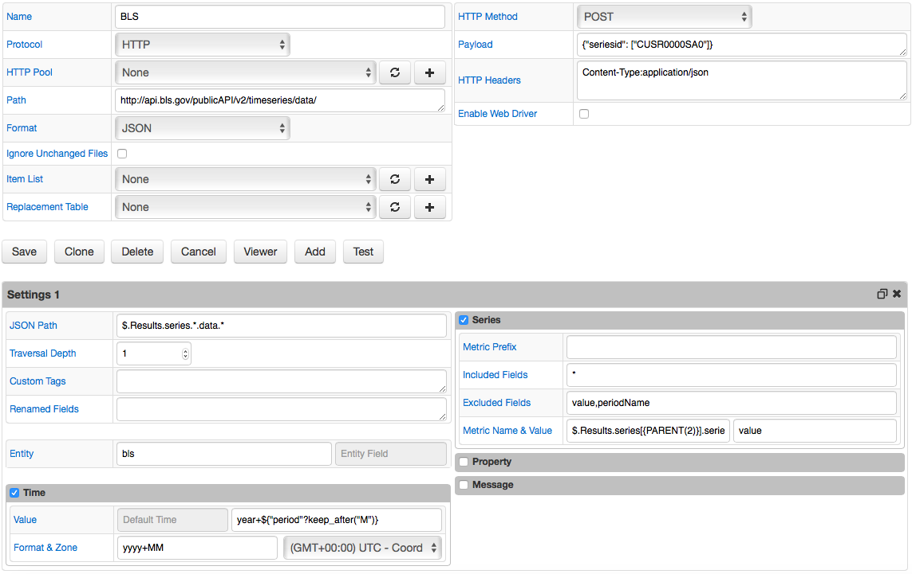

# JSON Job Example: BLS

## Overview

Download statistics from the [Bureau of Labor Statistics service](http://www.bls.gov).

## File

### URI

Example: `http://api.bls.gov/publicAPI/v2/timeseries/data/`

POST request headers:

```txt
Content-Type:application/json
```

POST request payload:

```json
{
    "seriesid": [
        "CUSR0000SA0"
    ]
}
```

### Local Copy

[bls.json](bls.json)

### JSON Path

```javascript
$.Results.series.*.data.*
```

### Matched Objects

```javascript
$['Results']['series'][0]['data'][0]
$['Results']['series'][0]['data'][1]
...
$['Results']['series'][0]['data'][N]
```

```json
[
    {
        "footnotes": [
            {}
        ],
        "period": "M09",
        "periodName": "September",
        "value": "241.002",
        "year": "2016"
    },
    {
        "footnotes": [
            {
                "code": "R",
                "text": "Revised"
            }
        ],
        "period": "M08",
        "periodName": "August",
        "value": "240.301",
        "year": "2016"
    },
    {
        "footnotes": [
            {
                "code": "R",
                "text": "Revised"
            }
        ],
        "period": "M07",
        "periodName": "July",
        "value": "239.810",
        "year": "2016"
    }
]
```

## Commands

```ls
series e:bls d:2016-09-01T00:00:00.000Z m:CUSR0000SA0=241.002
series e:bls d:2016-08-01T00:00:00.000Z m:CUSR0000SA0=240.301
series e:bls d:2016-07-01T00:00:00.000Z m:CUSR0000SA0=239.81
```

## Configuration

* [JSON job configuration](bls-job.xml). Import xml into Collector.

## Screenshot


