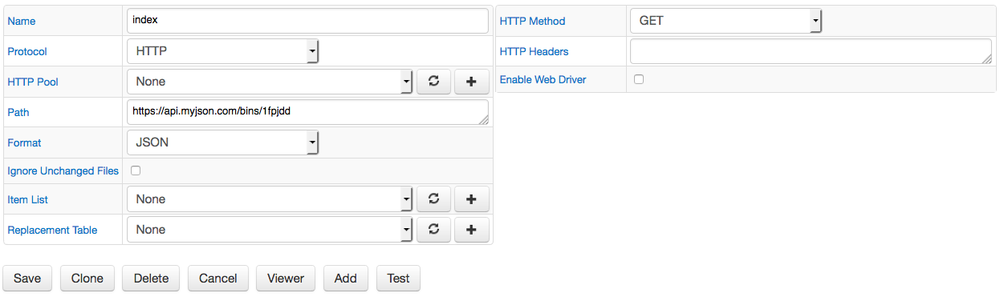
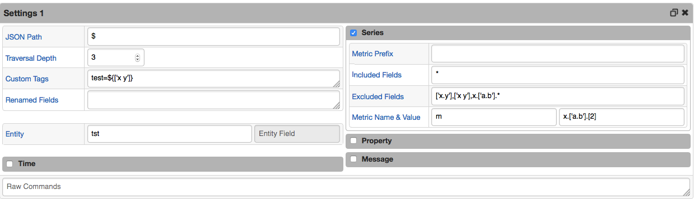
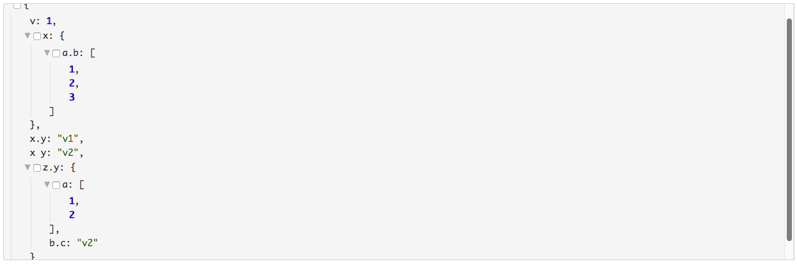
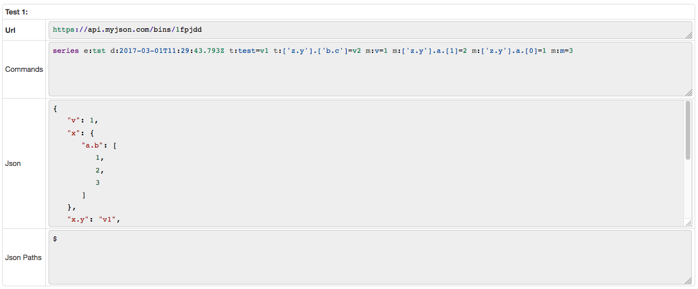

# JSON Job Example: Fields with non alphanumeric characters

## Overview

Since the fields with non-alphanumeric characters, excluding '_' and '-', are not accessible by name, use square brackets and single quotes to access the field, for example ['x.y'].

## JSON

```json

  "v": 1,
  "x": {
    "a.b": [
      1,
      2,
      3
    ]
  },
  "x.y": "v1",
  "x y": "v2",
  "z.y": {
    "a": [
      1,
      2
    ],
    "b.c": "v2"
  }
}{
```

[JSON](fields_with_non_alphanumeric.json) file.

## Configuration

Field Name | Field Value
:--------- | :----------
Format     | JSON

## Examples

* **Base**

### Settings

  Field Name         | Field Value
:----------------- | :----------
Default Entity     | tst
JSON Path          | $
Depth              | 1
Included Fields    | ['x.y']
Metric Name Field  | m
Metric Value Field | v

### Commands

   ```ls
 series e:tst d:2017-03-01T11:13:56.344Z t:['x.y']=v1 m:m=1
 ```

* **Multiple Fields**

### Additional Settings

  Field Name         | Field Value
:----------------- | :----------
Default Entity     | tst
JSON Path          | $
Depth              | 3
Custom Tags        | test=${['x y']}
Included Fields    | *
Excluded Fields    | ['x.y'],['x y'],x.['a.b'].*
Metric Name Field  | m
Metric Value Field | x.['a.b'].[2]

  [JSON Job Configuration](fields_with_non_alphanumeric.xml) file. Import the xml file into Collector.

## Matched Object

  ```javascript
  $
  ```

  ```json
  {
   "v": 1,
   "x": {
      "a.b": [
         1,
         2,
         3
      ]
   },
   "x.y": "v1",
   "x y": "v2",
   "z.y": {
      "a": [
         1,
         2
      ],
      "b.c": "v2"
   }
  }
  ```

### Additional Commands

  ```ls
  series e:tst d:2017-03-01T11:13:56.344Z t:test=v2 t:['z.y'].['b.c']=v2 m:v=1 m:['z.y'].a.[1]=2 m:['z.y'].a.[0]=1 m:m=3
  ```

## Screenshots

### Configurations



### Other Settings



### Viewer



### Test Results


