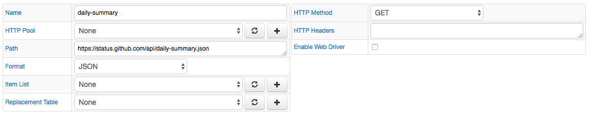
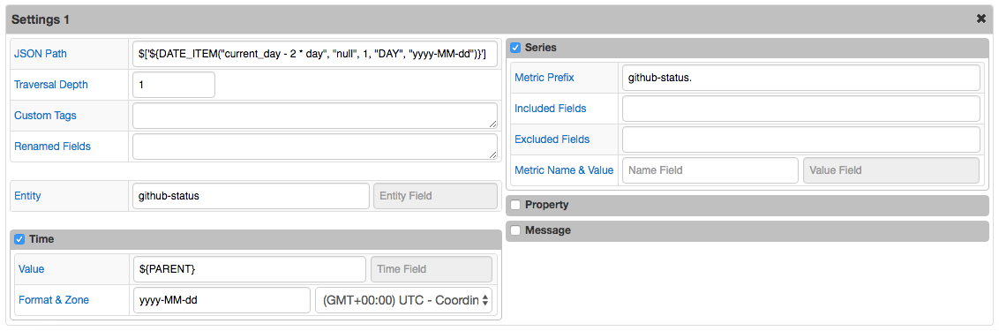
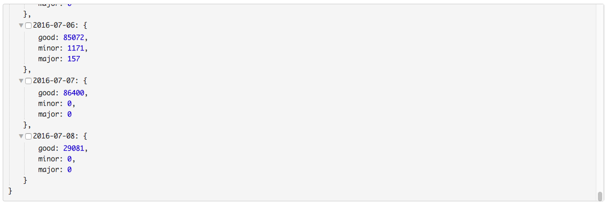
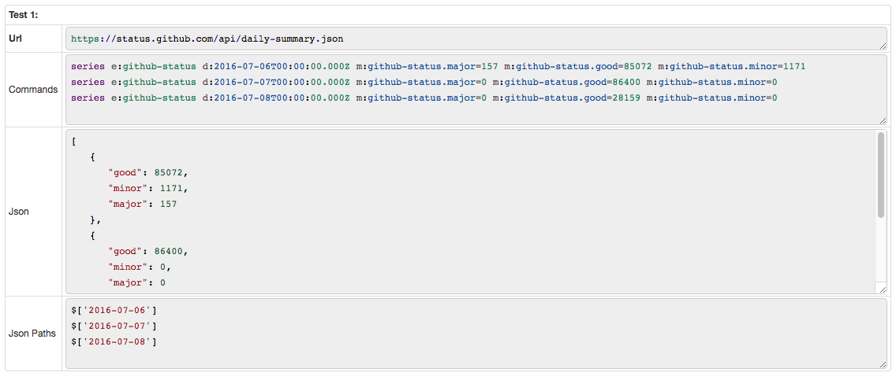

# JSON Job Example: GitHub Daily Summary

## Overview

Download GitHub Daily Summary by using [api](https://status.github.com/api).

The Json Path field contains the `${DATE_ITEM}` placeholder so that multiple dates can be queried with one configuration.

## File

### URI

`https://status.github.com/api/daily-summary.json`

### JSON

```json
{
  "2016-07-04": {
    "good": 64800,
    "major": 0,
    "minor": 0
  },
  "2016-07-05": {
    "good": 86400,
    "major": 0,
    "minor": 0
  },
  "2016-07-06": {
    "good": 85072,
    "major": 157,
    "minor": 1171
  },
  "2016-07-07": {
    "good": 86400,
    "major": 0,
    "minor": 0
  },
  "2016-07-08": {
    "good": 27327,
    "major": 0,
    "minor": 0
  }
}
```

[JSON](github_daily_summary.json) file.

## Configuration

Field Name | Field Value
:--------- | :----------
Path       |`https://status.github.com/api/daily-summary.json`
Format     | JSON

### Settings

Field Name     | Field Value
:------------- | :----------
Default Entity | github-status
JSON Path      | $['${DATE_ITEM("current_day - 2 * day", "null", 1, "DAY", "yyyy-MM-dd")}']
Depth          | 1
Time Default   | ${PARENT}
Time Format    | yyyy-MM-dd
Time Zone      | UTC
Metric Prefix  | github-status.

[JSON Job Configuration](github_daily_summary_job.xml) file. Import xml into Collector.

### Matched Objects

```javascript
$['2016-06-06']
$['2016-06-07']
$['2016-06-08']
```

```json
[
   {
      "good": 85072,
      "minor": 1171,
      "major": 157
   },
   {
      "good": 86400,
      "minor": 0,
      "major": 0
   },
   {
      "good": 28159,
      "minor": 0,
      "major": 0
   }
]
```

## Commands

```ls
series e:github-status d:2016-07-06T00:00:00.000Z m:github-status.major=157 m:github-status.good=85072 m:github-status.minor=1171
series e:github-status d:2016-07-07T00:00:00.000Z m:github-status.major=0 m:github-status.good=86400 m:github-status.minor=0
series e:github-status d:2016-07-08T00:00:00.000Z m:github-status.major=0 m:github-status.good=28159 m:github-status.minor=0
```

## Screenshots

### Additional Configuration



### Additional Settings



### Viewer



### Test Results


