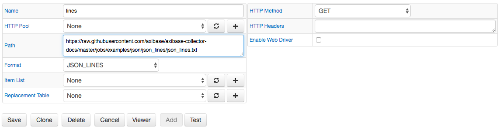
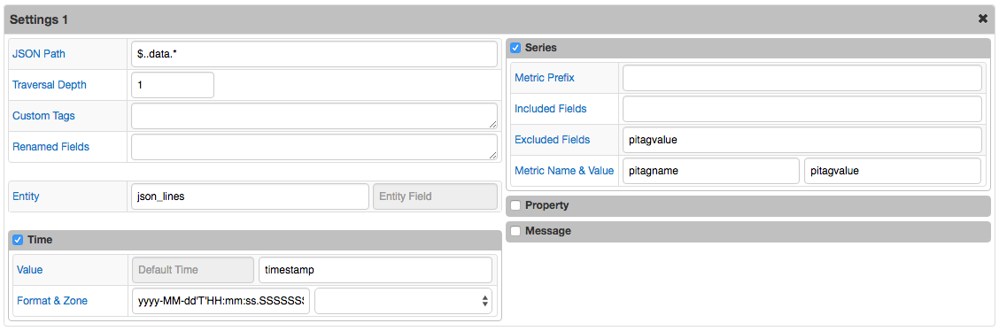
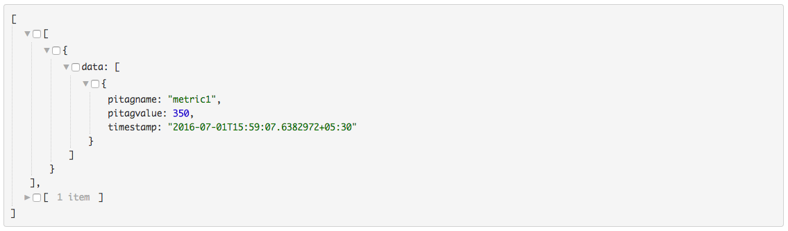
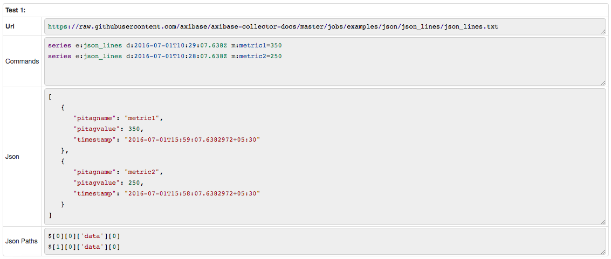

# JSON Job Example: JSON Lines

## Overview

JSON Lines is a text format, also called [newline-delimited JSON](http://jsonlines.org/).

## JSON Lines

```json
[{"data":[{"pitagname":"metric1","pitagvalue":350.0,"timestamp":"2016-07-01T15:59:07.6382972+05:30"}]}]
[{"data":[{"pitagname":"metric2","pitagvalue":250.0,"timestamp":"2016-07-01T15:58:07.6382972+05:30"}]}]
```

[JSON Lines](json_lines.txt) file.

Before processing JSON Lines are converted to a JSON array:

```json
[
  [
    {
      "data": [
        {
          "pitagname": "metric1",
          "pitagvalue": 350.0,
          "timestamp": "2016-07-01T15:59:07.6382972+05:30"
        }
      ]
    }
  ],
  [
    {
      "data": [
        {
          "pitagname": "metric2",
          "pitagvalue": 250.0,
          "timestamp": "2016-07-01T15:58:07.6382972+05:30"
        }
      ]
    }
  ]
]
```

## Configuration

Field Name | Field Value
:--------- | :----------
Format     | JSON_LINES

### Settings

Field Name         | Field Value
:----------------- | :----------
Default Entity     | json_lines
JSON Path          | $..data.*
Depth              | 1
Time Field         | timestamp
Time Format        | yyyy-MM-dd'T'HH:mm:ss.SSSSSSSZ
Excluded Fields    | pitagvalue
Metric Name Field  | pitagname
Metric Value Field | pitagvalue

[JSON Job Configuration](json_job_configuration.xml) file. Import xml into Collector.

## Matched Objects

```javascript
$..data.*
```

```json
[
   {
      "pitagname": "metric1",
      "pitagvalue": 350,
      "timestamp": "2016-07-01T15:59:07.6382972+05:30"
   },
   {
      "pitagname": "metric2",
      "pitagvalue": 250,
      "timestamp": "2016-07-01T15:58:07.6382972+05:30"
   }
]
```

## Commands

```ls
series e:json_lines d:2016-07-01T10:29:07.638Z m:metric1=350
series e:json_lines d:2016-07-01T10:28:07.638Z m:metric2=250
```

## Screenshots

### Additional Configurations



### Additional Settings



### Viewer



### Test Results


