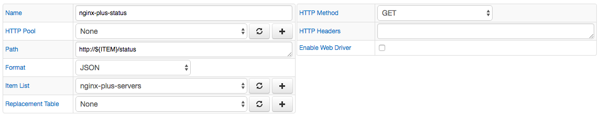
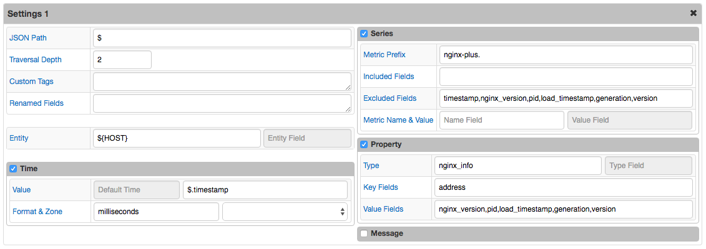
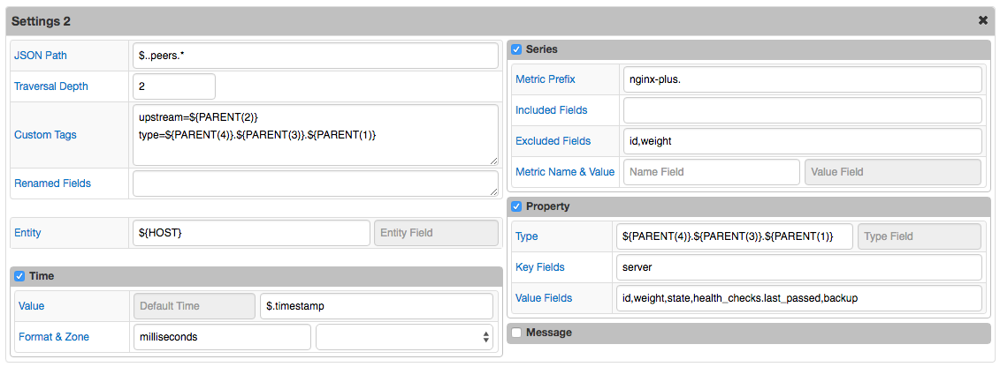
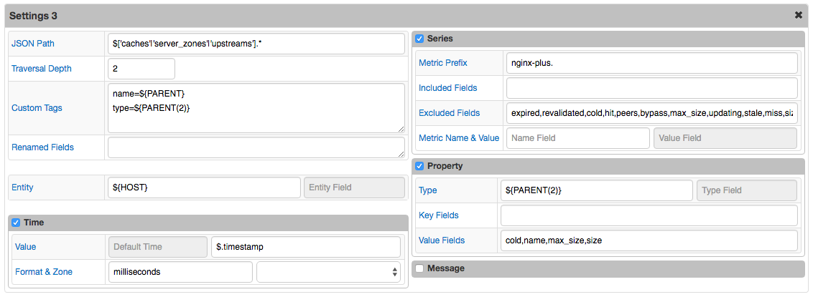
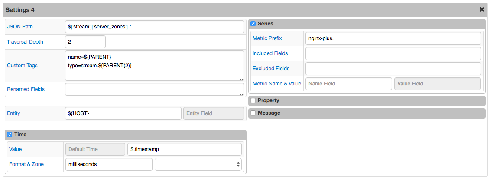
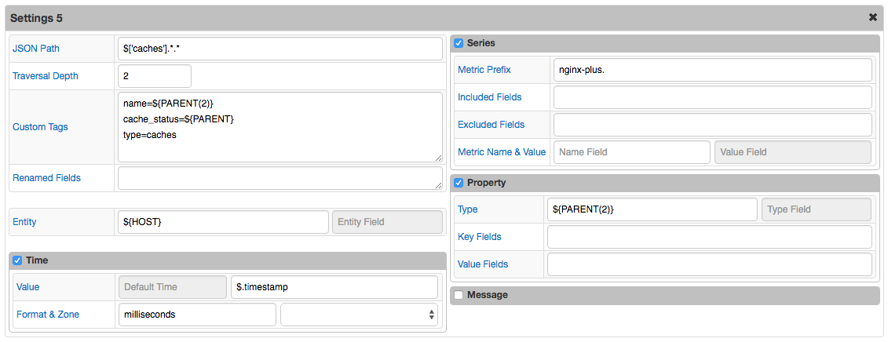

# JSON Job Example: Nginx Status

## Overview

Download Nginx statistics using [api](http://nginx.org/en/docs/http/ngx_http_status_module.html).

The Path field contains the `${ITEM}` placeholder so that multiple servers can be queried with one configuration.

## File

### URI

Template: `http://${ITEM}/status`

Example: `http://demo.nginx.com/status`

### Local Copy

[JSON](nginx_status.json) file.

## Configuration

[JSON Job Configuration](nginx_status_job.xml) file. Import xml into Collector.

### Matched Objects

* **Base:**

  ```javascript
  $
  ```

  [JSON](nginx_status.json) file.

### Commands

  ```ls
  series e:demo.nginx.com d:2016-07-08T14:01:31.516Z m:nginx-plus.connections.accepted=20373129 m:nginx-plus.connections.dropped=0 m:nginx-plus.requests.current=6 m:nginx-plus.ssl.handshakes=84733 m:nginx-plus.connections.idle=46 m:nginx-plus.requests.total=48937280 m:nginx-plus.processes.respawned=0 m:nginx-plus.ssl.session_reuses=16478 m:nginx-plus.connections.active=8 m:nginx-plus.ssl.handshakes_failed=7022
  property t:nginx_info e:demo.nginx.com d:2016-07-08T14:01:31.516Z k:address=206.251.255.64 v:nginx_version=1.9.13 v:pid=59970 v:load_timestamp=1467911779387 v:generation=11 v:version property t:nginx_info e:demo.nginx.com d:2016-07-08T14:01:31.516Z k:address=206.251.255.64 v:nginx_version=1.9.13 v:pid=59970 v:load_timestamp=1467911779387 v:generation=11 v:version=6
  ```


* **Peers:**

  ```javascript
  $..peers.*
  ```

  ```json
  [
    {
      "active": 0,
      "backup": false,
      "downstart": 0,
      "downtime": 14907,
      "fails": 18,
      "health_checks": {
        "checks": 7459,
        "fails": 0,
        "last_passed": true,
        "unhealthy": 0
      },
      "id": 0,
      "received": 1362661342,
      "requests": 74535,
      "responses": {
        "1xx": 0,
        "2xx": 49890,
        "3xx": 988,
        "4xx": 14548,
        "5xx": 9109,
        "total": 74535
      },
      "selected": 1467986488000,
      "sent": 45523551,
      "server": "10.0.0.1:8080",
      "state": "up",
      "unavail": 18,
      "weight": 1
    },
    {
      "active": 0,
      "backup": true,
      "downstart": 1467911779938,
      "downtime": 74711578,
      "fails": 0,
      "health_checks": {
        "checks": 7468,
        "fails": 7468,
        "last_passed": false,
        "unhealthy": 1
      },
      "id": 1,
      "received": 0,
      "requests": 0,
      "responses": {
        "1xx": 0,
        "2xx": 0,
        "3xx": 0,
        "4xx": 0,
        "5xx": 0,
        "total": 0
      },
      "selected": 0,
      "sent": 0,
      "server": "10.0.0.1:8081",
      "state": "unhealthy",
      "unavail": 0,
      "weight": 1
    },
    ...
    {
      "active": 0,
      "backup": false,
      "connections": 0,
      "downstart": 0,
      "downtime": 0,
      "fails": 0,
      "health_checks": {
        "checks": 0,
        "fails": 0,
        "unhealthy": 0
      },
      "id": 3,
      "received": 0,
      "selected": 0,
      "sent": 0,
      "server": "[2001:1af8:4060:a004:21::e3]:80",
      "state": "down",
      "unavail": 0,
      "weight": 1
    }
  ]
  ```

  [JSON](matched_objects_2.json) file.

### Other Commands

  ```ls
  series e:demo.nginx.com d:2016-07-08T14:01:31.516Z t:upstream=trac-backend t:type=upstreams.peers m:nginx-plus.fails=18 m:nginx-plus.received=1362661342 m:nginx-plus.responses.4xx=14548 m:nginx-plus.responses.5xx=9109 m:nginx-plus.health_checks.fails=0 m:nginx-plus.sent=45523551 m:nginx-plus.responses.total=74535 m:nginx-plus.selected=1467986488000 m:nginx-plus.health_checks.unhealthy=0 m:nginx-plus.health_checks.checks=7459 m:nginx-plus.active=0 m:nginx-plus.responses.3xx=988 m:nginx-plus.requests=74535 m:nginx-plus.unavail=18 m:nginx-plus.responses.2xx=49890 m:nginx-plus.downtime=14907 m:nginx-plus.downstart=0 m:nginx-plus.responses.1xx=0
  series e:demo.nginx.com d:2016-07-08T14:01:31.516Z t:upstream=trac-backend t:type=upstreams.peers m:nginx-plus.fails=0 m:nginx-plus.received=0 m:nginx-plus.responses.4xx=0 m:nginx-plus.responses.5xx=0 m:nginx-plus.health_checks.fails=7468 m:nginx-plus.sent=0 m:nginx-plus.responses.total=0 m:nginx-plus.selected=0 m:nginx-plus.health_checks.unhealthy=1 m:nginx-plus.health_checks.checks=7468 m:nginx-plus.active=0 m:nginx-plus.responses.3xx=0 m:nginx-plus.requests=0 m:nginx-plus.unavail=0 m:nginx-plus.responses.2xx=0 m:nginx-plus.downtime=74711578 m:nginx-plus.downstart=1467911779938 m:nginx-plus.responses.1xx=0
  ...
  series e:demo.nginx.com d:2016-07-08T14:01:31.516Z t:upstream=unused_tcp_backends t:type=stream.upstreams.peers m:nginx-plus.active=0 m:nginx-plus.received=0 m:nginx-plus.fails=0 m:nginx-plus.health_checks.fails=0 m:nginx-plus.connections=0 m:nginx-plus.sent=0 m:nginx-plus.unavail=0 m:nginx-plus.selected=0 m:nginx-plus.health_checks.unhealthy=0 m:nginx-plus.health_checks.checks=0 m:nginx-plus.downtime=0 m:nginx-plus.downstart=0
  series e:demo.nginx.com d:2016-07-08T14:01:31.516Z t:upstream=unused_tcp_backends t:type=stream.upstreams.peers m:nginx-plus.active=0 m:nginx-plus.received=0 m:nginx-plus.fails=0 m:nginx-plus.health_checks.fails=0 m:nginx-plus.connections=0 m:nginx-plus.sent=0 m:nginx-plus.unavail=0 m:nginx-plus.selected=0 m:nginx-plus.health_checks.unhealthy=0 m:nginx-plus.health_checks.checks=0 m:nginx-plus.downtime=0 m:nginx-plus.downstart=0
  property t:upstreams.peers e:demo.nginx.com d:2016-07-08T14:01:31.516Z k:upstream=lxr-backend k:server=unix:/tmp/cgib.sock k:type=upstreams.peers v:id=1 v:weight=1 v:state=up v:backup=true
  property t:stream.upstreams.peers e:demo.nginx.com d:2016-07-08T14:01:31.516Z k:upstream=dns_udp_backends k:server=10.0.0.2:53 k:type=stream.upstreams.peers v:id=1 v:weight=1 v:state=up v:health_checks.last_passed=true v:backup=false
  ...
  property t:stream.upstreams.peers e:demo.nginx.com d:2016-07-08T14:01:31.516Z k:upstream=unused_tcp_backends k:server=95.211.80.227:80 k:type=stream.upstreams.peers v:id=1 v:weight=1 v:state=down v:backup=false
  property t:upstreams.peers e:demo.nginx.com d:2016-07-08T14:01:31.516Z k:upstream=demo-backend k:server=10.0.0.2:15431 k:type=upstreams.peers v:id=0 v:weight=1 v:state=up v:health_checks.last_passed=true v:backup=false
  ```


* **Caches, Server Zones, and Upstreams:**

  ```javascript
  $['caches'|'server_zones'|'upstreams'].*
  ```

  ```json
  [
    {
      "bypass": {
        "bytes": 13010815042,
        "bytes_written": 13010806733,
        "responses": 340141,
        "responses_written": 340113
      },
      "cold": false,
      "expired": {
        "bytes": 6709984777,
        "bytes_written": 6537974501,
        "responses": 198350,
        "responses_written": 177369
      },
      "hit": {
        "bytes": 16090273077,
        "responses": 1233531
      },
      "max_size": 536870912,
      "miss": {
        "bytes": 77000388079,
        "bytes_written": 23642451487,
        "responses": 1872931,
        "responses_written": 612094
      },
      "revalidated": {
        "bytes": 0,
        "responses": 0
      },
      "size": 536838144,
      "stale": {
        "bytes": 0,
        "responses": 0
      },
      "updating": {
        "bytes": 0,
        "responses": 0
      }
    },
    {
      "discarded": 136,
      "processing": 1,
      "received": 34286911,
      "requests": 64805,
      "responses": {
        "1xx": 0,
        "2xx": 60361,
        "3xx": 1440,
        "4xx": 1640,
        "5xx": 1227,
        "total": 64668
      },
      "sent": 1054502861
    },
    ...
    {
      "keepalive": 0,
      "peers": [
        {
          "active": 0,
          "backup": false,
          "downstart": 0,
          "downtime": 0,
          "fails": 0,
          "health_checks": {
            "checks": 74458,
            "fails": 0,
            "last_passed": true,
            "unhealthy": 0
          },
          "id": 0,
          "received": 0,
          "requests": 0,
          "responses": {
            "1xx": 0,
            "2xx": 0,
            "3xx": 0,
            "4xx": 0,
            "5xx": 0,
            "total": 0
          },
          "selected": 0,
          "sent": 0,
          "server": "10.0.0.2:15431",
          "state": "up",
          "unavail": 0,
          "weight": 1
        }
      ]
    }
  ]
  ```

  [JSON](matched_objects_3.json) file.

### Additional Commands

  ```ls
  series e:demo.nginx.com d:2016-07-08T14:01:31.516Z t:name=hg.nginx.org t:type=server_zones m:nginx-plus.received=34286911 m:nginx-plus.responses.4xx=1640 m:nginx-plus.responses.5xx=1227 m:nginx-plus.responses.3xx=1440 m:nginx-plus.requests=64805 m:nginx-plus.sent=1054502861 m:nginx-plus.processing=1 m:nginx-plus.responses.total=64668 m:nginx-plus.responses.2xx=60361 m:nginx-plus.discarded=136 m:nginx-plus.responses.1xx=0
  series e:demo.nginx.com d:2016-07-08T14:01:31.516Z t:name=trac.nginx.org t:type=server_zones m:nginx-plus.received=79989134 m:nginx-plus.responses.4xx=15632 m:nginx-plus.responses.5xx=9762 m:nginx-plus.responses.3xx=11006 m:nginx-plus.requests=142075 m:nginx-plus.sent=2025993239 m:nginx-plus.processing=1 m:nginx-plus.responses.total=139793 m:nginx-plus.responses.2xx=103393 m:nginx-plus.discarded=2281 m:nginx-plus.responses.1xx=0
  ...
  series e:demo.nginx.com d:2016-07-08T14:01:31.516Z t:name=lxr-backend t:type=upstreams m:nginx-plus.keepalive=0
  series e:demo.nginx.com d:2016-07-08T14:01:31.516Z t:name=demo-backend t:type=upstreams m:nginx-plus.keepalive=0
  property t:caches e:demo.nginx.com d:2016-07-08T14:01:31.516Z k:name=http_cache k:type=caches v:cold=false v:max_size=536870912 v:size=536838144
  ```


* **Server Zones:**

  ```javascript
  $['stream']['server_zones'].*
  ```

  ```json
  [
    {
      "connections": 74457,
      "processing": 0,
      "received": 7892442,
      "sent": 549295747
    },
    {
      "connections": 42742,
      "processing": 0,
      "received": 1154034,
      "sent": 5344776
    }
  ]
  ```

### Commands, Continued

  ```ls
  series e:demo.nginx.com d:2016-07-08T14:01:31.516Z t:name=postgresql_loadbalancer t:type=stream.server_zones m:nginx-plus.received=7892442 m:nginx-plus.connections=74457 m:nginx-plus.sent=549295747 m:nginx-plus.processing=0
  series e:demo.nginx.com d:2016-07-08T14:01:31.516Z t:name=dns_loadbalancer t:type=stream.server_zones m:nginx-plus.received=1154034 m:nginx-plus.connections=42742 m:nginx-plus.sent=5344776 m:nginx-plus.processing=0
  ```


* **Caches:**

  ```javascript
  $['caches'].*.*
  ```

  ```json
  [
    536838144,
    536870912,
    false,
    {
      "bytes": 16090273077,
      "responses": 1233531
    },
    {
      "bytes": 0,
      "responses": 0
    },
    {
      "bytes": 0,
      "responses": 0
    },
    {
      "bytes": 0,
      "responses": 0
    },
    {
      "bytes": 77000388079,
      "bytes_written": 23642451487,
      "responses": 1872931,
      "responses_written": 612094
    },
    {
      "bytes": 6709984777,
      "bytes_written": 6537974501,
      "responses": 198350,
      "responses_written": 177369
    },
    {
      "bytes": 13010815042,
      "bytes_written": 13010806733,
      "responses": 340141,
      "responses_written": 340113
    }
  ]
  ```

  [JSON](matched_objects_5.json) file.

### More Commands

  ```ls
  series e:demo.nginx.com d:2016-07-08T14:01:31.516Z t:name=http_cache t:cache_status=hit t:type=caches m:nginx-plus.responses=1233531 m:nginx-plus.bytes=16090273077
  series e:demo.nginx.com d:2016-07-08T14:01:31.516Z t:name=http_cache t:cache_status=stale t:type=caches m:nginx-plus.responses=0 m:nginx-plus.bytes=0
  series e:demo.nginx.com d:2016-07-08T14:01:31.516Z t:name=http_cache t:cache_status=updating t:type=caches m:nginx-plus.responses=0 m:nginx-plus.bytes=0
  ...
  series e:demo.nginx.com d:2016-07-08T14:01:31.516Z t:name=http_cache t:cache_status=bypass t:type=caches m:nginx-plus.responses=340141 m:nginx-plus.bytes=13010815042 m:nginx-plus.responses_written=340113 m:nginx-plus.bytes_written=13010806733
  ```


## Screenshots

### Additional Configurations



### Settings 1



### Settings 2



### Settings 3



### Settings 4



### Settings 5


