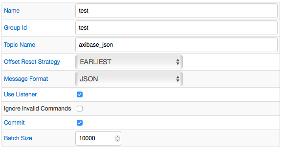
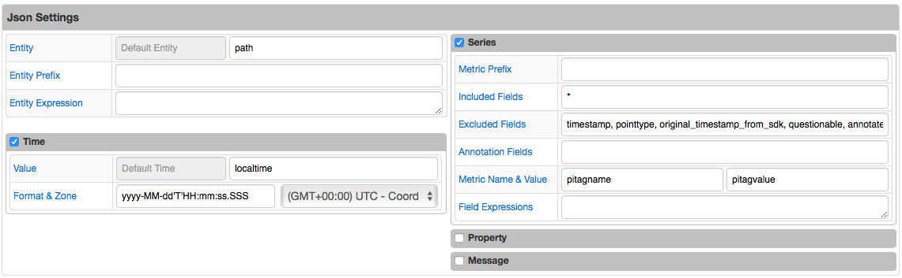
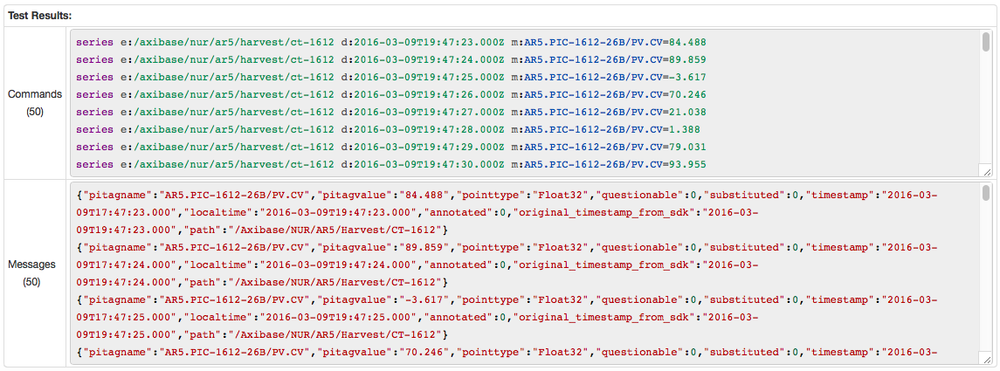

# Kafka Job Example: JSON format

## Kafka Message

```json
{
  "pitagname":"AXI.REM-1612-26B/PV.CV",
  "pitagvalue":"84.488",
  "pointtype":"Float32",
  "questionable":0,
  "substituted":0,
  "timestamp":"2016-03-09T17:47:23.000",
  "localtime":"2016-03-09T19:47:23.000",
  "annotated":0,
  "original_timestamp_from_sdk":"2016-03-09T19:47:23.000",
  "path":"/Axibase/NUR/AXI/Harvest/CT-1612"
}
```

[Kafka Message](message.json) file.

## Configuration

Field Name | Field Value
:--------- | :----------
Message Format | JSON
Use Listener | true

### Settings

Field Name         | Field Value
:----------------- | :----------
Entity     | path
Time Field         | localtime
Time Format        | yyyy-MM-dd'T'HH:mm:ss.SSS
Excluded Fields    | timestamp, pointtype, original_timestamp_from_sdk, questionable, annotated, substituted
Metric Name Field  | pitagname
Metric Value Field | pitagvalue

[Kafka Job Configuration](kafka_job_configuration.xml) file. Import xml into Collector.

## Command

```ls
series e:/axibase/nur/axi/harvest/ct-1612 d:2016-03-09T19:47:23.000Z m:AXI.REM-1612-26B/PV.CV=84.488
```

## Screenshots

### Additional Configurations



### Additional Settings



### Test Results


