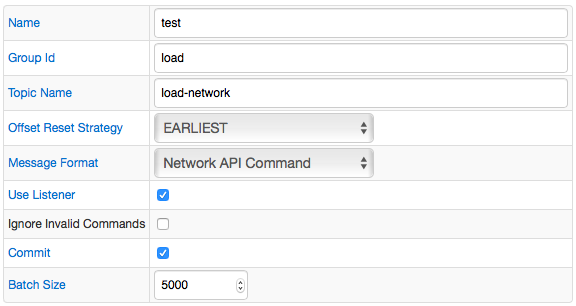
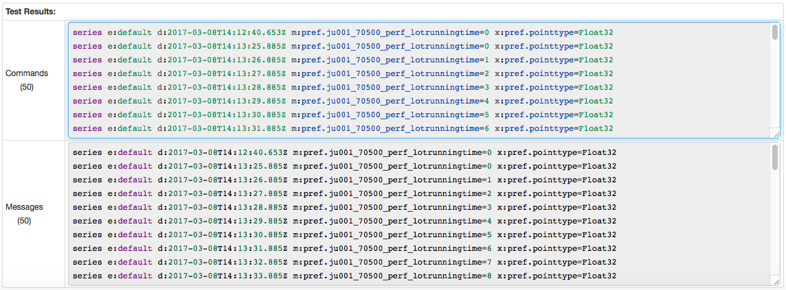

# Kafka Job Example: Network API Command

## Kafka Message

```ls
series e:default d:2017-03-08T14:12:40.653Z m:pref.ju001_70500_perf_lotrunningtime=0 x:pref.pointtype=Float32
```

## Configuration

Field Name | Field Value
:--------- | :----------
Message Format | Network API Command
Use Listener | true

[Kafka Job Configuration](kafka_job_configuration.xml) file. Import xml into Collector.

## Command

```ls
series e:default d:2017-03-08T14:12:40.653Z m:pref.ju001_70500_perf_lotrunningtime=0 x:pref.pointtype=Float32
```

## Screenshots

### Additional Configuration



### Test Results


