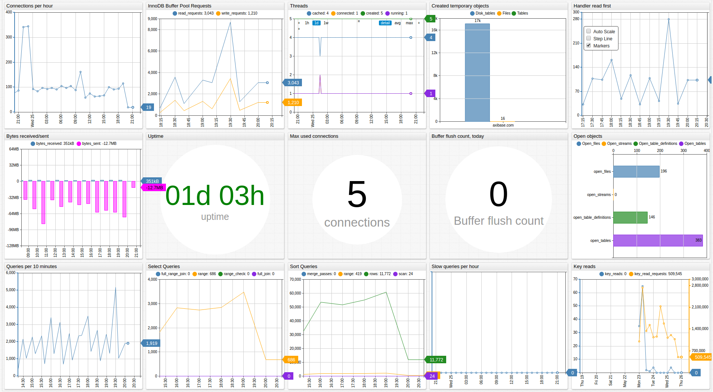

# MySQL Server

## Overview

This document describes how to collect global status metrics from `performance_schema` introduced in [MySQL](http://www.mysql.com/) 5.7+ for long-term retention and monitoring in the Axibase Time Series Database.

The process involves enabling a JDBC job in Axibase Collector to poll a `global_status` table and uploading the counters to ATSD for processing.

## Requirements

* MySQL Server `5.7+`

## Installation Steps

### Create a Read-Only Account in the Target MySQL Server

```sql
CREATE USER 'axibase-ro'@'collector_host' IDENTIFIED BY '********';
GRANT SELECT ON performance_schema.* TO 'axibase-ro'@'collector_host';
FLUSH PRIVILEGES;
```

To allow connection from any IP address, use the wildcard for remote address:

```sql
CREATE USER 'axibase-ro'@'collector_host' IDENTIFIED BY '********';
GRANT SELECT ON performance_schema.* TO 'axibase-ro'@'*';
FLUSH PRIVILEGES;
```

### Allow External Connection to the Database

Modify `mysql.cnf` by setting `bind-address = 0.0.0.0`.

### Import MySQL Server Job into Axibase Collector

* Open **Jobs:Import** and upload the [mysql-server-jobs.xml](mysql-server-jobs.xml) file.

### Configure MySQL Server Database Connection

* Open the **Data Sources:Databases** page and select the `10.102.0.7` database.
* Provide connection parameters to the target MySQL Server database as displayed below:


* Execute the following test query to check the connection:

```SQL
SELECT 1
```

* Query result must be `Query OK`.

### Verify Job Configuration

* Open MySQL Server job.
* Set Data Source to `10.102.0.7`.


* Choose one of the target ATSD instances if your Collector instance is connected to multiple ATSD servers.
* Save the Job.
* Open each configuration, click on the [Test] button and review output. See [Data Queries](#data-queries) below.


### Schedule the Job

* Open the `JDBC Job` page and click the [Run] button for the MySQL Server JDBC job.
* Make sure that the job status is `COMPLETED` and `Items Read` and `Sent commands` are greater than 0.


* If there are no errors, set job status to Enabled and save the job.

### Verify Metrics in ATSD

* Log in to ATSD.
* Click on the Metrics tab and filter metrics by name `mysql.*`.


## Viewing Data in ATSD

### Metrics

* List of collected [MySQL Server metrics](metric-list.md).

### Entity Groups

* Open the **Admin: Entity Groups** page.
* Create a new Entity Group, click on Expression 'Edit mode', and enter the following expression:

```javascript
hasMetric('mysql.global_status.uptime')
```

* Save and verify that the group contains your MySQL database hosts:


### Portals

* Open the **Configuration: Portals** page and import a MySQL portal from [portal-mysql.xml](portal-mysql.xml).
* Click Assign link and associate the portal with the entity group you created earlier.
* Open Entity tabs, find the mysql database by name, and click on its portal icon.


[**MySQL Server Perfomance Live Portal**](http://apps.axibase.com/chartlab/cf72dec3)


## Data Queries

* Metrics Queries select most recent statistics:

```SQL
SELECT * FROM performance_schema.global_status
```
