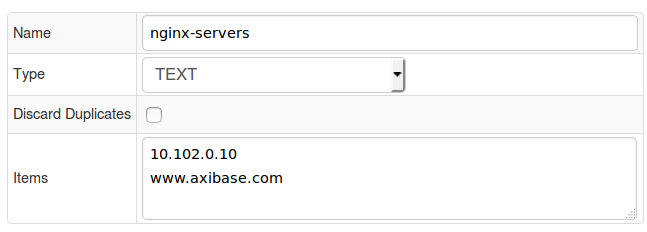
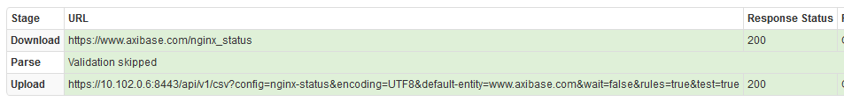
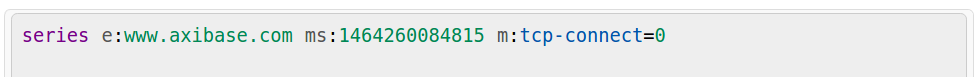
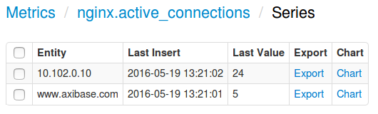
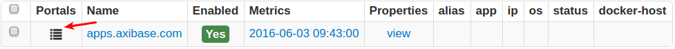
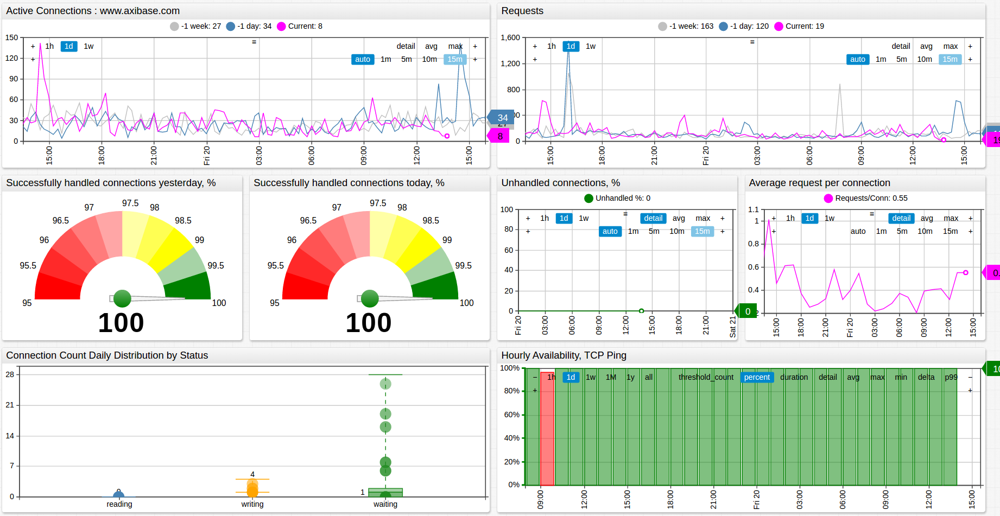

# NGINX Web Server Monitoring

## Overview

This document describes how to collect connection and request metrics from an NGINX web server for long-term retention and monitoring in the Axibase Time Series Database.

The process involves enabling the NGINX status page and configuring Axibase Collector to poll and upload this page every 5 seconds for parsing in ATSD.

## Requirements

* NGINX server with [ngx_http_stub_status_module](http://nginx.org/en/docs/http/ngx_http_stub_status_module.html) enabled.
* [Axibase Collector](../../../README.md) for scheduled polling of the NGINX status page.
* [Axibase Time Series Database](https://axibase.com/docs/atsd/installation/) as a centralized data repository.

## NGINX Server Configuration

Follow the steps outlined in the [NGINX server configuration guide](./nginx-configure.md) to enable metrics on its status page.

The status page returns connection statistics in an unstructured/malformed format, which is parsed by ATSD with [RFC 7111](https://axibase.com/docs/atsd/parsers/csv/#schema-based-parsing) selectors using whitespace as a separator.

```ls
Active connections: 291
server accepts handled requests
 16630948 16630948 31070465
Reading: 6 Writing: 179 Waiting: 106
```

```javascript
select("#row=1").select("#col=3").
addSeries().
metric(cell(row, 1) + '_' + (cell(row,col-1)+'').substring(0,(cell(row,col-1)+'').length-1));
...
```

## Import NGINX CSV Parser Configuration into ATSD

* Login into the ATSD web interface.
* Open the **Configuration:Parsers CSV** page. Click Import.
* Import [CSV parser](./configs/nginx-atsd-csv-parser.xml) for the NGINX status page.
* The parser splits status page content into cells and assembles series commands from extracted cell values.In addition, it creates a derived metric `unhandled_percent` equal to `100*(1-handled/accepted)`.

## Configure Jobs in Axibase Collector

Axibase Collector will poll the NGINX status page every 5 seconds and upload the downloaded file into ATSD for parsing. Moreover, Axibase Collector will try to establish a TCP connection with the same period to check availability of the server.

* Login into Axibase Collector web interface

### Create Item List for NGINX servers

* Open the **Collections:Item Lists** page.
* Add a new TEXT [Item List](../../../collections.md) named **nginx-servers**, containing DNS names or IP addresses of the monitored NGINX servers, one server per line. Make sure that each server on the list is accessible on the specified protocol and port and exposes the status page on the same path: `/nginx_status`. If the protocols and ports are different, move the entire url to the list and set the Path field equal to the `${ITEM}` placeholder.
* **Save** the list.



### Import Jobs

* Import the [nginx-collector-jobs.xml](./configs/nginx-collector-jobs.xml) job on the **Jobs:Import** page.
* Open the `nginx-statistics` FILE job.
* If the 'Storage' drop-down is set to `None`, select the target ATSD server.
* Set Status to Enabled.
* **Save** the job.
* Open the `nginx-connect-check` TCP job.
* If the 'Storage' drop-down is set to `None`, select the target ATSD server.
* Set Status to Enabled.
* **Save** the job.

### Validate Data Availability

* Open the `nginx-status` configuration in the `nginx-statistics` job.
* Click Test to verify processing.



* Open the `nginx-connect` configuration in the `nginx-connect-check` job.
* Click Test to verify connectivity to the target server. If TCP connection was successful, the `tcp-connect` metric returns a 0 exit code.



* Login into the ATSD web interface.
* Open the Metrics tab and apply the `nginx*` name mask to view `nginx` metrics received by ATSD.
* Click on the Series link and check that metrics are present for each server in the **nginx-servers** list.



### NGINX Status Page Metrics

| Metric                  |                                      Description                                        |
|:-----------------------:|:----------------------------------------------------------------------------------------|
| Active connection       |The current number of active client connections, including Waiting connections.           |
| Server accepts          |The total number of accepted client connections.                                         |
| Server handled          |The total number of handled connections. The parameter is lower than Server accepts if the resource limits have been reached (for example, the `worker_connections` limit).                          |
| Server requests         |The total number of client requests.                                                     |
| Reading                 |The current number of connections where nginx is reading the request header.             |
| Writing                 |The current number of connections where nginx is writing the response back to the client.|
| Waiting                 |The current number of idle client connections waiting for a request.                     |

## Viewing Data in ATSD

## Metrics

List of collected [NGINX server metrics](./nginx-basic-server-metrics.md).

## Entity Group

* Open **Admin:Entity Groups**, click the [Import] button, and upload [nginx_basic_entity_group.xml](./configs/nginx_entity_group.xml).
* Select imported `nginx-servers` group.
* Verify that the group contains your NGINX servers.

## Portal

* Open **Configuration: Portals**, click the [Import] button, and upload [nginx_portal.xml](./configs/nginx_portal.xml).
* Click the **Assign** link and associate the portal with the entity group you created earlier.
* Open the *Entity* tab, find the NGINX servers you would like to see information about, and click on its portal icon.


[Basic NGINX Status portal example](http://apps.axibase.com/chartlab/966f33e4)


## Notifications

You can monitor key NGINX statistics by creating a rule in ATSD rule engine to send an email notification in case of abnormal conditions.

For example, you can send an email if the average *Active Connections* count over the last 15 minutes on a target NGINX server drops below the specified threshold.

### Setting up Mail Client

* Configure [Mail Client](https://axibase.com/docs/atsd/administration/mail-client.html).

### Import rules

* Download an [xml file](./configs/nginx_notification_rules.xml) containing the rules.
* Open the **Configuration: Rules** page.
* Click *Import* and attach the `nginx_notification_rules.xml` file.
* Open created rules in the Rule Editor and change the recipient address on the *Email Notifications* tab.
* These rules will automatically apply to all NGINX servers monitored by Axibase Collector.

The following rules are provided in the `nginx_notification_rules.xml` file:

| **Rule**                                     |                                      **Description**                        |
|:----------------------------------------:|:------------------------------------------------------------------------|
|nginx_unhandled_percent_high| Raise an alert when an NGINX server unhandled connection percentage is above 2%.|
| nginx_active_connections_low | Raise an alert when an NGINX server average Active Connection count is below 10 over the last 15 minutes.|
| nginx_active_connections_heartbeat| Raise an alert when status page statistics are no longer being received by ATSD. Check that the server is reachable and Axibase Collector job is running. |
|nginx_tcp_heartbeat| Raise an alert when the TCP connect metric is no longer being received by ATSD or if the TCP connect metric contains error codes.Check that the server is reachable and Axibase Collector job is running.|

To create your own rules, refer to [Rule Engine documentation](https://axibase.com/docs/atsd/rule-engine/).
