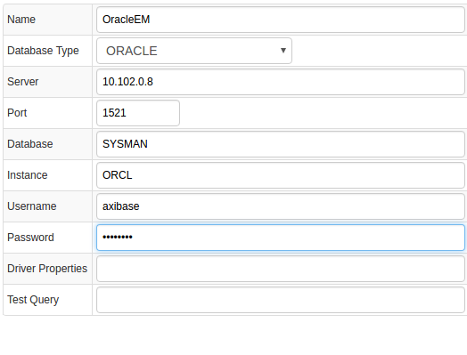
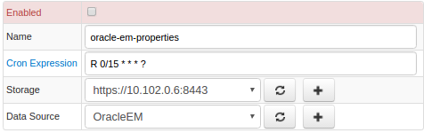
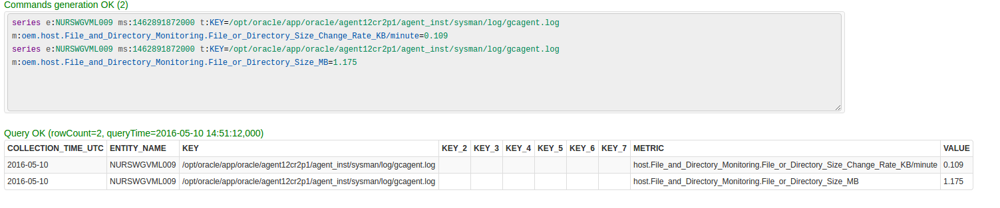
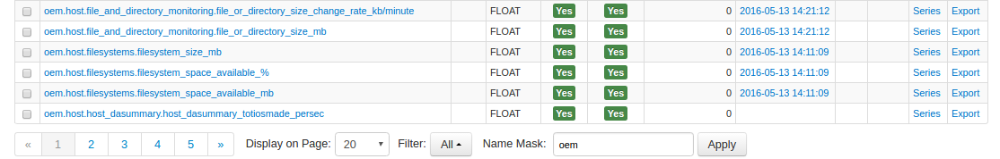
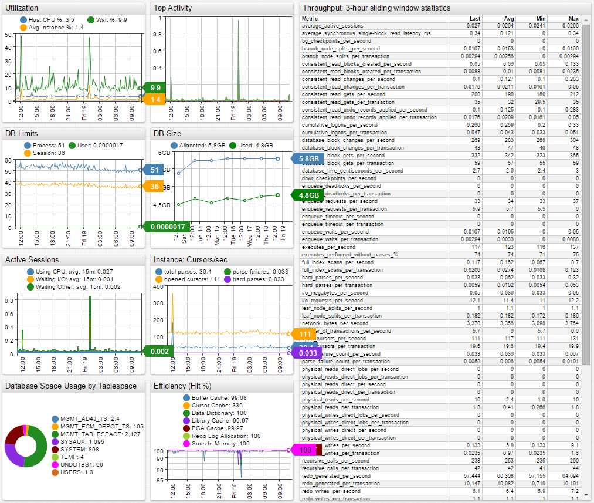
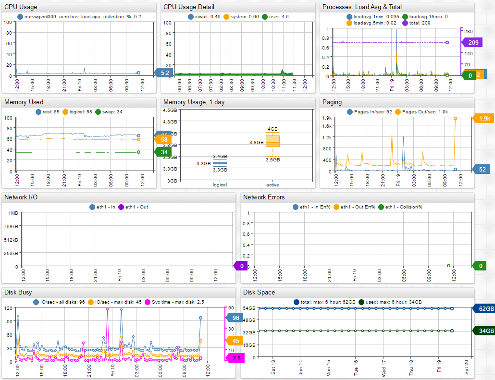

# Oracle Enterprise Manager

## Overview

[Oracle Enterprise Manager](http://www.oracle.com/us/products/enterprise-manager/index.html "Oracle Enterprise Manager") (Oracle EM) is a distributed application for centralized monitoring, diagnosing, and resolving issues related to Oracle products.

Oracle EM collects and stores statistics from remote databases, applications, and systems in an Oracle database (`SYSMAN.gc$metric_values` table) which Axibase Collector queries every 15 minutes to offload incremental data into the Axibase Time Series Database for long-term retention and operations analytics.

## Requirements

* Oracle Enterprise Manager `11+`

## Installation Steps

### Import Oracle EM JDBC Job

* Open **Jobs:Import** and upload the [oracle-em-jobs.xml](oracle-em-jobs.xml) file.

### Configure Oracle EM Database Connection

* Open the **Data Sources:Databases** page and select the `OracleEM` database.
* Provide connection parameters to the target Oracle EM database as displayed below:



* Read-only/SELECT privileges to `SYSMAN.GC$TARGET` and `SYSMAN.gc$metric_values` tables are sufficient.
* Execute the following test query to check the connection:

```SQL
SELECT NULL FROM dual
```

* Click on the [Meta Data] button and check that the **SYSMAN** schema is present in the list of schemas.

### Verify Job Configuration

* Open Oracle EM JDBC job.
* Set the Data Source to OracleEM.



* Choose one of target ATSD instances if your Collector instance is connected to multiple ATSD servers.
* Save the Job.
* Open each configuration, click on the [Test] button, and review the output. See [Data Queries](#data-queries) below.



### Schedule the Job

* Open the `JDBC Job` page and click the [Run] button for the Oracle EM JDBC job.
* Make sure that the job status is `COMPLETED` and `Items Read` and `Sent commands` are greater than 0.


* If there are no errors, set job status to 'Enabled' and save the job.

### Verify Metrics in ATSD

* Login into ATSD.
* Click on the Metrics tab and filter metrics by name `oem.*`.



## Viewing Data in ATSD

### Metrics

* List of collected [Oracle EM metrics](metric-list.md)

### Properties

* List of collected [Oracle EM properties](properties-list.md)

### Entity Groups

* oracle-databases
* oracle-hosts

### Portals

* [Oracle Databases Live Portal](https://apps.axibase.com/chartlab/8c86c962)



* [Oracle Host Live Portal](https://apps.axibase.com/chartlab/81259b97)



## Data Queries

* Metrics Queries select most recent statistics

```SQL
SELECT ENTITY_NAME, ENTITY_TYPE || '.' || REPLACE(REPLACE(METRIC_GROUP_LABEL, ',', ' '), ' ', '_') || '.' ||
REPLACE(REPLACE(TRIM(REPLACE(REPLACE(REPLACE(REPLACE(METRIC_COLUMN_LABEL, ' - ', '-'), ',', ' '), ')', ' '), '(', ' ')), ' ', '_'), '__', '_') AS METRIC,
NULLIF(KEY_PART_1, '%') AS KEY, NULLIF(KEY_PART_2, '%') AS KEY_2, NULLIF(KEY_PART_3, '%') AS KEY_3, NULLIF(KEY_PART_4, '%') AS KEY_4,
NULLIF(KEY_PART_5, '%') AS KEY_5, NULLIF(KEY_PART_6, '%') AS KEY_6, NULLIF(KEY_PART_7, '%') AS KEY_7, COLLECTION_TIME_UTC, VALUE
FROM SYSMAN.gc$metric_values
WHERE ENTITY_TYPE = 'oracle_database' AND METRIC_GROUP_LABEL_NLSID IS NOT NULL AND COLLECTION_TIME_UTC >= ? ORDER BY COLLECTION_TIME_UTC
```

```SQL
SELECT ENTITY_NAME, ENTITY_TYPE || '.' || REPLACE(REPLACE(METRIC_GROUP_LABEL, ',', ' '), ' ', '_') || '.' ||
REPLACE(REPLACE(TRIM(REPLACE(REPLACE(REPLACE(REPLACE(METRIC_COLUMN_LABEL, ' - ', '-'), ',', ' '), ')', ' '), '(', ' ')), ' ', '_'), '__', '_') AS METRIC,
NULLIF(KEY_PART_1, '%') AS KEY, NULLIF(KEY_PART_2, '%') AS KEY_2, NULLIF(KEY_PART_3, '%') AS KEY_3, NULLIF(KEY_PART_4, '%') AS KEY_4,
NULLIF(KEY_PART_5, '%') AS KEY_5, NULLIF(KEY_PART_6, '%') AS KEY_6, NULLIF(KEY_PART_7, '%') AS KEY_7, COLLECTION_TIME_UTC, VALUE
FROM SYSMAN.gc$metric_values
WHERE ENTITY_TYPE = 'host' AND COLLECTION_TIME_UTC >= ? ORDER BY COLLECTION_TIME_UTC
```

* Properties Query selects current properties

```SQL
SELECT 'oem.' || TARGET_TYPE AS TTYPE, TARGET_NAME, HOST_NAME, DISPLAY_NAME, TIMEZONE_REGION, TYPE_QUALIFIER1 AS TYPE
FROM SYSMAN.GC$TARGET
WHERE TARGET_TYPE IN ('host', 'oracle_database')
```
