# PI Server

## Overview

This document describes how to export archive data from a [PI Server](http://www.osisoft.com/pi-system/pi-capabilities/pi-server/) into the Axibase Time Series Database as series commands using the Collector PI job.

## Requirements

* PI SQL Data Access Server `1.5+`
* PI JDBC Driver `1.5+`

PI JDBC Driver should be installed and added as a data source in Collector. Follow the steps in [the tutorial](export-metrics.md#provide-axibase-collector-with-pi-jdbc-driver) to do it.

## PI Job Configuration

Select **PI** in the **Jobs** dropdown. Click on the **Add Job** button. Fill in all the necessary fields.

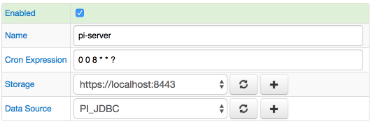

## PI Task Configuration

Click on the **Create Configuration** button.
Provide tag-to-entity mapping. You can use freemarker expressions in the `Entity` field for string manipulations.
If you want to query only a subset of available tags or get picomp2 values satisfying the condition, fill in the `WHERE Filter` fields.
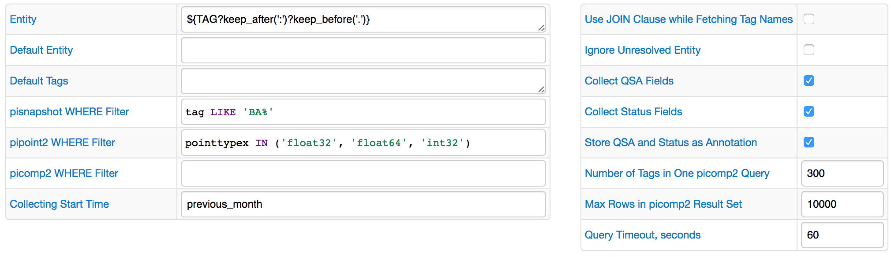

When you finish, click on the [Test] button to see the queries executed by the job, returned result set, and generated ATSD network commands. During the test mode the number of queried picomp2 rows is limited by 1000.
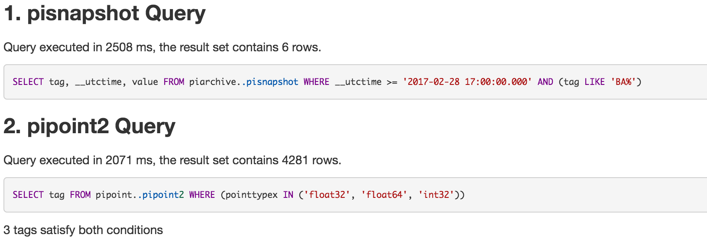
If the option `Use JOIN Clause while Fetching Tag Names` is enabled, only one query is executed:
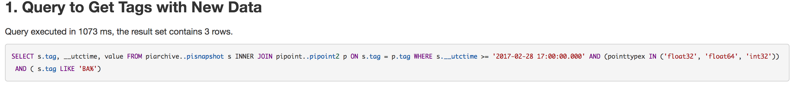

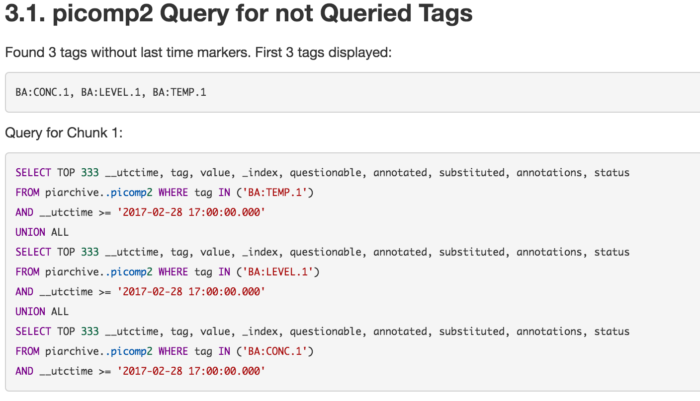
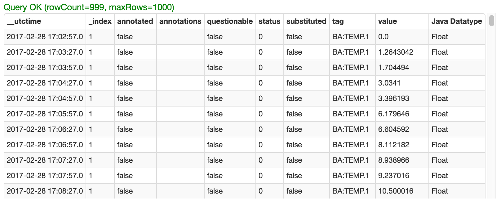
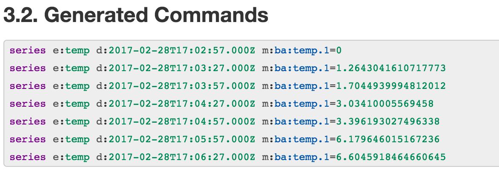
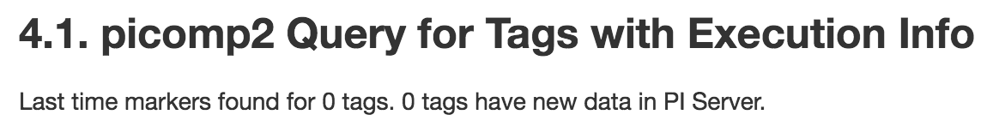

When configuration is done, save the job and run it.
You may see the execution details by clicking on the `View` link in the `Execution Details` column.
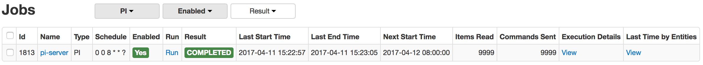

You can see executed queries info by following the `Details` link.
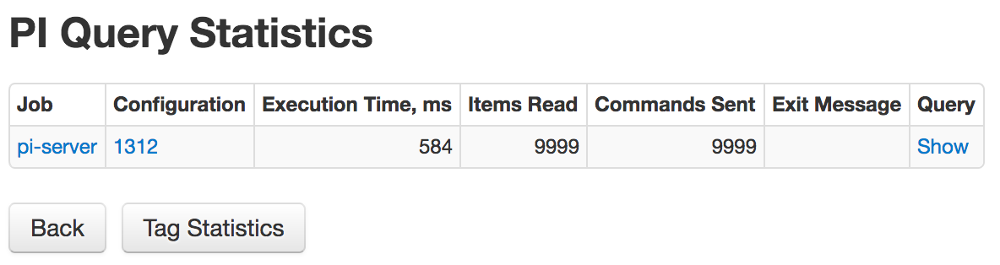

The `Tag Statistics` button will lead to the page with information on every processed PI tag, such as first and last collected measure time, last value, number of collected measures.
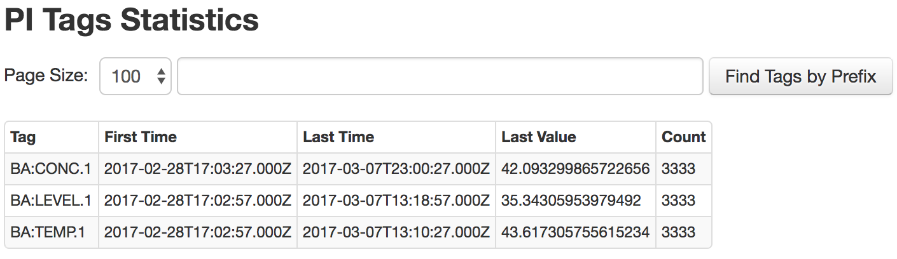

## Verify Metrics in ATSD

* Log in to ATSD.
* Click on the `Entities` tab and filter entities by name, e.g. `temp`.

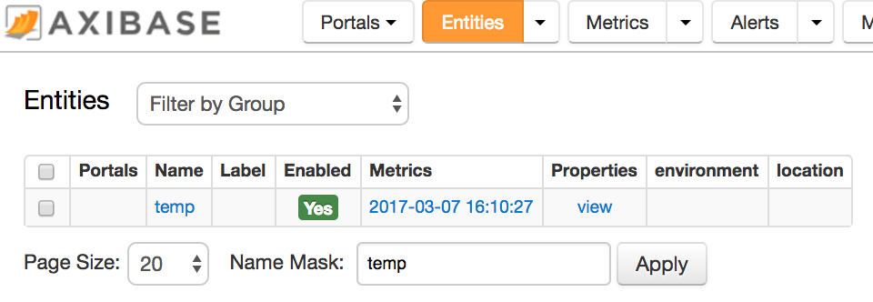

* Follow the link in the `Metrics` column

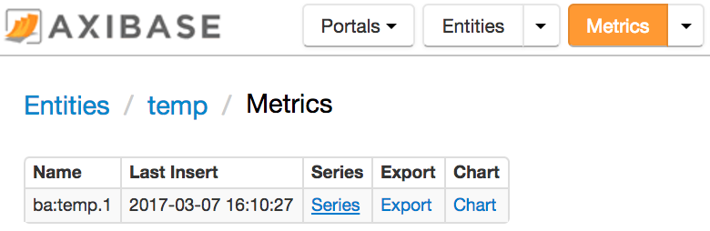