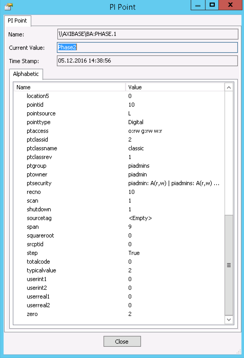
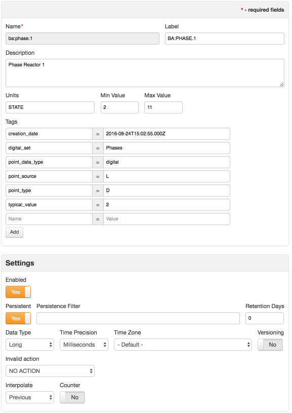
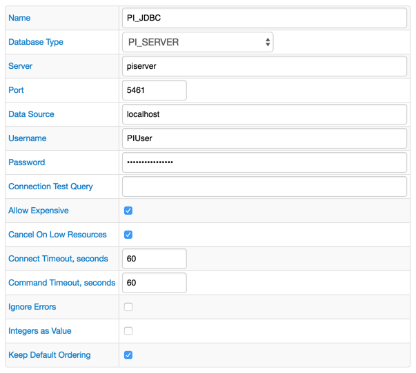
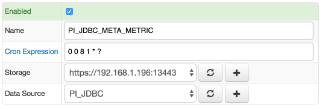
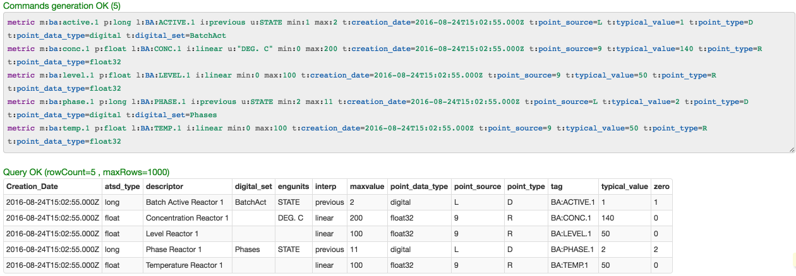
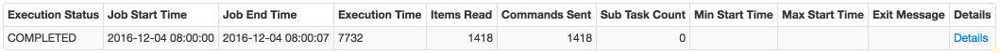
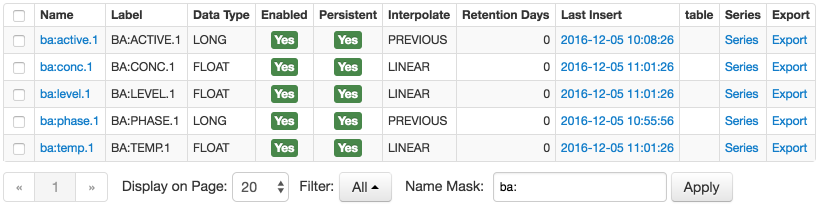

# PI Server

## Overview

This document describes how to copy PI Tag attributes from a [PI Server](http://www.osisoft.com/pi-system/pi-capabilities/pi-server/) into the corresponding [metric](https://axibase.com/docs/atsd/api/meta/metric/list.html#fields) fields in the Axibase Time Series Database.

The process involves enabling a JDBC job in Axibase Collector.

## Attributes

| **PI Tag Attribute** | **ATSD Metric Attribute** | **Type** |
|---|---|---|
| tag | name (lowercased, normalized) | field |
| tag | label | field |
| descriptor | description | field |
| zero | min | field |
| zero + span | max | field |
| engunits | units | field |
| step | interpolation (0=>linear, 1=>previous) | field |
| pointtypex | data type (converted to ATSD type) | field |
| creationdate | creation_date | tag |
| digitalset | digital_set | tag |
| pointsource | point_source | tag |
| pointtype | point_type | tag |
| pointtypex | point_data_type | tag |
| typicalvalue | typical_value | tag |

In addition to copying PI Point attributes, the job can be configured to populate the metrics' timezone field based on the selected timezone identifier.



### ATSD Metric Info



## Requirements

* PI SQL Data Access Server `1.5+`
* PI JDBC Driver `1.5+`

## Installation Steps

### Provide Axibase Collector with PI JDBC Driver

* Install the PI JDBC Driver:

```sh
cd $PATH_TO_PI_JDBC_DRIVER_ARCHIVE
tar -xzvf pijdbc_2016-x86-x64_.tar.gz
cd pijdbc_2016-x86-x64_/pipc/jdbc
sudo ./install.sh
sudo chown -R $USER /opt/pipc
```

* Copy the PI JDBC Driver to the Axibase Collector's `ext` folder:

```sh
cp /opt/pipc/jdbc/PIJDBCDriver.jar $AXIBASE_COLLECTOR_HOME/ext/
```

* Restart Axibase Collector:

```sh
$AXIBASE_COLLECTOR_HOME/bin/stop-collector.sh
$AXIBASE_COLLECTOR_HOME/bin/start-collector.sh
```

### Import PI Server job into Axibase Collector

* Open **Jobs:Import** and upload the file [pi_jdbc_metric.xml](pi_jdbc_metric.xml).

### Configure PI Server Database Connection

* Open the **Data Sources:Databases** page and select the `PI_JDBC` database.
* Provide connection parameters to the target PI Server instance as displayed below:



* Execute the following test query to check the connection:

```SQL
SELECT 1
```

* Query result must be `Query OK`.

### Verify Job Configuration

* Open the `PI_JDBC_META_METRIC` job.
* Set the Data Source to `PI_JDBC`.



* Choose one of the target ATSD instances if your Collector instance is connected to multiple ATSD servers.
* Save the Job.
* Open each configuration, click the [Test] button, and review the output.



### Schedule the Job

* Open the `JDBC Job` page and click the [Run] button for the PI Server jobs.
* Make sure that the job status is `COMPLETED`, and `Items Read` and `Sent commands` are greater than 0.



* If there are no errors, set the job status to 'Enabled' and save the job.

### Verify Metrics in ATSD

* Log in to ATSD.
* Click on the Metrics tab and filter metrics by name, e.g. find by prefix `ba:`. You should see a list of exported PI tags:


