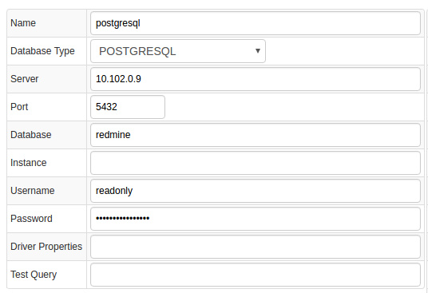
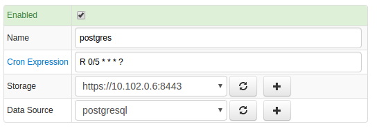
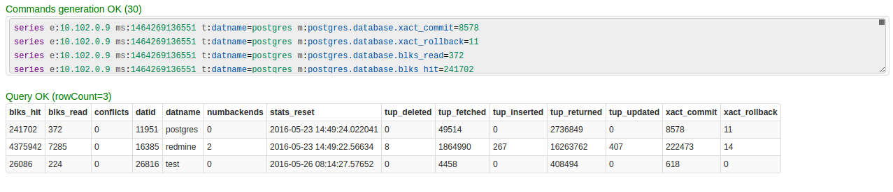
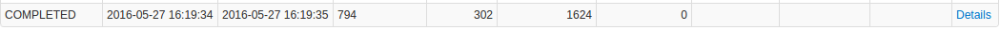
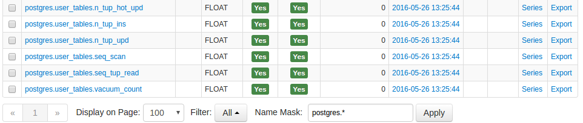
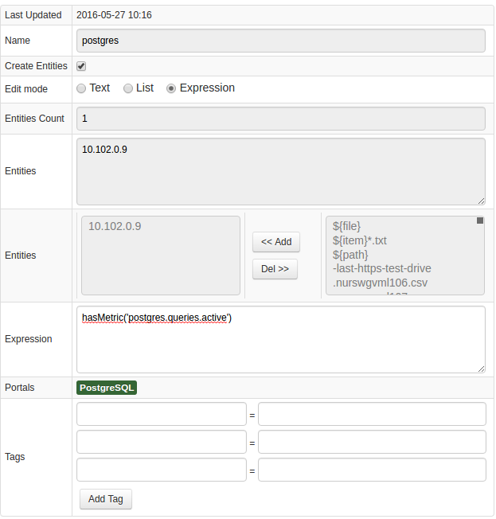
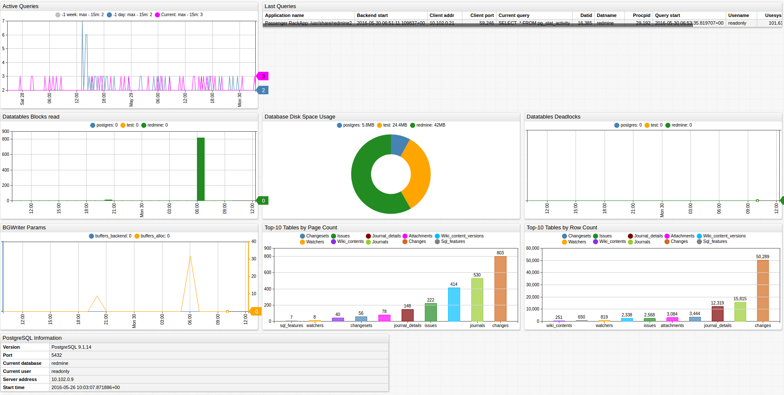

# PostgreSQL

## Overview

This document describes how to collect statistics' metrics introduced in [PostgreSQL](http://www.mysql.com/) 9.1+ for long-term retention and monitoring in Axibase Time Series Database.

The process involves enabling a JDBC job in Axibase Collector to poll [statistics views](https://www.postgresql.org/docs/9.1/static/monitoring-stats.html) in the PostgreSQL database and uploading the counters and properties into ATSD for processing.

## Requirements

* PostgreSQL `9.1+`

## Installation Steps

## Create a readonly user for Axibase Collector

* Create user:

```sh
adduser readonly
```

* Log in as a `postgres` user and open the `psql` console:

```sh
sudo su postgres
psql
```

* Run the following commands in the `psql` console:

```sql
CREATE ROLE readonly;
GRANT SELECT ON ALL TABLES IN SCHEMA public TO readonly;
ALTER USER readonly WITH PASSWORD 'readonly';
ALTER USER readonly VALID UNTIL 'infinity';
ALTER ROLE readonly login;
```

* Open the file **/etc/postgresql/${POSTGRES_VERSION}/main/pg_hba.conf**.
* Add the following record to allow remote access from the Axibase Collector machine:

```txt
host    all             readonly        10.102.0.12           trust
```

* Open the file **/etc/postgresql/${POSTGRES_VERSION}/main/postgresql.conf**.
* Enable the database to accept remote connections by specifying its external IP address:

```sh
listen_addresses = 'localhost,10.102.0.9' # what IP address(es) to listen on;
```

### Import PostgreSQL Job into Axibase Collector

* Open **Jobs:Import** and upload the [postgres-jobs.xml](postgres-jobs.xml) file.

### Configure PostgreSQL Database Connection

* Open the **Data Sources:Databases** page and select the `postgresql` database.
* Provide connection parameters to the target PostgreSQL database as displayed below:



* Execute the following test query to check the connection:

```SQL
SELECT 1
```

* Query result must be `Query OK`.

### Verify Job Configuration

* Open the PostgreSQL job.
* Set the Data Source to `postgresql`.



* Choose one of the target ATSD instances if your Collector instance is connected to multiple ATSD servers.
* Save the Job.
* Open each configuration, click on the [Test] button, and review the output. See [Data Queries](#data-queries) below.



### Schedule the Job

* Open the `JDBC Job` page and click the [Run] button for the PostgreSQL JDBC job.
* Make sure that the job status is `COMPLETED` and `Items Read` and `Sent commands` are greater than 0.



* If there are no errors, set the job status to 'Enabled' and save the job.

### Verify Metrics in ATSD

* Login to ATSD.
* Click on the Metrics tab and filter metrics by name `postgres.*`.



## Viewing Data in ATSD

### Metrics

* List of collected [PostgreSQL metrics](metric-list.md)

### Properties

* List of collected [PostgreSQL properties](properties-list.md)

### Entity Groups

* Open the **Admin: Entity Groups** page.
* Create a new Entity Group, click on the Expression 'Edit mode', and enter the following expression:

```javascript
hasMetric('postgres.global_status.uptime')
```

* Save and verify that the group contains your PostgreSQL database hosts:



### Portals

* Open the **Configuration: Portals** page and import a `postgresql` portal from [portal-postgres.xml](portal-postgres.xml).
* Click the Assign link and associate the portal with the entity group you created earlier.
* Open Entity tabs, find the `postgresql` database by name, and click on its portal icon.


[PostgreSQL Live Portal](http://apps.axibase.com/chartlab/070b4941)


## Data Queries

Metrics Queries select most recent statistics as described in this [file](data-queries.md).
