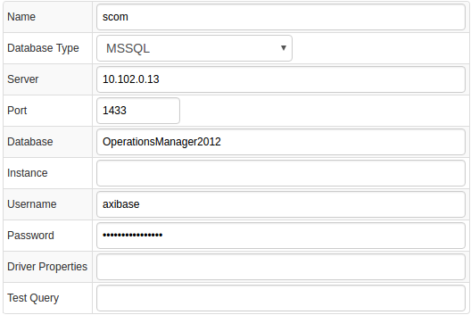
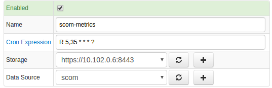
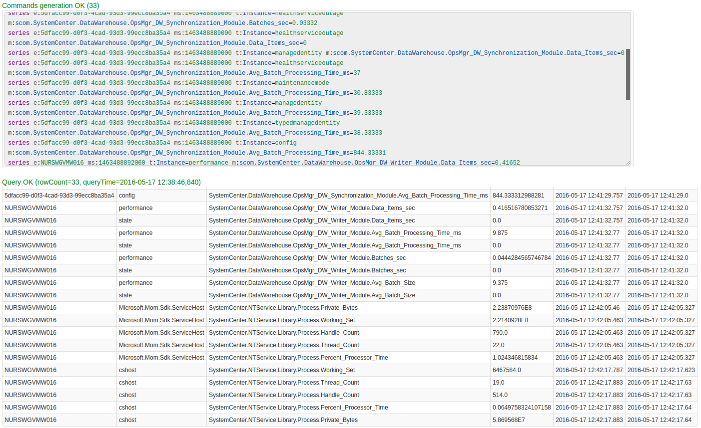
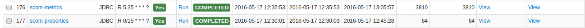
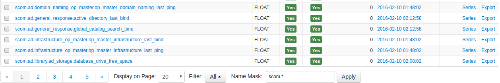
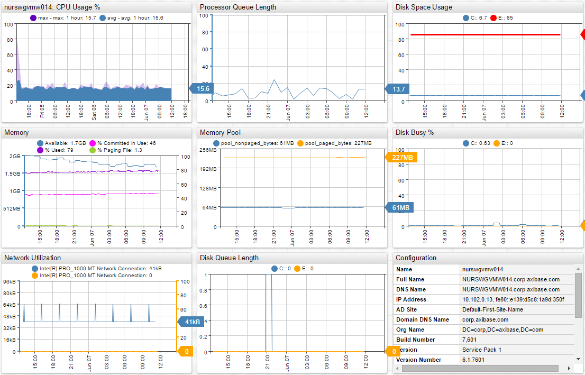
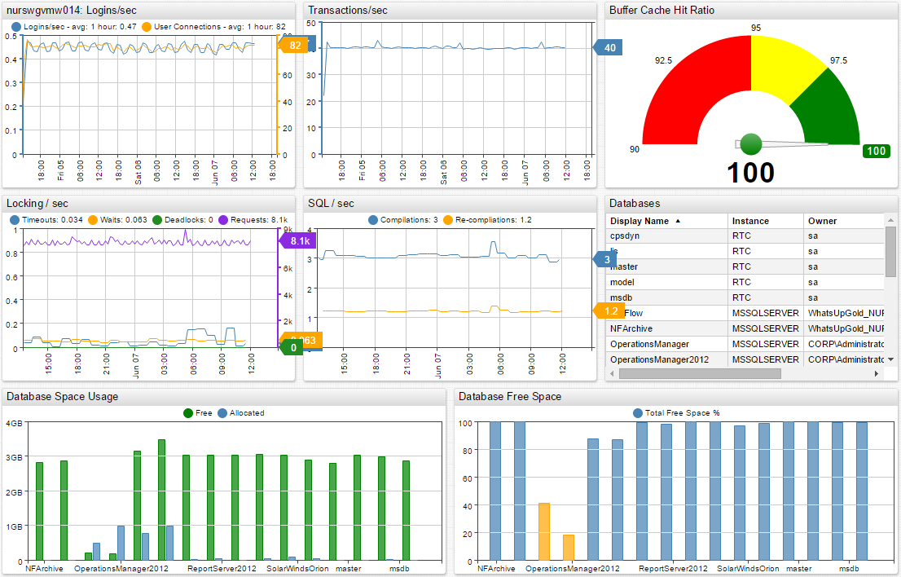

# Microsoft System Center Operations Manager

## Overview

[Microsoft System Center Operations Manager
(SCOM)](http://www.microsoft.com/en-us/server-cloud/products/system-center-2012-r2/ "Microsoft SCOM")
is an agent-based monitoring system for the Microsoft Windows operating system and applications that run on it.

SCOM collects and stores statistics from Windows servers in Operations (`PerformanceDataAllView`) and DataWareHouse (`vperf_raw`, `vperf_hourly`, `vperf_daily`) database views.

Axibase Collector queries `PerformanceDataAllView`in the SCOM Operations database view every 30 minutes to offload incremental data into the Axibase Time Series Database for long-term retention and operations analytics.

## Requirements

* Microsoft System Center Operations Manager 2012+.

## Installation steps

### Import Microsoft SCOM JDBC job

* Open the **Jobs:Import** page and upload the [collector-jobs-scom-jobs.xml](collector-jobs-scom-jobs.xml) file.

### Configure Microsoft SCOM Database Connection

* Open the **Data Sources:Databases** page and select the `scom` database.
* Provide connection parameters to the target `scom-2012` database as displayed below:



* Execute the following test query to check the connection:

```SQL
SELECT 1
```

* Query result must be `Query OK`.

### Verify Job Configuration

* Open SCOM job.
* Set Data Source to `scom`.



* Choose one of target ATSD instances if your Collector instance is connected to multiple ATSD servers.
* Save the Job.
* Open each configuration, click on the [Test] button, and review the output. See [Data Queries](#data-queries) below.



### Schedule the Job

* Open the `JDBC Job` page and click the [Run] button for the Microsoft SCOM JDBC job.
* Make sure that the job status is `COMPLETED` and `Items Read` and `Sent commands` are greater than 0.



* If there are no errors, set job status to 'Enabled' and save the job.

### Verify Metrics in ATSD

* Login into ATSD.
* Click on the Metrics tab and filter metrics by prefix `scom.*`.



## Viewing Data in ATSD

### Metrics

* List of collected [Microsoft SCOM metrics](metric-list.md)

### Properties

* List of collected [Microsoft SCOM properties](properties-list.md)

### Entity Groups

* `scom-servers`
* `scom-databases`

### Portals

* [SCOM Server Live Portal](http://apps.axibase.com/chartlab/c09dc1cd)



* [SCOM SQL Live Server](http://axibase.com/chartlab/693b4f8d/2/)



## Data Queries

[Data queries](data-queries.md) that offload recent metrics and properties.
