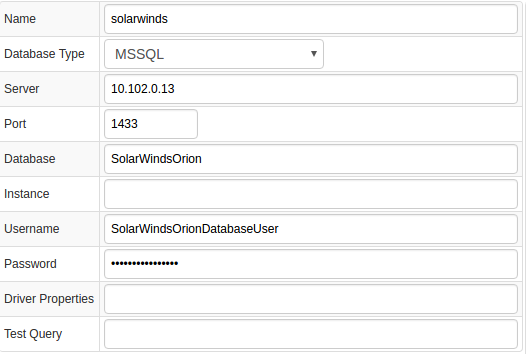
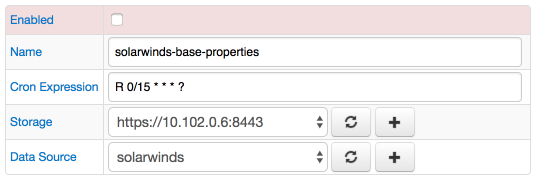
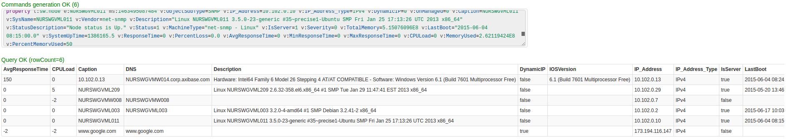
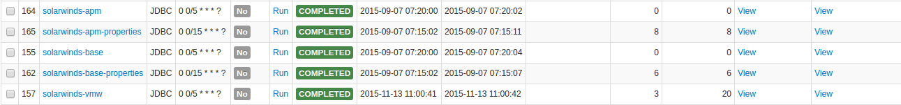
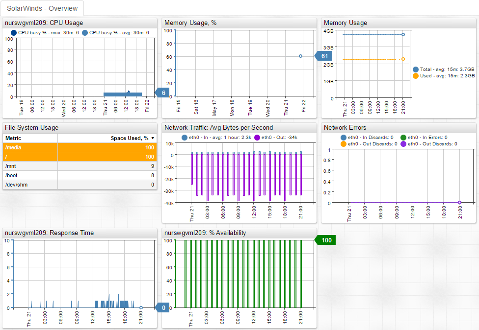

# SolarWinds

## Overview

[SolarWinds](http://www.solarwinds.com/) provides multi-vendor network, server, and application monitoring software for small and medium-size environments.

SolarWinds Monitor products collect and store statistics from target devices in a Microsoft SQL Server database (`SolarWindsOrion`), which Axibase Collector queries every 5 minutes to offload incremental data into the Axibase Time Series Database for long-term retention and operations analytics.

## Requirements

* SolarWinds Server & Application Monitor `6+`

## Installation Steps

### Import SolarWinds JDBC job

* Open the **Jobs:Import** page and upload the [collector-jobs-solarwinds-base-jobs.xml](collector-jobs-solarwinds-base-jobs.xml) file.

### Configure SolarWinds Database Connection

* Open the **Data Sources:Databases** page and select the `solarwinds` database.
* Provide connection parameters to the target `SolarWindsOrion` database as displayed below:



* Execute the following test query to check the connection:

```SQL
SELECT 1
```

* Query result must be `Query OK`.

### Verify Job Configuration

* Open the `SolarWinds` job.
* Set Data Source to `solarwinds`.



* Choose one of target ATSD instances if your Collector instance is connected to multiple ATSD servers.
* Save the Job.
* Open each configuration, click on the [Test] button, and review the output. See [Data Queries](#data-queries) below.



### Schedule the Job

* Open the `JDBC Job` page and click the [Run] button for the SolarWinds job.
* Make sure that the job status is `COMPLETED` and `Items Read` and `Sent commands` are greater than 0.



* If there are no errors, set job status to 'Enabled' and save the job.

### Verify Metrics in ATSD

* Login into ATSD.
* Click on Metrics tab and filter metrics by prefix `sw.*`.

## Viewing Data in ATSD

### Metrics

* List of collected [SolarWinds metrics](metric-list.md)

### Properties

* List of collected [SolarWinds properties](properties-list.md)

### Entity Groups

* `solarwinds-base`
* `solarwind-vmware-vm`
* `solarwind-vmware-host`
* `solarwind-vmware-cluster`

### Portals

* SolarWinds Base Portal



* SolarWinds - VMware VM
* SolarWinds - VMware Host
* SolarWinds - VMware Cluster

## Data Queries

[Data queries](data-queries.md) that offload recent metrics and properties.
