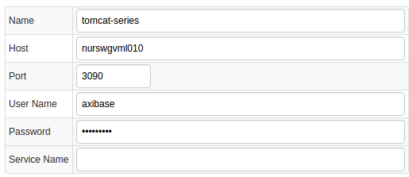
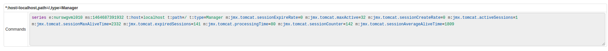
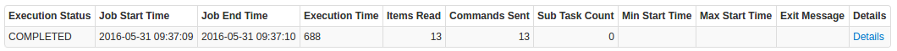
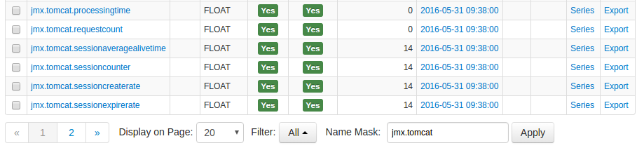
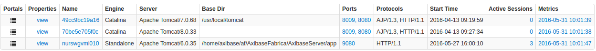
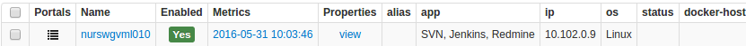
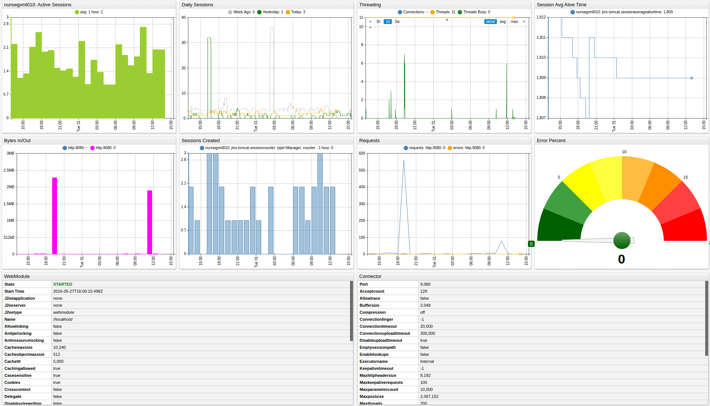

# Tomcat Servlet Container

## Overview

This document describes how to collect JMX metrics exposed by [Apache Tomcat](http://tomcat.apache.org/) Servlet Containers  for long-term retention and monitoring in Axibase Time Series Database.

## Requirements

* Apache Tomcat `6+`

## Installation Steps

### Enable JMX in Java Application

Configure your Java for JMX monitoring as described [here](../../jmx.md).

### Import Tomcat job into Axibase Collector

* Open **Jobs:Import** and upload the job file depending on the version of your servlet container engine:
* [Catalina](configs/tomcat_catalina_job.xml)
* [Standalone](configs/tomcat_standalone_job.xml)

### Configure Tomcat JMX Connection

* Open the **Jobs:JMX** page and select the `jmx-tomcat` job.
* For each JMX Configuration:
* Provide connection parameters to the target Tomcat:

* Click the [Test] button and make sure that the result is similar to the below screenshot:

### Schedule the Job

* Open the `JMX Job` page and click the [Run] button for the Tomcat JMX job.
* Make sure that the job status is `COMPLETED` and `Items Read` and `Sent commands` are greater than 0.

* If there are no errors, set job status to 'Enabled' and save the job.

### Verify Metrics in ATSD

* Log in to ATSD.
* Click on the Metrics tab and filter metrics by name `jmx.tomcat*`.

## Viewing Data in ATSD

### Metrics

* List of collected [Tomcat metrics](metric-list.md)

### Properties

* List of collected [Tomcat properties](properties-list.md)

### Entity group

* Open **Admin:Entity Groups**, click the [Import] button, and upload  [tomcat_entity_group.xml](configs/tomcat_entity_group.xml).
* Select the imported `apache-tomcat` group.
* Verify that the group contains your Tomcat hosts.

### Entity Views

* Open **Configuration:Entity Views**, click the [Import] button, and upload  [tomcat_entity_view.xml](configs/tomcat_entity_view.xml).
* Select the imported `Apache Tomcat Containers` view.
* Select the Entity Group that you created earlier.
* Click on the [View] button and browse information about your entities:

### Portal

* Open **Configuration: Portals**, click the [Import] button, and upload [tomcat_portal.xml](configs/tomcat_portal.xml).
* Click the Assign link and associate the portal with the entity group you created earlier.
* Open Entity tabs, find the java application by name, and click on its portal icon.

[**Tomcat Portal**](http://apps.axibase.com/chartlab/106bddba)

