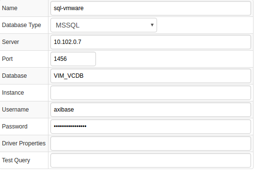
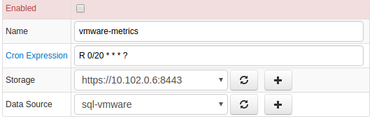
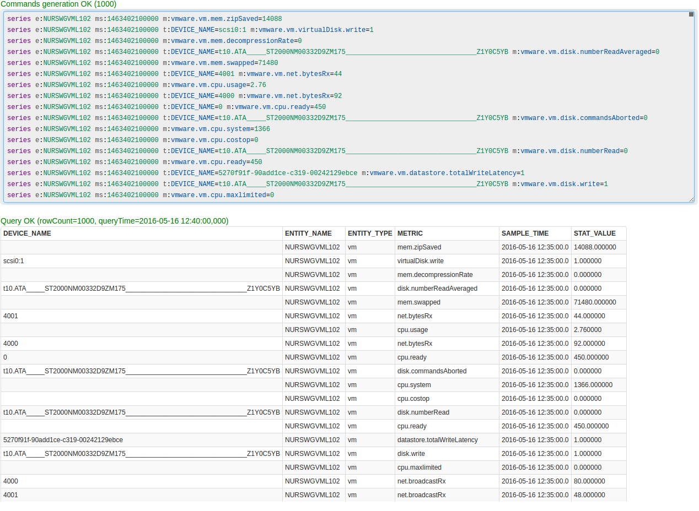
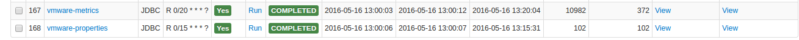
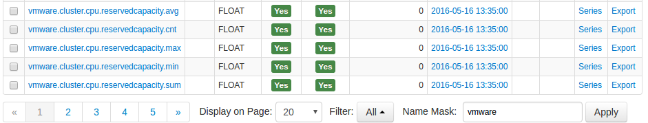
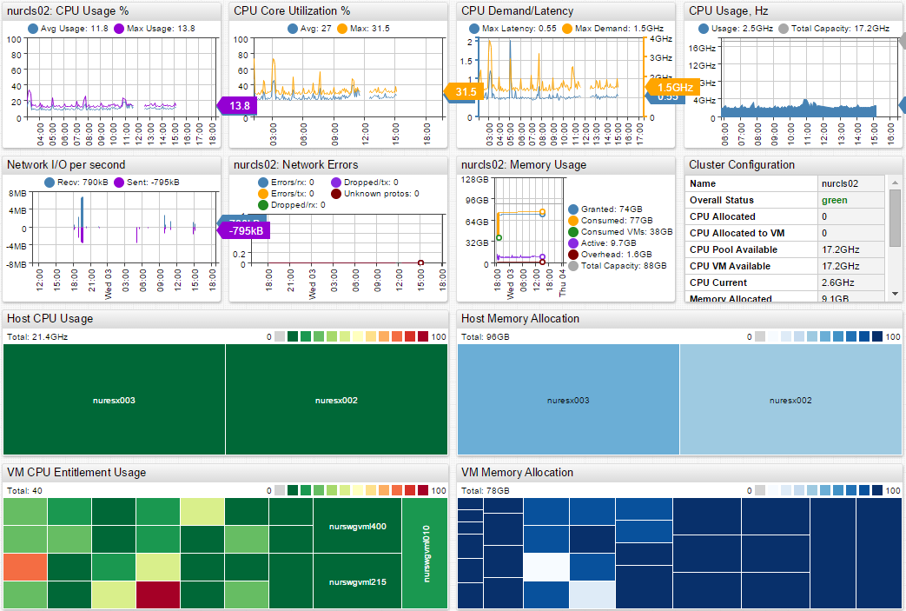
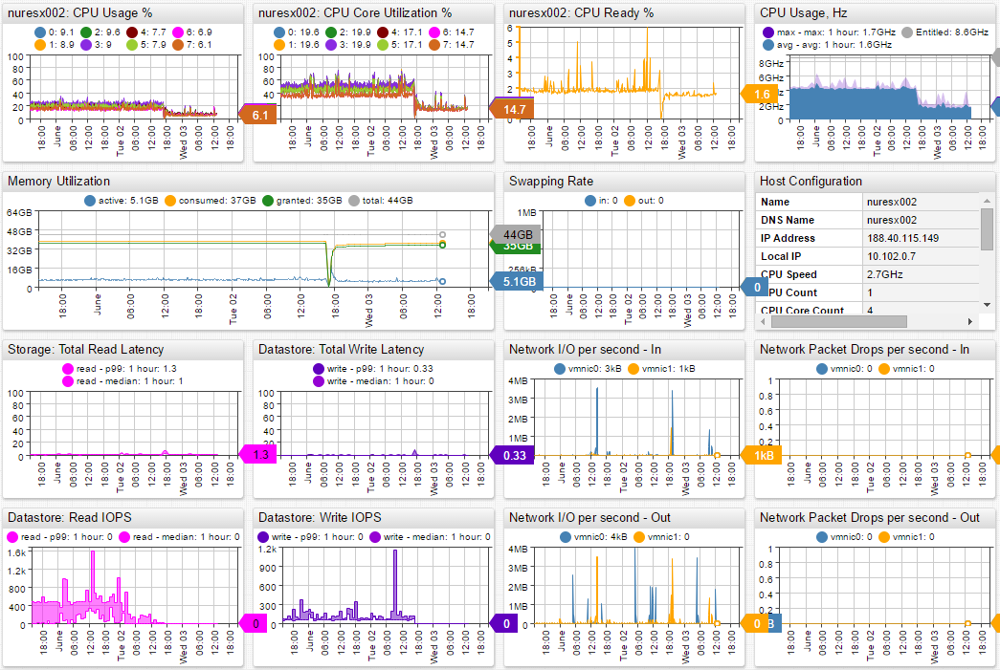
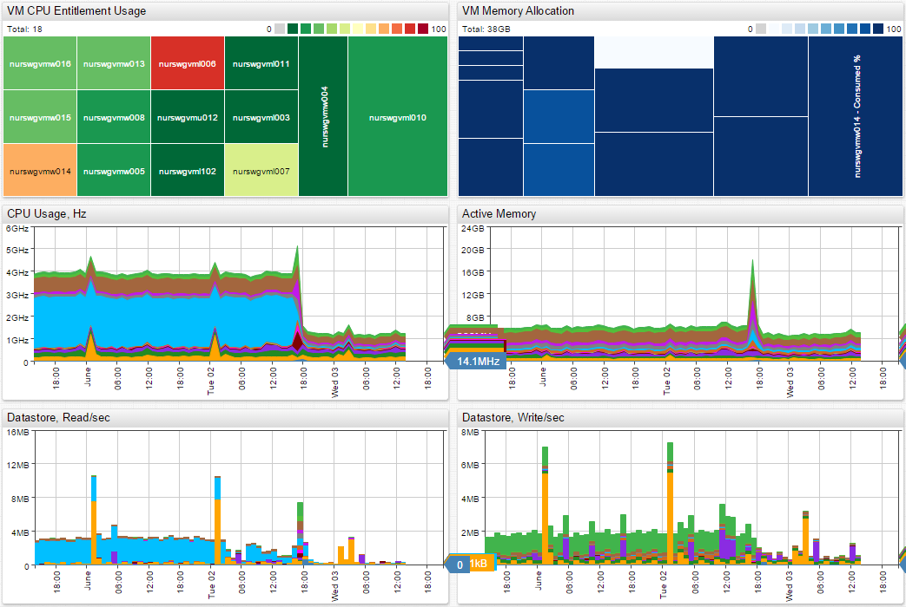
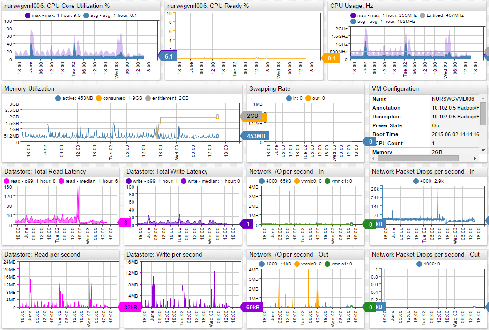

# VMware

## Overview

[VMware vCenter](https://www.vmware.com/products/vcenter-server) provides a centralized platform for managing VMware vSphere environments.

VMware vCenter collects and stores statistics from ESX servers in an Microsoft SQL Server database (`VIM_VCDB`) which Axibase Collector queries every 20 minutes to offload incremental statistics from the `VPX_HIST_STAT1` table into the Axibase Time Series Database for long-term retention and operations analytics.

## Requirements

* VMware vCenter `5.x+`

## Installation Steps

### Import VMware JDBC job

* Open the **Jobs:Import** page and upload the [collector-jobs-vmware-jobs.xml](collector-jobs-vmware-jobs.xml) file.

### Configure VMware Database Connection

* Open the **Data Sources:Databases** page and select the `sql-vmware` database.
* Provide connection parameters to the target `VIM_VCDB` database as displayed below:



* Execute the following test query to check the connection:

```SQL
SELECT 1
```

Query result must be `Query OK`.

### Verify Job Configuration

* Open the VMware job.
* Set Data Source to `sql-vmware`.



* Choose a target ATSD server if your Collector instance is connected to multiple ATSD servers.
* Save the Job.
* Open each configuration, click on the [Test] button, and review the output. See [Data Queries](#data-queries) below.



### Schedule the Job

* Open the `JDBC Job` page and click the [Run] button for the VMware job.
* Make sure that the job status is `COMPLETED` and `Items Read` and `Sent commands` are greater than 0.



* If there are no errors, set the job status to Enabled and save the job.

### Verify Metrics in ATSD

* Login into ATSD.
* Click on Metrics tab and filter metrics by the prefix `vmware.*`.



## Viewing Data in ATSD

### Metrics

* List of collected [VMware metrics](metric-list.md)

### Properties

* List of collected [VMware properties](properties-list.md)

### Entity Groups

* `VMware VMs`
* `VMware Hosts`
* `VMware Clusters`

### Live Portals

* [VMware Cluster Portal](http://axibase.com/chartlab/36ae5c9e/3/)



* [VMware Host Portal](http://axibase.com/chartlab/36ae5c9e)



* [VMware Host VMs](http://axibase.com/chartlab/36ae5c9e/2/)



* [VMware VM Portal](http://axibase.com/chartlab/36ae5c9e/4/)



## Data Queries

[Data queries](data-queries.md) that offload recent metrics and properties.
