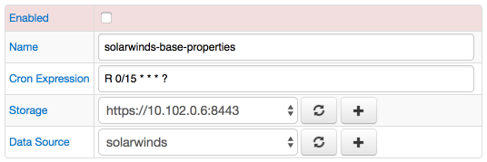
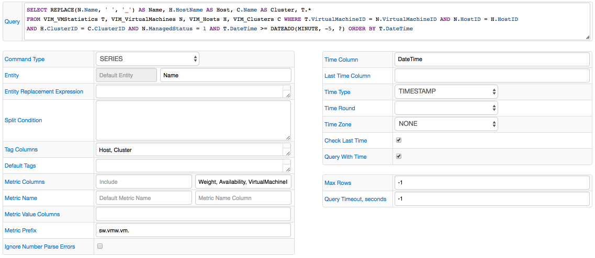

# JDBC Job

## Overview

JDBC (Java Database Connectivity Technology) is an API for Java which provides methods for querying and updating a database.

Axibase Collector can be configured to query a remote database to either obtain current statistics for the purpose of accumulating their history in Axibase Time Series Database or to offload incremental statistics into ATSD for long-term retention and analytics.

## Supported Databases

* Oracle Database
* Microsoft SQL Server
* IBM DB2
* MySQL
* PostgreSQL
* Sybase
* Apache Derby
* SAP HANA
* OSIsoft PI
* HP Vertica
* ATSD
* CUSTOM

## Examples

* [Oracle EM](examples/oracle-enterprise-manager)
* [Microsoft SCOM](examples/scom)
* [SolarWinds](examples/solarwinds)
* [VMware](examples/vmware)
* [MySQL Database](examples/mysql)

## Job Settings

Apart from [common](../job-generic.md), JDBC job has an additional field. 
**Data Source** list allows you to select a database that will be queried. The list contains all databases connected as data sources.

### Job Configuration

To add a new query, on the JDBC Job page click 'Create Query'. 
Use the table below to fill in the fields and configure the query.

| FIELD              | DESCRIPTION  |
| :----------------- |:-------------|
| Query           | SELECT query containing the entity name, time, and a list of metric columns. |
| Command Type    | Type of command sent to ATSD. Possible values: SERIES, PROPERTY, MESSAGE, METRIC, ENTITY. |
| Default Entity  | Default entity assigned to the collected commands. |
| Entity Column   | Retrieve entity value from the specified entity column. |
| Entity Replacement Expression | Freemarker expression to extract entity name from an input string or to retrieve it from a lookup table using [LOOKUP](#lookup-function). |
| Split Condition  | One or multiple WHERE conditions to copy the base query into multiple queries returning smaller resultsets.  |
| Tag Columns     | Columns that contain series tags. |
| Predefined Tags    | Assign predefined tags to all series. |
| Time Column | Column containing the timestamp. |
| Last Time Column | Column containing last update time. |
| Time Type | Timestamp type.  Possible values: TIMESTAMP, TIVOLI, TEXT, UNIX |
| Time Format | Format of the timestamp. |
| Time Round | Time will be rounded before storing the series in ATSD.  Possible values: MILLISECOND, SECONDS, MINUTE, HOUR, DAY |
| Time Zone | Time zone in which the data was originally collected and stored. |
| Check Last Time | Ignore metrics that have time set to less than the previous entry. |
| Query With Time | When executing the job, the server will be set to the maximum time of the previous data. |
| Collection Start Time | [Calendar expression](https://axibase.com/docs/atsd/shared/calendar.html) defining the beginning of the data collection interval, for example, previous_week. |
| Max Rows | Maximum number of rows that will be collected with each batch, -1 is unlimited. |
| Query Timeout Seconds| Number of seconds after which the query will be interrupted, -1 is unlimited. |

#### Placeholders

[Default Entity](#field-default-entity) and [Predefined Tags](#field-pre-tags) fields support the following placeholders:

| **Placeholder** | **Description** |
| --- | :--- |
| `${DB_CONFIG_NAME}` | Data source [Name](jdbc-data-source.md#db-name). |
| `${DB_SERVER}` | Data source [Server](jdbc-data-source.md#db-server). |
| `${DB_PORT}` | Data source [Port](jdbc-data-source.md#db-port).|
| `${DB_NAME}` | Data source [Database Name](jdbc-data-source.md#db-database). |

#### Type-Specific options

##### SERIES

| FIELD              | DESCRIPTION  |
| :----------------- |:-------------|
| Metric Columns  | Columns containing metric values |
| Ignored Metric Columns | Metric columns that you want to skip. |
| Default Metric Name  | Assign a default metric to the collected series. All series will be stored in ATSD with this metric. |
| Metric Name Column | Column containing metric (series) names. |
| Metric Value Column | Column containing metric (series) values. It is possible to collect multiple value columns for the same metric, as is common in aggregation queries. For example: cnt, avg, max, min, sum.  Example query:  SELECT st.SAMPLE_TIME, e.ENTITY_NAME, sd.NAME AS METRIC,  COUNT(hs.STAT_VAL) AS "cnt",  AVG(hs.STAT_VAL) AS "avg",  SUM(hs.STAT_VAL) AS "sum",  MAX(hs.STAT_VAL) AS "max",  MIN(hs.STAT_VAL) AS "min"  FROM VPX_HIST_STAT1 ...|
| Metric Prefix | Metric prefix can be assigned to easily sort and differentiate metrics in ATSD. |
| Ignore Number Parse Errors | Ignore cells that fail to parse from string into number without raising error. Default: false.  |

#### PROPERTY

| FIELD              | DESCRIPTION  |
| :----------------- |:-------------|
| Property Type | Default property type for all property commands, or column containing property type |
| Property Key Columns | Columns containing strings that will be treated as property keys |
| Property Value Columns | If specified, only listed columns will be considered a source of property values. By default all unused columns are treated as property values |
| Ignored Property Value Columns | Columns to be excluded from list of property values |

##### MESSAGE

| FIELD              | DESCRIPTION  |
| :----------------- |:-------------|
| Type | Type applied to all messages, or column containing message type |
| Source | Source applied to all messages, or column containing message source |
| Severity | String representation of message severity. Either a selected value or a column containing severity |

##### METRIC

| FIELD              | DESCRIPTION  |
| :----------------- |:-------------|
| Metric Name Column | Column containing metric names. |
| Label Column | Label Column: Column containing metric or entity label.Default Label: Label applied to all generated metrics or entities |
| Description Column | Column containing metric or entity description. |
| Data Type | Default metric data type, or column containing metric datatype. One of: short, integer, long, float, double, decimal |
| Interpolation Mode | Default interpolation mode setting or column containing interpolation mode setting. Should contain a string value, case-insensitive. Possible values: LINEAR, PREVIOUS, or NONE  |
| Filter Column | Column containing metric filter expression. |
| Versioning | Default versioning behavior if versioning column is not specified, or column specifying if metric is versioned. |
| Min and Max Value Columns | Minimum and Maximum Values |
| Units | Measurement Units |
| Metric Time Zone | Default Time Zone or column containing the [Time Zone Identifier](https://axibase.com/docs/atsd/shared/timezone-list.html)  |

##### ENTITY

| FIELD              | DESCRIPTION  |
| :----------------- |:-------------|
| Label Column | Label Column: Column containing metric or entity label.Default Label: Label applied to all generated metrics or entities |
| Interpolation Mode | Default interpolation mode setting or column containing interpolation mode setting. Should contain a string value, case-insensitive. Possible values: LINEAR, PREVIOUS, or NONE  |
| Entity Time Zone | Default Time Zone or column containing the [Time Zone Identifier](https://axibase.com/docs/atsd/shared/timezone-list.html) |

### Configuration Example

The image below shows an example JDBC query configuration.

