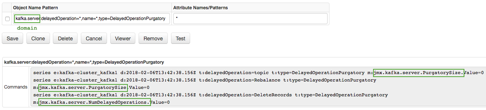
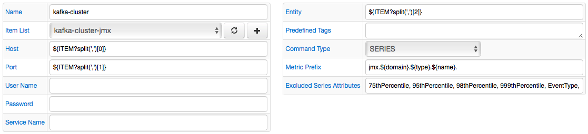
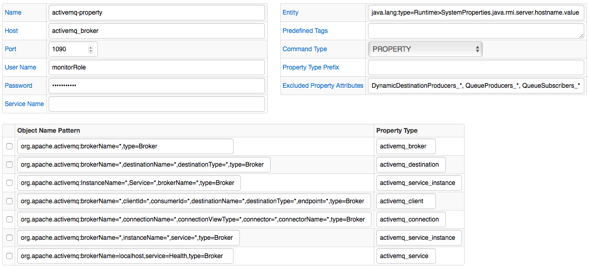

# JMX Job

## Overview

JMX (Java Management Extensions) is an [industry-standard](http://java.sun.com/products/JavaManagement/download.html) technology for monitoring and managing Java applications. Java applications instrumented with JMX expose a set of resources called MBeans (Management Beans) with attributes and methods that can be queried and invoked programmatically.

The JMX job in Axibase Collector provides a way to query MBean attribute values from remote Java applications and transmit them to the Axibase Time Series Database for alerting and long-term retention. MBean attribute values can be stored as properties or series in case of numeric attributes.

The JMX job can have one or multiple JMX configurations each describing connection parameters and MBean queries. It is common for configurations in a given job to connect to the same Java application.

## JMX Configuration

### Connection Parameters

| Field       | Description |
|:-------------|:-------------|
| Name | Job configuration name. |
| Item List | A collection of elements to execute multiple requests to JMX service in a loop.The current element in the loop can be accessed with `${ITEM}` placeholder. When Item List is selected and `${ITEM}` is present in one of the fields, the job will execute as many queries as there are elements in the list, substituting `${ITEM}` with element value for each request.The placeholder `${ITEM}` supports [standard functions](../collections.md#functions) and [column](../functions-freemarker.md#column) function. |
| Host | Hostname or IP address of the remote server running Java application with JMX service. |
| Port | JMX service port.  |
| User Name | JMX username. |
| Password | JMX password. |
| Service Name | JMX service username. The default service name is `jmxrmi`. |

Connection parameters should correspond to the `com.sun.management.jmxremote` settings specified by the target Java application.

```sh
ACTIVEMQ_SUNJMX_START="-Dcom.sun.management.jmxremote \
   -Dcom.sun.management.jmxremote.port=1090 \
   -Dcom.sun.management.jmxremote.rmi.port=1090 \
   -Dcom.sun.management.jmxremote.ssl=false \
   -Djava.rmi.server.hostname=NURSWGVML011 \
   -Dcom.sun.management.jmxremote.password.file=${ACTIVEMQ_BASE}/conf/jmx.password \
   -Dcom.sun.management.jmxremote.access.file=${ACTIVEMQ_BASE}/conf/jmx.access"
```

To verify connectivity with the remote host, click the [Test] or [Viewer] buttons.

Add hostname to the `/etc/hosts` file directory on the collector machine in case of `UnknownHostException`.

```java
Failed to retrieve RMIServer stub: javax.naming.ConfigurationException [Root exception is java.rmi.UnknownHostException: Unknown host: NURSWGVML011; nested exception is: java.net.UnknownHostException: NURSWGVML011]
```

## Query Parameters

| Field | Description |
|:---|:---|
| Entity | Entity name under which the data will be stored. |
| Predefined Tags | Predefined tags added to all commands, one name=value pair per line.This field supports the following placeholders:- `${domain}` = Domain of the mbean- `${name}` = Value of 'name' attribute of the mbean |
| Command Type | Insert command type: SERIES, PROPERTY or BOTH. |
| Metric Prefix | Common prefix added to metric names, for example `jmx.activemq.`This field supports the following placeholders:- `${domain}` = Domain of the MBean- `${attribute_name}` = Value of attribute of the MBeanThe attributes will be excluded from series tags, if they are included using a placeholder. |
| Property Type Prefix  | Prefix added to property type, for example `jmx.activemq.`Property type is set to MBean `type` attribute by default.This field supports the following placeholders:- `${domain}` = Domain of the MBean- `${attribute_name}` = Value of attribute of the MBeanThe attributes will be excluded from property keys, if they are included using a placeholder. |
| Excluded Property Attributes | List of attribute names excluded from property commands.  |
| Excluded Series Attributes | List of attribute names excluded from series commands. |

> Excluded Property and Series Attributes support '*' wildcards, for example: `DynamicDestinationProducers_*, QueueProducers_*`.

### Entity Name

If not specified, the entity name is set to the value of the Host field. You can override it, for example, if the Host field contains a DNS hostname, whereas you need to collect data under a short hostname of the server where the Java application is running.

In addition, the entity name can be retrieved dynamically by specifying the MBean Object Name followed by `>` and the attribute name (`mbean>attribute`). For example:

```java
java.lang:type=Runtime>SystemProperties.java.rmi.server.hostname.value
```

> If the entity name query fails to provide a value or if the bean or attribute is not found, the entity name will be set to the Host field. If the composite expression retrieves a value successfully, it will be stored in the Axibase Collector database and will be re-used in case of subsequent connection errors.

## Queries

Configuration includes a list of MBean queries consisting of two parts: object name pattern and attribute list.

The list of queries can be entered manually or by opening [Viewer](#viewer), expanding MBean hierarchy, and choosing attributes of interest.

Both parts of the query support wildcards:

* Asterisk `*` replaces any number (including zero) of characters.
* Question mark `?` replaces any one character.

### [Object Name](https://docs.oracle.com/javase/7/docs/api/javax/management/ObjectName.html) pattern

The pattern pattern matches MBean instances of specified type and name.

```sh
org.apache.activemq:brokerName=localhost,type=Broker   -->     TotalProducerCount, TotalMessageCount
```

Negation is not supported by JMX natively and is therefore implemented on the client. To exclude MBean use `!=` operator. For example, to exclude topics starting with underscore:

```sh
kafka.cluster:name=*,partition=*,topic!=_*,type=Partition
```

| Example  | Description |
|:-------------|:-------------|
| `*:type=Foo,name=Bar` | matches names in any domain whose exact set of keys is `type=Foo,name=Bar`. |
| `d:type=Foo,name=Bar,*`| matches names in the domain `d` that have the keys `type=Foo,name=Bar` plus zero or more other keys.|
| `*:type=Foo,name=Bar,*`| matches names in any domain that has the keys `type=Foo,name=Bar` plus zero or more other keys.|
| `d:type=F?o,name=Bar`| matches for example `d:type=Foo,name=Bar` and `d:type=Fro,name=Bar`.|
| `d:type=F*o,name=Bar`| matches for example `d:type=Fo,name=Bar` and `d:type=Frodo,name=Bar`.|
| `d:type=Foo,name="B*"`| matches for example `d:type=Foo,name="Bling"`. Wildcards are recognized inside quotes and can be escaped with `\`.|
| `d:type=Foo,name!=B*` | matches names that doesn't start with `B`, for example `d:type=Foo,name=Store`.|

### Attribute Name list

The list specifies attributes whose values will be retrieved and sent to the database.

The list can include specific names as well as name patterns.

You can specify the list of collected attributes by replacing specific attribute names with wildcards. For example, to collect all numeric attributes from MBean `java.lang:*,type=GarbageCollector`, specify `*` in the corresponding attribute selector field.

| Object Name Pattern        | Attribute Name List  |
|:-------------|:-------------|
| `java.lang:*,type=GarbageCollector` | `CollectionCount, CollectionTime`|
| `java.lang:*,type=GarbageCollector` | `CollectionCount, LastGcInfo.*`|
| `java.lang:type=Memory` | `HeapMemoryUsage*` |

Special processing for `PROPERTY` command:

* Attribute Name list is ignored for property commands since property commands collect all attributes of the matched beans.
* The default value for property `type` field is set to MBean type, for instance, to `Broker` in the example above. To override the default type, enter a custom value or use `${attribute_name}` placeholders in the `property_type` column.


#### Metric Prefix Example

Metric Prefix:

```sh
jmx.${domain}.${name}
```

The attribute `name` is excluded from series tags, because the `Metric Prefix` field contains it using placeholder:



#### Item List Example

The `kafka-cluster-jmx` list contains items (`host,port,entity`):

```txt
172.17.0.1,1099,kafka1
172.17.0.2,1099,kafka2
172.17.0.3,1099,kafka3
```

The each row is splitted by [freemarker function](https://freemarker.apache.org/docs/ref_builtins_string.html#ref_builtin_split) to extract values:



## JMX Configuration Example



## Viewer

Click 'Viewer' to open a tree-based MBean navigator displaying available Management Beans and their attributes.

Select a checkbox next to an attribute name to add to the list of collected attributes. Modify the expression by replacing the specific Object Name fields with wildcards, if necessary.


## Ignored MBean Attributes

The following MBean attributes are ignored from Viewer and the commands:

* Attribute value cannot be obtained due to a processing error: - `UnsupportedOperationException`- `UnmarshalException`- `ReflectionException`- `RuntimeOperationsException`- `InstanceNotFoundException`
* Attribute value is NaN (Not a Number) for numeric attributes in case of a **series** command. NaN can occur, for example, on division by zero.

To view attributes ignored due to processing errors, enable debugging for the **MBeansInfoExtractor** class:

```xml
<logger name="com.axibase.collector.model.jmx.MBeansInfoExtractor" level="DEBUG">
    <appender-ref ref="logRoller"/>
</logger>
```

Restart Axibase Collector process, execute the JMX job, or open the Viewer.

Review the log:

```txt
tail -f ./axibase-collector/logs/axibase-collector.log
```
