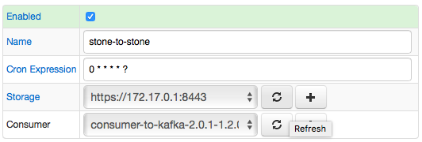
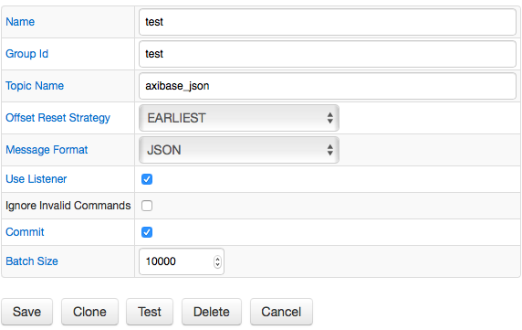
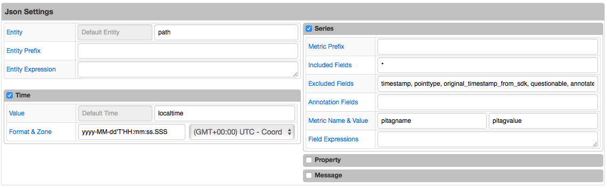

# Kafka Job

## Overview

The Kafka job provides a way to read messages from Apache Kafka broker(s) to convert them into series, property, and message commands.

## Job Settings

Apart from [common](../job-generic.md), Kafka job has an additional `Consumer` field. 
**Consumer** list allows you to select a [consumer](kafka-consumer.md) that will be used.



### Job Configuration

To configure a Kafka job, click on the `Create Configuration` button.
Use the table below to set configuration parameters.

**Field** | **Description**
----- | -----------
Group Id | A unique string that identifies the consumer group this consumer belongs to.
Topic Name | A topic is a category or feed name to which messages are published.
Offset Reset Strategy | Initial offset:\* EARLIEST: automatically reset the offset to the earliest offset\* LATEST: automatically reset the offset to the latest offset\* LAST_N: reset the offset to the lastes offset and substract `Last Cont` value from it.Offset strategies (EARLIEST, LATEST) use at first job running, then job uses the last committed offset.The `LAST_N` offset strategy doesn't use last committed offset, it uses last N records each time job executes.
Last Count | The number of last messages.
Message Format | [Network API Command](https://axibase.com/docs/atsd/api/network/) or JSON. Network API Command will be stored in ATSD as is. The JSON message will be parsed into command(s).
Use Listener | Enable continuous listener of messages instead of scheduled polling.
Ignore Invalid Commands | If enabled, skip messages for which no valid command can be created.If the message is invalid and this case is not enabled, the job will fail with an error.,
Commit | Send commands into ATSD synchronously and wait until the commands have been committed to the underlying storage.
Batch Size | Number of commands to send into ATSD in one request.

## JSON Settings

If `JSON` message format is selected, we need to configure JSON fields mapping to command fields:

### Entity Fields

**Name** | **Description**
---| ---
Entity | Entity name, specified literally or extracted from the specific field in the matched object.
Entity Prefix | Text added to the entity name, retrieved from the specified field. For example, if Entity Prefix is set to 'custom.', and the field value is 'my-host', the resulting entity name will be 'custom.my-host'.
Entity Expression | Freemarker expression to convert entities.For example:${city?keep_after('.')}${LOOKUP('city codes', city)}

### Time Fields

**Name** | **Description**
---| ---
Time Default | Specify time value for all commands.
Time Field   | Field with values that specify time for all commands.
Time Format  | Date format applied when parsing time value.
Time Zone    | Time zone can be optionally applied if the extracted date is in local time, otherwise the local Collector time zone is in effect.

### Series Fields

**Name** | **Description**
--- | ---
Metric Prefix | Text added to the metric name. For example, if Metric Prefix is set to 'custom.', and the metric name is 'cpu_busy', the resulting metric name will be 'custom.cpu_busy'.
Included Fields | By default, all numeric fields from nested objects are included in commands. The list of included fields can be overridden explicitly by specifying their names, separated by comma.
Excluded Fields | List of particular field names to be excluded from commands. Applies when 'Included Fields' is empty.
Annotation Fields | List of fields whose values will be saved as 'text' annotation along with the numeric value.
Metric Name & Value | Metric name and value extracted from the given fields in the matched object.
Field Expressions | Freemarker expressions to convert metric fields.For example:${city?keep_after('.')}${LOOKUP('city codes', city)}

### Property Fields

**Name** | **Description**
--- | ---
Property Default Type | Property type that will be used as a default type for all properties.
Property Type Field   | Field with value that will be used as property type.
Property Key Fields   | Fields that should be included into the Property command value collection.
Property Value Fields | Fields that should be loaded to a collection as properties.

### Message Fields

**Name** | **Description**
--- | ---
Message Default Type | Message type that will be used as a default type for all messages.
Message Type Field   | Field with value that will be used as message type.
Message Default Type | Message source that will be used as a default source for all messages.
Message Type Field   | Field with value that will be used as message source.
Message Tag Fields   | Message tags, included as tags into the message command.
Message Default | Message value that will be used as a default text for all messages.
Message Field   | Field with value that will be used as message text.

## Examples

* [Network API Command](examples/kafka/network-format/README.md)
* [JSON](examples/kafka/json-format/README.md)

### Configuration Example





* Sample Message:

```json
{
  "pitagname":"AXI.R06PIS01:SIC-84-601.PV",
  "pitagvalue":"149.478",
  "pointtype":"Float32",
  "questionable":0,
  "substituted":0,
  "timestamp":"2015-12-25T11:28:14.000",
  "localtime":"2015-12-25T13:28:14.000",
  "annotated":0,
  "original_timestamp_from_sdk":"2015-12-25T13:28:14.000",
  "path":"/Axibase/NUR/AXI/Upstream/84BR02"
}
```

* Sample Command:

```ls
series e:/axibase/nur/axi/upstream/84br02 d:2015-12-25T13:28:14.000Z m:AXI.R06PIS01:SIC-84-601.PV=149.478
```
