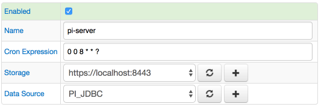
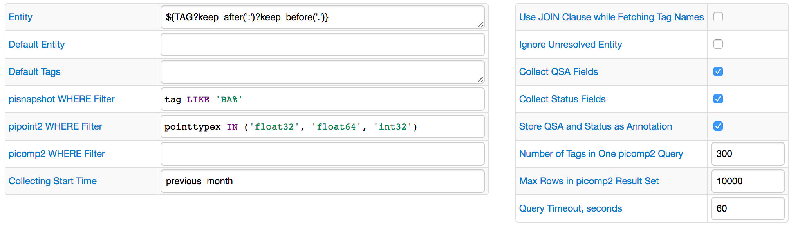

# PI Job

## Overview

The PI Server is the real-time data storage and distribution engine that provides a comprehensive real-time and historical view into operations

Axibase Collector can be configured to extract data from the PI Server via JDBC, transform PI tags into ATSD metrics, and upload metrics to ATSD for long-term retention and analytics.

## Preconditions

Before starting to configure the PI job, you should have the PI JDBC driver installed and put into the Collector's classpath. To do it, follow the steps in [the manual](examples/pi/export-metrics.md#provide-axibase-collector-with-pi-jdbc-driver).

## Job Settings

Just like the general [JDBC job](jdbc.md), PI job has the `Data Source` field. It will allow you to select the configured PI JDBC data source.

### PI Configuration

To configure a PI job, click on the `Create Configuration` button.
Use the table below to set configuration parameters.

| FIELD              | DESCRIPTION  |
| :----------------- |:-------------|
| Entity | The expression to retrieve entity name from PI tag name. Supported placeholders:- ${TAG} = current processed PI tag- ${[LOOKUP()](placeholders.md#lookup-function)} = function to retrieve a value for key from an Item List |
| Default Entity | Default entity applied if Entity Expression is not specified or entity is not found in the Item List. |
| Default Tags | List of name=value tag pairs, one per line, stored as series tags. Tag value can refer to the ${TAG} placeholder. |
| pisnapshot WHERE Filter | An expression included in the WHERE clause when querying the pisnapshot table. The expression must return a boolean value. |
| picomp2 WHERE Filter | An expression included in the WHERE clause when querying the picomp2 table. The expression must return a boolean value. |
| pipoint2 WHERE Filter | An expression included in the WHERE clause when querying the picomp2 table. The expression must return a boolean value. |
| Collecting Start Time | [Calendar expression](https://axibase.com/docs/atsd/shared/calendar.html) defining the beginning of the data collection interval, for example, previous_week. |
| Use JOIN Clause while Fetching Tag Names | If disabled, results of pipoint2 and pisnapshot tables will be merged on the client side (in Collector). If enabled, one query with JOIN clause will be executed to filter tags. |
| Ignore Unresolved Entity | If enabled, skip tags for which no valid entity can be retrieved. If the entity is invalid and this case is not ignored, the job will fail with an error. |
| Collect QSA Fields | If enabled, collect non-default values of questionable, substituted, annotated, annotations columns. |
| Collect Status Filelds | If enabled, collect non-default (non-zero) status. |
| Store QSA and Status as Annotation | If enabled, QSA and status columns will be serialized into text (annotation) field like questionable=true;substituted=true;annotated=true;status=-253.If disabled, QSA and/or status columns will be stored as series tags. |
| Number of Tags in One picomp2 Query | Maximum number of tags included in one query. |
| Max Rows in picomp2 Result Set | Maximum number of rows per query |
| Query Timeout, seconds | Query timeout in seconds |

### Configuration Example

The image below shows an example PI configuration.

### Examples

[PI Job](examples/pi/export-archive-data.md)