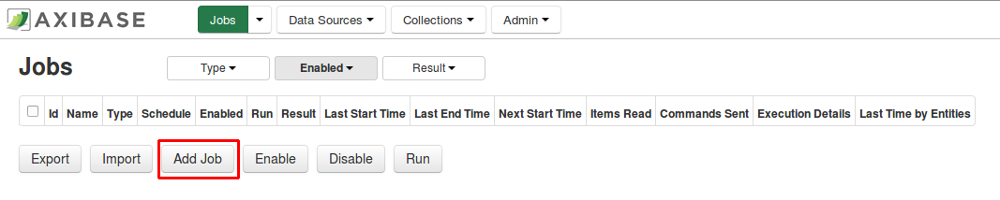
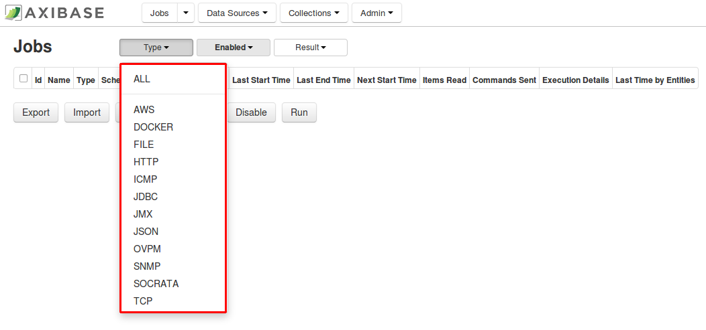
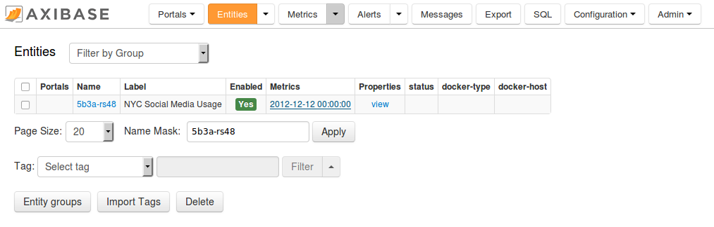

# Socrata Job Tutorial

In this tutorial we will walk through setting up a Socrata job in Collector for a data.gov dataset on [New York City Social Media Usage](https://catalog.data.gov/dataset/nyc-social-media-usage-555a2).
The JSON file (1.1 MB) can be found [here](https://data.cityofnewyork.us/api/views/5b3a-rs48/rows.json?accessType=DOWNLOAD).

1. Login into Collector.

   

2. Click on the 'Jobs' tab in Collector.

   

3. Click on the `Add Job` button.

   

4. To select the type of job you would like to add, you may complete either of the following steps.

   - Before completing the previous step, filter by your desired job type (Socrata) in the 'Jobs' tab. After pressing the `Add Job` button, the desired job type will have already been specified.

   

   - Press the `Add Job` button (step 3). On the following page, select your specified job type.

   

5. As shown in the image below, there are four fields to specify: `Enabled`, `Name`, `Cron Expression`, and `Storage`.

   

   - `Enabled`: job status. You may enable the job, which will schedule it for data collection with the period specified in the Cron Expression, by clicking the check box. To
      have the job disabled, leave it unchecked. Leave unchecked this for tutorial.
   - `Name`: job name. Enter in a relevant name for your new Socrata job. Let's use the name `NYC-Social-Media-Usage`.
   - `Cron Expression`: job execution time period. Cron fields are specified in the following order: second, minute, hour, day-of-month, month, and day-of-week. You can randomize time of execution by putting `R` onto time placeholders. Click
      on field to see time periods in human readable formats, as shown in the image below.
   - `Storage`: database for storing data collected by this job.

   

6. After specifying each of these fields, hit the `Save` button.
7. Press the `Create Configuration` button.

   

8. Copy the short URL (**without** `rows.json?accessType=DOWNLOAD` selected) from your JSON file and paste it into the `Path` line. You do not need to fill in the `Name` field, as
   it will be automatically filled in from the previous page. For more information on the remaining fields in this screenshot, click [here](../jobs/socrata.md#job-configuration).

   

9. Press `Add` to create a pre-configured settings section.
10. Press `Test`. To view descriptions of each of the fields shown below, click [here](../jobs/socrata.md#job-configuration).

    

11. After pressing the `Test` button, you should get the following output. Collector has downloaded a part of the JSON file (file limitation 1 Mb) and generated commands based off of
    the dataset configuration (series, property, message, metric, and entity tags). These commands are only for text purposes, and have not yet been sent/saved to ATSD.

    You may save this configuration by clicking the `Save` button shown in the image from step 10.

    

12. Navigate back to the Socrata job (the figure shown in step 7). Press `Run`. This will send generated commands to ATSD, which will enable you to begin working with this dataset.
    After hitting `Run`, you will be sent to this page. Hit the `Refresh` button after a couple of seconds. If your job has been successfully completed, you should see something
    like the images below.

    

    

13. Navigate to your local ATSD instance and log in. Open the 'Entities' tab to verify that metrics from the dataset are present in ATSD. You can search by your dataset id, which
    is taken from the original JSON file and in this case is `5b3a-rs48`. We can see that metrics were successfully sent from Collector to ATSD and we can begin analyzing this
    dataset.

    
