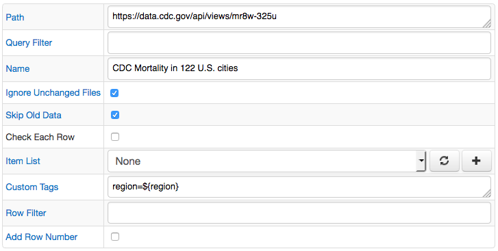
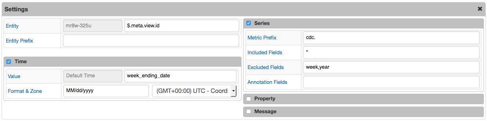
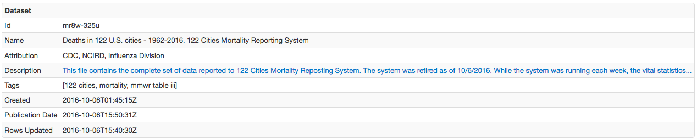
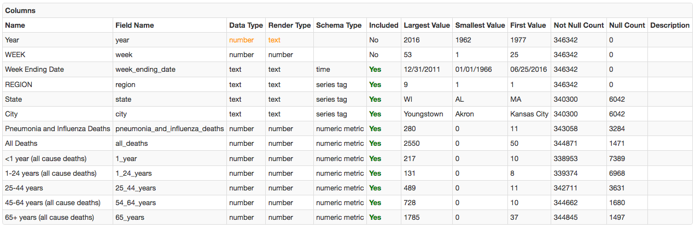

# Socrata Job

## Overview

The Socrata job provides a way to convert JSON documents published in [Open Data](https://project-open-data.cio.gov/v1.1/schema/) schema into series, property, and message commands.

Unlike the generic [JSON job](../jobs/json.md), the Socrata job simplifies the processing using built-in rules and heuristics, eliminating the need to use JSONPath expressions to map JSON fields to command fields.

JSON documents published in the Open Data format contain both metadata as well as data itself.

* Metadata: `https://data.cdc.gov/api/views/mr8w-325u`
* Metadata and data: `https://data.cdc.gov/api/views/mr8w-325u/rows.json`

The most important part that the Socrata job relies on for processing is the `columns` section in the metadata, which provides a list of column names, their datatypes, and typical values.

```json
"columns" : [ {
    "id" : 272239777,
    "name" : "Year",
    "dataTypeName" : "text",
    "fieldName" : "year",
    "position" : 2,
    "renderTypeName" : "text",
    "tableColumnId" : 38857128,
    "width" : 148,
    ,,,
}]
```

## Job Settings

The [settings](../job-generic.md) implemented at the job level are the same as for other job types.
The ['Cron Schedule'](../scheduling.md) defines how often the dataset should be checked for new records and ['Storage'](../atsd-server-connection.md) determines the target ATSD instance where the commands should be sent.

If the source dataset is static and will not be updated, it may not make sense to enable the job since the data will always be the same. To load data once for a static dataset, save the job and click on the 'Run' button/link to execute the job manually. If, however, the underlying dataset is regularly updated with new rows, enabling the job and specifying an appropriate schedule ensures that new data is continuously propagated into ATSD.

Each Socrata job can have multiple configurations, with each loading data for a different dataset. The configurations will be executed sequentially, when the job is launched, and will send the data into the same ATSD instance. It is recommended that datasets with similar update intervals are grouped under one job for efficient processing. For example, datasets that are updated weekly can be grouped into one 'Weekly Socrata' job.

### Job Configuration

The configuration instructs Collector how to convert fields in the JSON document into series, property, and message commands.

> To automatically map JSON columns to command fields, enter dataset URL into the Path field and click [Add].

| **Field** | **Description**  |
| :---- |:--- |
| Path | Full URL to the dataset including the protocol, host, port, path, and optional query string.Example: `https://data.cityofnewyork.us/api/views/f9bf-2cp4/rows.json` or `https://data.cityofnewyork.us/api/views/f9bf-2cp4`. The URL is typically available in the dataset [catalogs](https://catalog.data.gov/dataset/deaths-in-122-u-s-cities-1962-2016-122-cities-mortality-reporting-system) as 'Unique Identifier' under the 'Additional Metadata' section.The Path supports the following placeholders:- `${ITEM}` current element in the Item List- `${TIME()}` text output of the TIME function- `${DATE_ITEM()}` text output of the DATE_ITEM function.If `${DATE_ITEM()}` is present in Path, the job will execute as many queries as there are elements returned by the `${DATE_ITEM()}` function, substituting the `${DATE_ITEM()}` placeholder with the element value for each request.The Path can include either the `${DATE_ITEM()}` or `${ITEM}` function, but not both.|
| Query Filter | Column filter passed to the datasource as part of the request, for example:- single column: region==West- multiple columns: mega_ball>50&&draw_date>2004-09-24- column contains value: phone like '%123%'Query Filter supports the following options:- `${LAST_MODIFIED_TIME}` = Last modified time from previous execution
| Name | Configuration Name. You can complete this field manually. Otherwise, it will be automatically filled in from the 'Name' field from when you initially created the job.|
| Ignore Unchanged Files | Prevents unchanged http entities from being repeatedly processed.When enabled, Collector compares the "Last-Modified" header/MD5 hashcode with the previously stored value and ignores it if there are no changes.If the header is present and the value hasn't changed since the last execution, the response content is not downloaded.|
| Skip Old Data | Ignore re-sending previously sent data when an updated dataset file is being processed.|
| Check Each Row | Check each row when `Skip Old Data` is enabled. Use it when dataset is not ordered.
| Item List | A collection of elements to execute multiple requests for different SOCRATA files in a loop. The current element in the loop can be accessed with the `${ITEM}` placeholder, which can be embedded into the Path and Default Entity fields.|
| Custom Tags | Additional series, property, and message tags, specified as name=value, one tag per line. Examples: `region=${region}`, `class=${graduating_class}` |
| Row Filter | The row filter expression excludes matching rows for which the expression evaluates to 'true'.The expression should return a boolean value and may reference field values using ${field-name} placeholder, for example:- compare string: `${sat_math_avg_score} == 's'`, this means that all rows with field sat_math_avg_score equal to 's' will be ignored.- compare number: `${mobility} > 2000`, this means that all rows with field mobility greater than 2000 will be ignored.- matches regex: `${start_date} matches \'^\d{5,}-.*$\'`, this means that all rows with field start_date like \'20132-08-07T00:00:00.000Z\' will be ignored',
| Add Row Number | An extra metric with name `{prefix}row_number` added to series commands in case the data row doesn't contain any numeric columns.|

### Conversion Settings

#### Entity Fields

| **Name** | **Description** |
|:---|:---|
| Default Entity | Entity that will be used in all commands. This field  supports the following options: - Text value - `${HOST}` placeholder - Hostname from which the JSON document was loaded. - `${ITEM}` placeholder - Current element in the Item List. - `${PARENT(n)}` placeholder - Name of the Nth parent of the matched object. `{PARENT}` is a shortcut for `${PARENT(1)}`.|
| Entity | Entity name, specified literally or extracted from the specific field in the matched object (usually `$.meta.view.id`).Entity Field supports the following options:- Name of the field containing entity.- JSON Path|
| Entity Prefix | Text added to the entity name, retrieved from the specified field. For example, if Entity Prefix is set to 'custom.', and the field value is 'my-host', the resulting entity name will be 'custom.my-host'.|

#### Time Fields

| **Name** | **Description** |
|:---|:---|
| Time Default | Specify time value for all commands. This field supports the following options: - `${TIME()}` - text output of the TIME function. - `${ITEM}` placeholder - Current element in the Item List. - `${PARENT(n)}` - Name of the Nth parent of the matched object. `{PARENT}` is a shortcut for `${PARENT(1)}`.|
| Time Field   | Field with values that specify time for all commands. This field supports the following options: - Name of the field containing date in the matched object - JSON Path |
| Time Format  | Date format applied when parsing time value. |
| Time Zone    | Time zone can be optionally applied if the extracted date is in local time, otherwise the local Collector time zone is in effect. |

#### Series Fields

| **Name** | **Description** |
|:---|:---|
| Metric Prefix | Text added to the metric name. For example, if Metric Prefix is set to 'custom.', and the metric name is 'cpu_busy', the resulting metric name will be 'custom.cpu_busy'.|
| Included Fields | By default, all numeric fields from nested objects are included in commands. The list of included fields can be overridden explicitly by specifying their names, separated by comma.|
| Excluded Fields | List of particular field names to be excluded from commands. Applies when 'Included Fields' is empty.|
| Annotation Fields | List of fields whose values will be saved as 'text' annotation along with the numeric value.|

### Configuration Example





#### Dataset Info



#### Columns Info



* Dataset URL: `https://data.cdc.gov/api/views/mr8w-325u`
* Sample Command:

```ls
series e:mr8w-325u d:1962-01-06T00:00:00.000Z t:region=1 t:state=MA t:city=Boston m:cdc._54_64_years=87 m:cdc._1_year=10 m:cdc.all_deaths=262 m:cdc._25_44_years=11 m:cdc._65_years=146 m:cdc.pneumonia_and_influenza_deaths=11 m:cdc._1_24_years=8
```