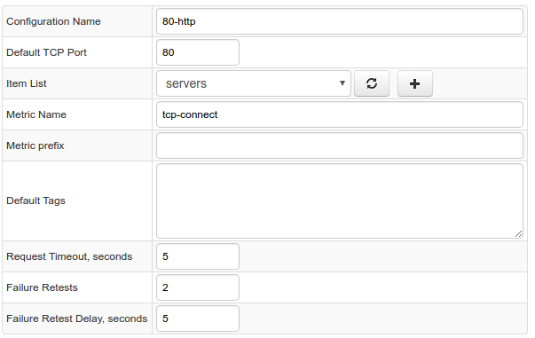

# TCP Job

TCP (Transmission Control Protocol) is an IP protocol which provides reliable data delivery between systems.

The TCP job checks the remote system's availability by establishing a TCP connection, as well as measuring the amount of time spent on opening the connection.

If connection is successful, the `tcp-check-status` metric is set to **0**, otherwise it is to one of the codes in the [connection status](#connection-status) table.

## Collected Metrics

| **Name** | **Description** |
| :--- |:--- |
| tcp-connect-status | Connection status. |
| tcp-connect-time | Number of milliseconds spent on opening the connection. |

In case of failure retests, the values for the above metrics are based on the last connection attempt.

## Connection Status

| **Status** | **Description** |
| :--- |:--- |
| 0 | Connection established successfully. |
| 1 | Connection Error |
| 2 | No Route To Host |
| 3 | Unknown Host |
| 4 | Socket Timeout |
| 5 | Other Error |

## Job Configuration

| Field          | Description   |
| :--------------- |:-------------|
| Configuration Name | Name of the configuration. |
| Default TCP Port           | Default TCP port to which collector will be connecting,unless a specific port is included in the remote system address. |
| Item List | Collection of remote system hostnames or IP addresses with an optional `:{port}` suffix, to be used instead of the default port. |
| Metric Prefix     | Metric prefix prepended to the [collected metric](#collected-metrics) names. |
| Default Tags      | Predefined series tags added to all series commands. |
| Request Timeout, seconds | The number of seconds the server will wait for the connection to open. |
| Failure Retests | Number of attempts to re-establish the connection in case of failure. |
| Failure Retest Delay, seconds | Delay between retry attempts in case of failure. |

## Configuration Example

